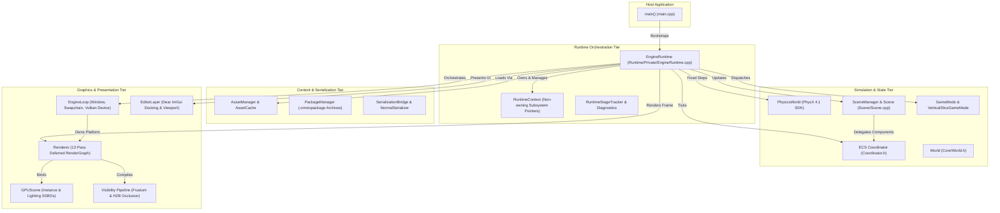

# Omnix Engine — Architecture Specification

> **Authoritative Technical Specification & Ground-Truth Systems Release**  
> **Repository:** `OmnixEngine`  
> **Target Version:** v0.4  
> **Platform Target:** Windows x64 (MSVC C++17 / Vulkan)  
> **Status:** Inspected & Verified Implementation

---

## 1. What is Omnix Engine?

Omnix Engine is a modular, data-oriented 3D game engine engineered in C++17 for 64-bit Windows environments. Designed around deterministic state simulation, explicit memory control, and modern low-level graphics hardware execution, the engine serves as a testbed and runtime foundation for real-time 3D simulation and tooling.

The architecture decouples world state, systems simulation, and hardware presentation across strict boundaries. A central orchestrator ([`eng::runtime::EngineRuntime`](file:///d:/OmnixEngine/Runtime/Public/EngineRuntime.h)) governs engine lifecycle and subsystem dispatch through a 15-stage frame loop. Core simulation is powered by a custom Entity Component System ([`Coordinator`](file:///d:/OmnixEngine/ECS/Coordinator.h)) with contiguous dense component storage, an NVIDIA PhysX 4.1 integration for rigid body and kinematic queries, and a hierarchical scene graph whose nodes act as lightweight proxies over ECS entity handles.

Hardware rendering is implemented via a multi-pass deferred Vulkan pipeline ([`eng::renderer::Renderer`](file:///d:/OmnixEngine/Rendering/Core/Renderer.h)) operating over a compiled Directed Acyclic Graph ([`RenderGraph`](file:///d:/OmnixEngine/Rendering/Graph/RenderGraph.h)). The graphics tier integrates GPU-driven visibility passes (frustum culling, hierarchical Z-buffer occlusion culling), multi-render-target G-Buffers, directional shadow mapping, and post-process tonemapping. Tooling is exposed through an embedded Dear ImGui and ImGuizmo editor suite ([`EditorLayer`](file:///d:/OmnixEngine/Runtime/Public/Editor/EditorLayer.h)).

---

## 2. High-Level Architecture

The Omnix Engine architecture is structured in five distinct tiers, organized from application entry down to OS and hardware abstractions:

---

## 3. Component-Level Architecture

Every core subsystem in Omnix Engine has strictly defined ownership boundaries, dependencies, and communication rules.

### 3.1 Runtime Orchestrator (`eng::runtime::EngineRuntime`)
- **Responsibility**: Top-level lifecycle owner. Coordinates sequential initialization, drives the 15-stage frame tick, manages execution modes (Game vs. `--editor`), and enforces strict LIFO subsystem teardown.
- **Inputs**: Command-line arguments (`argc`, `argv`), OS window events, platform clock ticks.
- **Outputs**: Frame render commands, simulation delta time, exit status code.
- **Dependencies**: [`RuntimeContext`](file:///d:/OmnixEngine/Runtime/Public/RuntimeContext.h), [`EngineLoop`](file:///d:/OmnixEngine/RenderingEngine/Runtime/engine/EngineLoop.h), [`World`](file:///d:/OmnixEngine/Core/World.h), [`PhysicsWorld`](file:///d:/OmnixEngine/Physics/Public/PhysicsWorld.h), [`SceneManager`](file:///d:/OmnixEngine/Scene/SceneManager.h).
- **Interactions**: Passes `RuntimeContext` non-owning references to systems; invokes `Renderer::RenderFrame()` and `EditorLayer::Render()`.
- **Design Rationale**: Centralizing orchestration prevents competing main loops and race conditions during bootstrap and shutdown.

### 3.2 ECS Coordinator (`Coordinator`, `EntityManager`, `ComponentManager`, `SystemManager`)
- **Responsibility**: Manages entity ID recycling, component type registration, contiguous dense array storage, component bitset signatures, and system entity subscriptions.
- **Inputs**: Entity creation/destruction calls, component mutation requests.
- **Outputs**: Contiguous component arrays for cache-efficient linear iteration.
- **Dependencies**: [`Core/Logger.h`](file:///d:/OmnixEngine/Core/Logger.h), [`ECSConfig.h`](file:///d:/OmnixEngine/ECS/ECSConfig.h).
- **Interactions**: Queried by gameplay systems, physics updates, scene hierarchy, and the render scene extractor.
- **Design Rationale**: Data-oriented cache locality ensures high throughput during system iteration without pointer-chasing across heap allocations.

### 3.3 Multi-Pass Deferred Renderer (`eng::renderer::Renderer`)
- **Responsibility**: Records and executes a 12-pass Vulkan render graph. Manages G-Buffer MRT attachments, shadow map rendering, tiled compute light culling, SSAO, deferred lighting evaluation, and tone-mapping.
- **Inputs**: `RenderScene` extracted from ECS state, active camera parameters, light structures.
- **Outputs**: Offscreen viewport texture for editor presentation or final swapchain frame.
- **Dependencies**: Vulkan RHI (`VulkanDevice`, `VulkanSwapChain`), [`RenderGraph`](file:///d:/OmnixEngine/Rendering/Graph/RenderGraph.h), [`GPUScene`](file:///d:/OmnixEngine/Rendering/GPUScene/GPUScene.h).
- **Interactions**: Extracts entity state via [`RenderSceneExtractor`](file:///d:/OmnixEngine/Rendering/Scene/RenderSceneExtractor.h); feeds offscreen descriptors to [`EditorViewportRenderer`](file:///d:/OmnixEngine/Rendering/Editor/EditorViewportRenderer.h).
- **Design Rationale**: Deferred lighting decouples geometric complexity from light evaluation count ($O(\text{geometry}) + O(\text{lights})$ instead of $O(\text{geometry} \times \text{lights})$).

### 3.4 Physics Simulation (`eng::physics::PhysicsWorld`)
- **Responsibility**: Wraps NVIDIA PhysX 4.1 scene lifecycle. Manages static colliders, dynamic rigid actors, raycasts, box/sphere/capsule overlap queries, and 60 Hz fixed timestep sub-stepping.
- **Inputs**: Rigid body velocities, collider geometries, transform matrices, fixed delta time.
- **Outputs**: Raycast hit buffers, overlap entity sets, updated transform states.
- **Dependencies**: NVIDIA PhysX SDK (`PxFoundation`, `PxPhysics`, `PxScene`), [`Scene/Vector3.h`](file:///d:/OmnixEngine/Scene/Vector3.h).
- **Interactions**: Queried by `InteractionSystem` and `CharacterControllerComponent`; synchronizes collider bounds with ECS.
- **Design Rationale**: Offloading spatial queries and physical constraints to an industry-standard SDK guarantees numerical stability and broad collision primitive support.

### 3.5 Scene Graph & Hierarchy (`SceneManager`, `Scene`, `SceneObject`)
- **Responsibility**: Authors and maintains parent-child transform relationships, level hierarchy queries, scene validation, prefab instancing, and JSON level serialization.
- **Inputs**: Level files (`.omnixscene`), editor hierarchy drag-and-drop operations.
- **Outputs**: Hierarchically transformed world matrices, validated entity structures.
- **Dependencies**: [`Coordinator`](file:///d:/OmnixEngine/ECS/Coordinator.h), [`SceneValidator`](file:///d:/OmnixEngine/Scene/SceneValidator.h), [`SceneSerializer`](file:///d:/OmnixEngine/Scene/SceneSerializer.h).
- **Interactions**: Proxies all component access directly to the ECS `Coordinator`, eliminating data duplication.
- **Design Rationale**: Retaining an intuitive node hierarchy for level authoring while storing the underlying data in flat ECS arrays combines ease of authoring with data-oriented performance.

### 3.6 Content Pipeline & Package Manager (`AssetManager`, `PackageManager`, `AssetRegistry`)
- **Responsibility**: Tracks unique asset GUIDs, loads raw source formats (`.obj`, `.gltf`, `.png`), mounts compiled `.omnixpackage` binary archives, and provides procedural fallbacks (`builtin://cube`, `builtin://plane`).
- **Inputs**: Disk paths, package archives, asset handles (`AssetHandle`).
- **Outputs**: Cached CPU structures and Vulkan GPU buffer/texture handles.
- **Dependencies**: [`AssetRegistry.json`](file:///d:/OmnixEngine/AssetRegistry.json), [`VulkanMemory`](file:///d:/OmnixEngine/RenderingEngine/Vulkan/VulkanMemory.h).
- **Interactions**: Supplies meshes, textures, and material factors to the renderer and physics colliders.
- **Design Rationale**: A handle-based abstraction with fallback assets guarantees the engine boots and renders even when disk assets are corrupt or missing.

### 3.7 State Serialization & Snapshot System (`SerializationBridge`, `NormalSerializer`, `NormalDeserializer`)
- **Responsibility**: Compiles component schemas into binary descriptors; serializes and restores full ECS snapshots with checksum validation; captures delta state changes.
- **Inputs**: ECS world snapshots, file streams, byte buffers.
- **Outputs**: Deterministic binary payload streams (`.snapshot.bin`), reconstructed ECS entities.
- **Dependencies**: [`SchemaRegistry`](file:///d:/OmnixEngine/Serializer/ECS/SchemaRegistry.h), [`ECSSnapshot`](file:///d:/OmnixEngine/Serializer/ECS/Snapshot/ECSSnapshot.h).
- **Interactions**: Used by `GameplaySaveSystem` and scene play-session backup/restore transitions.
- **Design Rationale**: Schema-driven serialization enables reflection-like binary packing without C++ RTTI overhead or external code generators.

---

## 4. Subsystem Inventory Matrix

| Subsystem | Primary Implementation | Header Location | Lifecycle Owner | Implementation Status |
| :--- | :--- | :--- | :--- | :--- |
| **Runtime Orchestrator** | `Runtime/Private/EngineRuntime.cpp` | `Runtime/Public/EngineRuntime.h` | `main.cpp` | Verified / Implemented |
| **ECS Coordinator** | `ECS/Coordinator.cpp`, `EntityManager.cpp` | `ECS/Coordinator.h` | `eng::runtime::World` | Verified / Implemented |
| **Deferred Renderer** | `Rendering/Core/Renderer.cpp` | `Rendering/Core/Renderer.h` | `EngineLoop` | Verified / Implemented |
| **Render Graph** | `Rendering/Graph/RenderGraph.cpp` | `Rendering/Graph/RenderGraph.h` | `Renderer` | Verified / Implemented |
| **GPU Scene Buffer** | `Rendering/GPUScene/GPUScene.cpp` | `Rendering/GPUScene/GPUScene.h` | `Renderer` | Verified / Implemented |
| **Visibility / Culling** | `Rendering/Visibility/FrustumCullPass.cpp` | `Rendering/Visibility/Frustum.h` | `Renderer` | CPU Verified / GPU Experimental |
| **PhysX 4.1 Integration**| `Physics/Private/PhysicsWorld.cpp` | `Physics/Public/PhysicsWorld.h` | `EngineRuntime` | Verified / Implemented |
| **Scene Graph & Prefabs**| `Scene/Scene.cpp`, `SceneObject.cpp` | `Scene/SceneManager.h` | `EngineRuntime` | Verified / Implemented |
| **Asset Pipeline** | `Runtime/Private/AssetManager.cpp` | `Runtime/Public/AssetManager.h` | `EngineRuntime` | Verified / Implemented |
| **Package Mounting** | `Runtime/Private/PackageManager.cpp` | `Runtime/Public/PackageManager.h` | `EngineRuntime` | Verified / Implemented |
| **Binary Serializer** | `Serializer/Serialization/Normal/*` | `NormalSerializer.h` | On-Demand | Verified / Implemented |
| **Audio Backend** | `Runtime/Private/Audio/MiniaudioBackend.cpp` | `AudioSystem.h` | `EngineRuntime` | Verified / Implemented |
| **Input Subsystem** | `Input/InputManager.cpp` | `Input/InputManager.h` | `EngineRuntime` | Verified / Implemented |
| **Editor Suite** | `Runtime/Private/Editor/EditorLayer.cpp` | `EditorLayer.h` | `EngineRuntime` | Verified / Implemented |
| **Job / Task Graph** | `Systems/Scheduler/*` | `SystemScheduler.h` | Planned | **Planned / Stubbed** |
| **Skeletal Animation**| `Components/Perceptual/AnimatorComponent.h` | `AnimatorComponent.h` | Planned | **Planned** |
| **Scripting VM** | `Components/Logical/ScriptComponent.h` | `ScriptComponent.h` | Planned | **Planned** |
