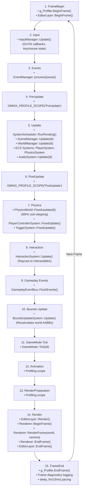
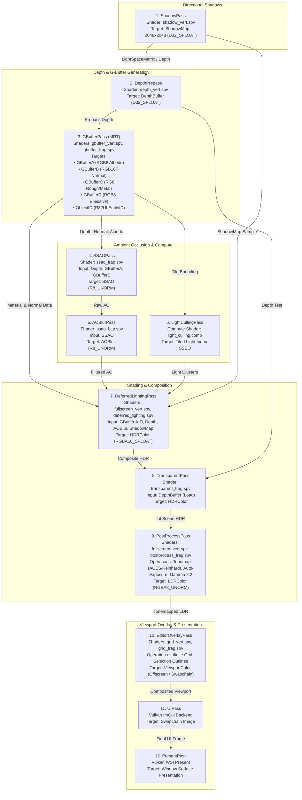
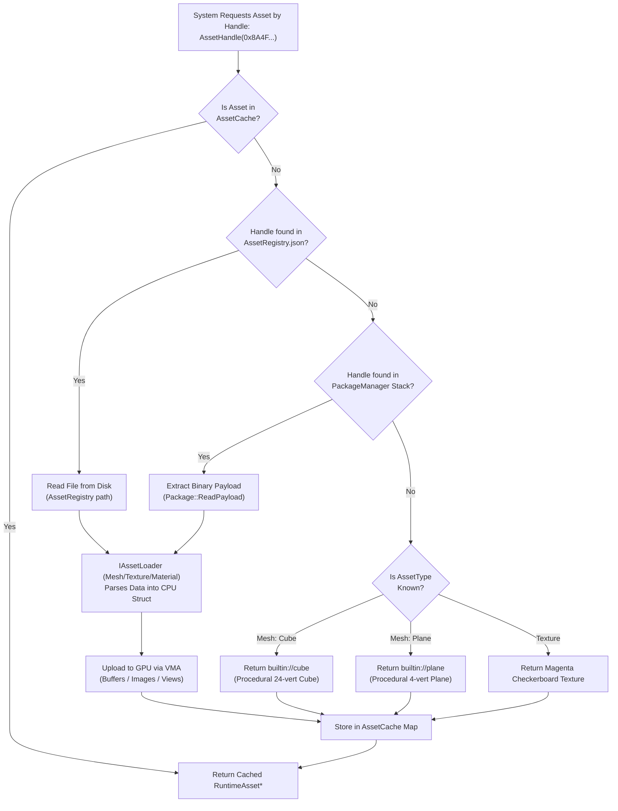
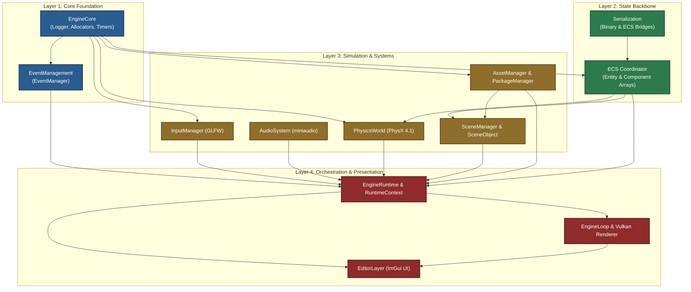

# Omnix Engine — Architecture Diagrams

> **Visual Architectural Atlas & Dataflow Topologies**  
> **Target Version:** Omnix Engine v0.4  
> **Audited Repository:** `d:\OmnixEngine`  
> **Accompanying Document:** [`docs/ARCHITECTURE.md`](file:///d:/OmnixEngine/docs/ARCHITECTURE.md)

---

## 1. High-Level Subsystem Architecture

The following diagram illustrates the concrete subsystem topology, ownership boundaries, and communication pathways within Omnix Engine:

```mermaid
graph TB
    subgraph Host Application
        Main["main() (main.cpp)"]
    end

    subgraph Runtime Orchestration Tier
        Runtime["EngineRuntime<br/>(Runtime/Private/EngineRuntime.cpp)"]
        Context["RuntimeContext<br/>(Non-owning Borrowed Pointers)"]
        Tracker["RuntimeStageTracker & Profiler"]
    end

    subgraph Hardware & OS Abstraction Tier
        Window["Window System (GLFW / Win32)<br/>(RenderingEngine/Platform/window)"]
        Input["InputManager<br/>(Input/InputManager.cpp)"]
        Audio["AudioSystem (miniaudio)<br/>(Runtime/Private/Audio)"]
        VulkanRHI["Vulkan Hardware Interface<br/>(Instance, Device, SwapChain, VMA)"]
    end

    subgraph World Simulation Tier
        ECSWorld["World (IECSWorld)<br/>(Core/World.h)"]
        Coordinator["Coordinator (Austin Morlan ECS)<br/>(ECS/Coordinator.h)"]
        EntityManager["EntityManager<br/>(std::queue&lt;Entity&gt;, Bitset Signatures)"]
        ComponentManager["ComponentManager<br/>(Dense ComponentArray&lt;T&gt;)"]
        SystemManager["SystemManager<br/>(std::set&lt;Entity&gt; per System)"]
        PhysXWorld["PhysicsWorld (PhysX 4.1 SDK)<br/>(Physics/Private/PhysicsWorld.cpp)"]
        SceneGraph["SceneManager & Scene<br/>(Scene/Scene.cpp, SceneObject.cpp)"]
        WorldMgr["WorldManager (Zone Streaming)<br/>(Runtime/Private/World)"]
    end

    subgraph Graphics & Visibility Tier
        EngineLoop["EngineLoop (IRenderer)<br/>(RenderingEngine/Runtime/engine)"]
        Renderer["Renderer (Multi-Pass Deferred)<br/>(Rendering/Core/Renderer.cpp)"]
        RenderGraph["RenderGraph (12 Passes)<br/>(Rendering/Graph/RenderGraph.cpp)"]
        GPUScene["GPUScene (SSBO Allocations)<br/>(Rendering/GPUScene)"]
        Visibility["Visibility Pipeline<br/>(FrustumCullPass &amp; HZBPass)"]
    end

    subgraph Content & Serialization Tier
        AssetMgr["AssetManager &amp; Loaders<br/>(Runtime/Private/AssetManager.cpp)"]
        AssetReg["AssetRegistry (AssetRegistry.json)<br/>(Runtime/Private/AssetRegistry.cpp)"]
        PackMgr["PackageManager (.omxpkg Stack)<br/>(Runtime/Private/PackageManager.cpp)"]
        Serializer["SerializationBridge &amp; DeltaTracker<br/>(Serializer/ECS)"]
    end

    subgraph Tooling Tier
        Editor["EditorLayer (ImGui + ImGuizmo)<br/>(Runtime/Private/Editor)"]
        Panels["Inspector, Hierarchy, Viewport, AssetBrowser"]
    end

    Main -->|Instantiates & Runs| Runtime
    Runtime -->|Owns via unique_ptr| Context
    Runtime -->|Owns| Input
    Runtime -->|Owns| Audio
    Runtime -->|Owns| ECSWorld
    Runtime -->|Owns| PhysXWorld
    Runtime -->|Owns| SceneGraph
    Runtime -->|Owns| WorldMgr
    Runtime -->|Owns| EngineLoop
    Runtime -->|Owns| AssetMgr
    Runtime -->|Owns| PackMgr
    Runtime -->|Owns| Editor

    EngineLoop -->|Owns| Window
    EngineLoop -->|Owns| VulkanRHI
    EngineLoop -->|Owns| Renderer

    ECSWorld -->|Owns| Coordinator
    Coordinator -->|Owns| EntityManager
    Coordinator -->|Owns| ComponentManager
    Coordinator -->|Owns| SystemManager

    Renderer -->|Owns & Executes| RenderGraph
    Renderer -->|Owns| GPUScene
    Renderer -->|Owns| Visibility

    Editor -->|Owns| Panels
    Editor -->|Offscreen Viewport Render| Renderer
```



---

## 2. Complete Engine Lifecycle Diagram

### 2.1 Initialization vs. Teardown Ordering (Strict LIFO)

```mermaid
graph LR
    subgraph Initialization Order (Strict FIFO)
        I1["1. Logger::Init"] --> I2["2. Timer::Init"]
        I2 --> I3["3. InputManager::Initialize"]
        I3 --> I4["4. EventManager & GameplayEventBus"]
        I4 --> I5["5. World (ECS) Initialize"]
        I5 --> I6["6. SystemScheduler::Initialize"]
        I6 --> I7["7. EngineLoop (Window/Vulkan/Renderer)"]
        I7 --> I8["8. PhysicsWorld (PhysX 4.1)"]
        I8 --> I9["9. AssetRegistry & AssetManager"]
        I9 --> I10["10. SceneManager & WorldManager"]
        I10 --> I11["11. AudioSystem::Initialize"]
        I11 --> I12["12. EditorLayer::Initialize"]
    end

    subgraph Shutdown Order (Strict LIFO)
        S1["1. EditorLayer::Shutdown"] --> S2["2. AudioSystem::Shutdown"]
        S2 --> S3["3. WorldManager & SceneManager"]
        S3 --> S4["4. AssetCache & AssetManager"]
        S4 --> S5["5. PhysicsWorld::Shutdown"]
        S5 --> S6["6. GameplaySaveSystem"]
        S6 --> S7["7. Renderer & EngineLoop::Shutdown"]
        S7 --> S8["8. SystemScheduler::Shutdown"]
        S8 --> S9["9. World (ECS)::Shutdown"]
        S9 --> S10["10. EventManager & InputManager"]
        S10 --> S11["11. Leak Diagnostics Check"]
        S11 --> S12["12. Logger::Shutdown"]
    end
```

---

## 3. Frame Execution Loop (15 Frame Stages)

The 15 stages executed sequentially during each tick of [`EngineRuntime::Run()`](file:///d:/OmnixEngine/Runtime/Private/EngineRuntime.cpp#L350-L628):



---

## 4. Multi-Pass Vulkan Deferred Rendering Pipeline

The 12-pass Render Graph compiled and recorded by [`eng::renderer::Renderer`](file:///d:/OmnixEngine/Rendering/Core/Renderer.cpp):



---

## 5. GPU Scene & Multi-Pass Resource Architecture

The flow of scene data from the CPU ECS simulation into GPU-accessible descriptors and storage buffers:

```mermaid
graph LR
    subgraph CPU Simulation State
        ECS["World / Coordinator<br/>(Transforms, Meshes, Lights)"]
        Extractor["RenderSceneExtractor<br/>(Extracts RenderScene DTO)"]
        Culler["CPU / GPU Frustum Culler"]
    end

    subgraph GPU Scene Manager (GPUScene)
        InstanceSSBO["Instance Data SSBO<br/>• Model Matrix (mat4)<br/>• Inverse Model (mat4)<br/>• Material Indices (uint4)"]
        BoundsSSBO["Bounds SSBO<br/>• Center & Radius (vec4)<br/>• Min/Max AABB (vec4)"]
        LightUBO["Lighting UBO<br/>• Directional Lights<br/>• Point Lights (Count, Pos, Radius, Color)<br/>• Cascaded Shadow Splits"]
        CameraUBO["Camera Frame UBO<br/>• View Matrix (mat4)<br/>• Proj Matrix (mat4)<br/>• ViewProj & Position"]
    end

    subgraph Vulkan Pipeline Descriptors
        GlobalSet["Set 0: Frame & Lighting Descriptors"]
        MaterialSet["Set 1: Bindless Material Textures"]
        InstanceSet["Set 2: GPUScene SSBO Buffers"]
    end

    ECS --> Extractor
    Extractor --> Culler
    Culler --> GPUScene
    GPUScene --> InstanceSSBO
    GPUScene --> BoundsSSBO
    GPUScene --> LightUBO
    GPUScene --> CameraUBO

    InstanceSSBO --> InstanceSet
    BoundsSSBO --> InstanceSet
    LightUBO --> GlobalSet
    CameraUBO --> GlobalSet
```

---

## 6. Scene Hierarchy & ECS Data Proxy Model

The relationship between the hierarchical scene graph and the flat data-oriented ECS storage:

```mermaid
graph TD
    subgraph Scene Hierarchy Tree
        RootNode["SceneObject: 'WorldRoot'<br/>EntityID: 101"]
        ChildA["SceneObject: 'PlayerMesh'<br/>EntityID: 102"]
        ChildB["SceneObject: 'MainCamera'<br/>EntityID: 103"]
        ChildC["SceneObject: 'GroundPlane'<br/>EntityID: 104"]

        RootNode --> ChildA
        RootNode --> ChildB
        RootNode --> ChildC
    end

    subgraph ECS Coordinator Storage (Flat Contiguous Memory)
        TransformArray["ComponentArray&lt;TransformComponent&gt;<br/>[101: Pos/Rot/Scale] [102: Pos/Rot/Scale] [103: Pos/Rot/Scale] [104: Pos/Rot/Scale]"]
        MeshArray["ComponentArray&lt;RenderableMeshComponent&gt;<br/>[102: Handle=builtin://cube] [104: Handle=builtin://plane]"]
        CameraArray["ComponentArray&lt;CameraComponent&gt;<br/>[103: FOV=60, Near=0.1, Far=1000]"]
        PhysXArray["ComponentArray&lt;RigidBodyComponent&gt;<br/>[102: Mass=75kg, UseGravity=true]"]
        LightArray["ComponentArray&lt;DirectionalLightComponent&gt;<br/>[101: Intensity=3.0, Color=White]"]
    end

    ChildA -.->|Forwards Queries| TransformArray
    ChildA -.->|Forwards Queries| MeshArray
    ChildA -.->|Forwards Queries| PhysXArray
    ChildB -.->|Forwards Queries| TransformArray
    ChildB -.->|Forwards Queries| CameraArray
    ChildC -.->|Forwards Queries| TransformArray
    ChildC -.->|Forwards Queries| MeshArray
    RootNode -.->|Forwards Queries| TransformArray
    RootNode -.->|Forwards Queries| LightArray
```

---

## 7. Asset Loading, Caching & Fallback Pipeline

The resolution flow when a system requests an asset handle:



---

## 8. Subsystem Dependency Graph & Communication Rules

Permitted vs. prohibited subsystem dependencies in Omnix Engine:


