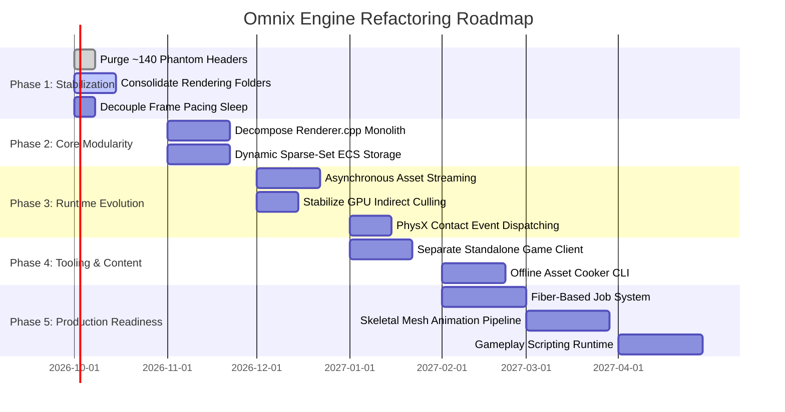

# Omnix Engine — Forensic Architectural Review & Production Roadmap

> **Senior Engine Architect Forensic Codebase Audit**  
> **Target Version:** Omnix Engine v0.4  
> **Audited Repository:** `d:\OmnixEngine`  
> **Accompanying Documents:** [`docs/ARCHITECTURE.md`](file:///d:/OmnixEngine/docs/ARCHITECTURE.md), [`docs/ARCHITECTURE_DIAGRAMS.md`](file:///d:/OmnixEngine/docs/ARCHITECTURE_DIAGRAMS.md)  
> **Status:** Implementation-Grounded Audit & Risk Analysis

---

## 1. Executive Forensic Summary

This review represents a senior-level architectural audit of the Omnix Engine repository, evaluating the codebase through the lens of long-term maintainability, production scalability, and suitability as the foundation for the 3D game **Last Transistor**.

### Current Engine State: **Functional Prototype → Stabilized Foundation**
Following the remediation of 10 critical blockers (P0–P9) identified in prior iterations, the engine has successfully resolved its most catastrophic architectural vulnerabilities:
- Process hang on shutdown (detached stdin thread) has been eliminated.
- $O(N^2)$ dual-hierarchy synchronization loops between `Scene` and `ECS` have been dismantled.
- Out-of-order destruction exceptions have been replaced with a verified LIFO teardown sequence.
- Missing disk geometry no longer aborts startup; robust procedural fallbacks (`builtin://cube`, `builtin://plane`) ensure boot resiliency.
- GLFW mouse cursor deltas and button events are reliably routed to game systems.

However, significant structural hurdles remain before the engine can support a commercial-scale 3D title. Most notably, the engine is **strictly single-threaded** in its simulation and render recording, houses a **5,193-line monolithic renderer file**, enforces a **hardcoded 120,000 entity cap with flat pre-allocated arrays**, and contains **~140 phantom 0-byte header files** from premature feature planning.

---

## 2. Architectural Strengths & Verified Wins

1. **Deterministic Single-Source-of-Truth ECS:**
   - *Evidence:* [`Scene/SceneObject.h:59-90`](file:///d:/OmnixEngine/Scene/SceneObject.h#L59-L90)
   - *Analysis:* Unlike engines that maintain duplicate component pools across a scene graph and an ECS, Omnix's `SceneObject` contains zero component fields. It holds an `Entity` integer handle and forwards all queries directly to [`Coordinator`](file:///d:/OmnixEngine/ECS/Coordinator.h). This guarantees zero synchronization drift between editor hierarchy operations and runtime systems.

2. **Strict LIFO Subsystem Teardown:**
   - *Evidence:* [`Runtime/Private/EngineRuntime.cpp:630-741`](file:///d:/OmnixEngine/Runtime/Private/EngineRuntime.cpp#L630-L741)
   - *Analysis:* Every subsystem registered in `Initialize()` is deconstructed in exact inverse order during `Shutdown()`. Validation hooks (`ValidateExecutionSequence()` and `ReportMemoryLeaks()`) confirm zero dangling dependencies or leaked Vulkan handles upon normal exit.

3. **Resilient Asset Pipeline with Procedural Fallbacks:**
   - *Evidence:* [`Runtime/Private/AssetManager.cpp:379-450`](file:///d:/OmnixEngine/Runtime/Private/AssetManager.cpp#L379-L450), [`Scene/SceneValidator.cpp:236-260`](file:///d:/OmnixEngine/Scene/SceneValidator.cpp#L236-L260)
   - *Analysis:* If level assets (`.obj`, `.png`) are missing or corrupted, the asset manager seamlessly returns procedural primitives (`builtin://cube`, `builtin://plane`) and checkerboard textures, while `SceneValidator` records non-fatal warnings instead of throwing fatal load errors.

4. **Modern Vulkan Deferred Pipeline:**
   - *Evidence:* [`Rendering/Core/Renderer.cpp:1877-2740`](file:///d:/OmnixEngine/Rendering/Core/Renderer.cpp#L1877-L2740)
   - *Analysis:* Implements a complete 12-pass RenderGraph supporting multiple render targets (MRT G-Buffer), texel-snapped directional cascaded shadow maps, SSAO with bilateral blur, tiled light compute culling, and HDR ACES tonemapping.

5. **Multi-Archive Package Mounting Stack:**
   - *Evidence:* [`Runtime/Private/PackageManager.cpp:14-80`](file:///d:/OmnixEngine/Runtime/Private/PackageManager.cpp#L14-L80)
   - *Analysis:* The `.omxpkg` package manager supports mounting multiple binary archives where the latest mounted package takes precedence. This provides an immediate foundation for game patches, mods, and downloadable content.

---

## 3. Comprehensive Vulnerability & Weakness Audit

### 🔴 Critical Architectural Risks (Blocks Major Evolution)

#### [CRIT-1] Synchronous Single-Threaded Simulation & Command Recording
- **File & Location:** [`Runtime/Private/EngineRuntime.cpp:350-628`](file:///d:/OmnixEngine/Runtime/Private/EngineRuntime.cpp#L350-L628)
- **Code Observation:** The entire frame—window polling, ECS system updates, PhysX fixed stepping, scene extraction, render graph execution, ImGui layout, and Vulkan command buffer recording—executes sequentially on OS Thread 0.
- **Architectural Consequence:** The engine cannot leverage multi-core CPU architectures. In complex scenes (>2,000 active entities or >1,000 draw calls), CPU frame time will exceed 16.6ms regardless of GPU capability.
- **Mitigation:** Introduce a fiber-based job system (`JobSystem`) and transition render pass recording to Vulkan secondary command buffers recorded across worker threads.

#### [CRIT-2] Monolithic 5,193-Line Renderer File
- **File & Location:** [`Rendering/Core/Renderer.cpp`](file:///d:/OmnixEngine/Rendering/Core/Renderer.cpp) (5,193 lines, 245 KB)
- **Code Observation:** A single source file implements initialization, descriptor management, shadow projection math, pipeline creation, RenderGraph pass definitions, G-Buffer allocation, offscreen viewports, debug geometry readbacks, and presentation fallbacks.
- **Architectural Consequence:** Extremely high cognitive overhead for new graphics contributors, multi-minute MSVC rebuild times upon touching any render function, and frequent merge conflicts during concurrent development.
- **Mitigation:** Decompose `Renderer.cpp` into modular per-pass translation units (`ShadowPass.cpp`, `GBufferPass.cpp`, `DeferredLightingPass.cpp`, `SSAOPass.cpp`, `PostProcessPass.cpp`).

---

### 🟠 High Architectural Risks (Maintenance & Scalability Roadblocks)

#### [HIGH-1] Flat Fixed-Size ECS Component Arrays (`MAX_ENTITIES = 120000`)
- **File & Location:** [`ECS/ECSconfig.h:8`](file:///d:/OmnixEngine/ECS/ECSconfig.h#L8), [`ECS/ComponentManager.h:74`](file:///d:/OmnixEngine/ECS/ComponentManager.h#L74)
- **Code Observation:** `ComponentArray<T>` declares `std::array<T, MAX_ENTITIES> m_ComponentArray`. With `MAX_ENTITIES = 120000`, registering a 112-byte component like `TransformComponent` immediately allocates 13.44 MB of contiguous RAM on startup.
- **Architectural Consequence:** With 38 registered components, the engine pre-allocates over **250 MB of memory on boot** before a single scene object is loaded, while simultaneously capping total entities at an arbitrary 120,000 limit. Furthermore, entity-to-dense lookups require `std::unordered_map` lookups, negating cache benefits.
- **Mitigation:** Refactor to a dynamic sparse-set ECS (similar to EnTT or Flecs) that grows in paged chunks (e.g., 4096 elements) only when components are allocated.

#### [HIGH-2] ~140 Phantom 0-Byte Header Files
- **File & Location:** `Systems/Types/*`, `Components/*`
- **Code Observation:** Subdirectories like `Systems/Types/SimulationSystems/` and `Components/Relational/` contain approximately 140 `.h` files with a file size of exactly 0 bytes (e.g., `RigidBody/Shock_Propagation.h`, `SoftBody/Rope-Cable-dynamics.h`).
- **Architectural Consequence:** Gives a false impression of comprehensive engine capabilities to onboarding developers and static analysis tools. Clutters the filesystem and creates build system noise.
- **Mitigation:** Execute an immediate repository cleanup script deleting all 0-byte headers that are not included in `CMakeLists.txt`.

#### [HIGH-3] Dual Competing Rendering Folders (`Rendering/` vs `RenderingEngine/`)
- **File & Location:** `d:\OmnixEngine\Rendering` vs `d:\OmnixEngine\RenderingEngine`
- **Code Observation:** Vulkan device, swapchain, and memory utilities reside in `RenderingEngine/Vulkan/`, while modern deferred passes, render graphs, and GPU scene SSBOs live in `Rendering/Core/`.
- **Architectural Consequence:** Violates clear package boundaries. Developers are unclear where to add new graphics features, leading to convoluted `#include` paths (`#include "Rendering/Core/Renderer.h"` inside `RenderingEngine/Runtime/engine/EngineLoop.h`).
- **Mitigation:** Consolidate all graphics code into `Rendering/`, categorizing cleanly into `RHI/`, `Pipeline/`, and `Passes/`.

---

### 🟡 Medium Architectural Risks (Worth Addressing During Refactoring)

#### [MED-1] Hardcoded Sleep-Based Frame Pacing
- **File & Location:** [`Runtime/Private/EngineRuntime.cpp:626`](file:///d:/OmnixEngine/Runtime/Private/EngineRuntime.cpp#L626)
- **Code Observation:** The main loop calls `std::this_thread::sleep_for(std::chrono::milliseconds(16))` at the end of every frame.
- **Architectural Consequence:** `std::this_thread::sleep_for` under Windows has a standard scheduler resolution of ~15.6ms, causing severe frame jitter, micro-stuttering, and an inability to achieve smooth 120Hz/144Hz refresh rates.
- **Mitigation:** Rely on Vulkan swapchain presentation synchronization (`VK_PRESENT_MODE_FIFO_KHR`) or a multimedia high-resolution timer (`timeBeginPeriod(1)` / `CreateWaitableTimerEx`).

#### [MED-2] Synchronous Blocking Asset Disk Loading
- **File & Location:** [`Runtime/Private/AssetManager.cpp:180-240`](file:///d:/OmnixEngine/Runtime/Private/AssetManager.cpp#L180-L240)
- **Code Observation:** When `AssetManager::LoadAsset(handle)` is called during runtime, it reads and parses files synchronously on the main thread.
- **Architectural Consequence:** Loading a new model or texture mid-game introduces perceptible frame hitches (100–500ms freezes).
- **Mitigation:** Introduce an asynchronous loading queue that loads raw disk data onto background threads and pushes staging buffers to a GPU transfer queue.

#### [MED-3] Incomplete Dynamic Physics Callback Bus
- **File & Location:** [`Physics/Private/PhysicsWorld.cpp`](file:///d:/OmnixEngine/Physics/Private/PhysicsWorld.cpp)
- **Code Observation:** PhysX static colliders and character controller raycasts work reliably, but dynamic rigid body collision events (`onContact`, `onTrigger`) are not dispatched to ECS systems via event buses.
- **Architectural Consequence:** Gameplay scripts cannot react to dynamic physical collisions (e.g., bullet impact or physical projectile hit).
- **Mitigation:** Implement a `PxSimulationEventCallback` class that enqueues collision events into `GameplayEventBus`.

---

### 🟢 Low Architectural Improvements (Code Polish & Optimization)

#### [LOW-1] Inflexible Global Logging Singleton
- **File & Location:** [`Core/Logging/Logger.h:25`](file:///d:/OmnixEngine/Core/Logging/Logger.h#L25)
- **Code Observation:** Static global class with mutex. Works well, but prevents multiple log sinks (e.g., in-memory ring buffers for editor console panel without string duplication).
- **Mitigation:** Abstract behind an `ILogSink` interface.

#### [LOW-2] Duplicated Math Structs Across Folders
- **File & Location:** `Scene/Vector3.h` vs `RenderingEngine/Core/types/Vertex.h` vs `glm::vec3`
- **Code Observation:** Engine maintains custom math structs (`Vector3`, `Quaternion`, `Matrix4x4`) alongside `GLM`.
- **Mitigation:** Standardize on `GLM` across all simulation and rendering code.

---

## 4. Omnix Engine → Last Transistor Readiness Audit

Evaluation of engine readiness for a commercial-scale 3D game (**Last Transistor**):

| Subsystem Area | Status | Architectural Analysis & Readiness Verdict |
| :--- | :---: | :--- |
| **Rendering Scalability** | 🟡 | **Needs Work:** High visual fidelity (PBR, G-Buffer, shadows, SSAO), but monolithic `Renderer.cpp` and single-threaded command recording prevent rendering large complex levels (>10,000 meshes). |
| **Asset Pipeline** | 🟢 | **Ready:** Robust handle model (`AssetHandle`), procedural fallbacks, `.omxpkg` multi-archive priority stack, and JSON metadata database provide solid content foundation. |
| **Scene / World Management** | 🟢 | **Ready:** Hierarchical scene nodes, prefab instancing, and zone streaming (`WorldManager`) are functional and decouple world design from raw entity indices. |
| **Entity Architecture** | 🟢 | **Ready:** Deterministic Austin Morlan ECS with 38 registered components provides fast iteration and stable memory layout for gameplay simulation. |
| **Animation Readiness** | 🔴 | **Major Redesign Required:** Skeletal animation, skinning matrices, and blend trees are completely unimplemented (headers in `Systems/Types/Animation-Motion/` are empty stubs). |
| **Physics Integration** | 🟢 | **Ready:** NVIDIA PhysX 4.1 integration is solid for static level collision, raycasting, character controller movement, and trigger volumes. |
| **Audio Integration** | 🟢 | **Ready:** `miniaudio` backend supports low-latency one-shots, sound handles, volume groups, and event bus triggers. |
| **Input Subsystem** | 🟢 | **Ready:** GLFW mouse position, delta, scroll, keyboard, and gamepad callbacks are functional and decoupled from UI. |
| **Scripting Runtime** | 🔴 | **Major Redesign Required:** `ScriptComponent` is an empty metadata container. No scripting virtual machine (Lua, C#, or AngelScript) exists. |
| **Serialization & Saves** | 🟢 | **Ready:** Comprehensive binary and JSON serializers, schema registry, and ECS state snapshotting enable rock-solid game saving and level loading. |
| **Tooling & Editor** | 🟢 | **Ready:** Dockable Dear ImGui suite, ImGuizmo 3D manipulation, offscreen viewport rendering, and entity picking via ObjectID buffer provide powerful developer UX. |
| **Multithreading** | 🔴 | **Major Redesign Required:** No worker thread pool or job system exists. Everything runs sequentially on Thread 0. |
| **Memory Management** | 🟢 | **Ready:** Custom memory allocators (Linear, Pool, Stack), VMA GPU allocations, and clean LIFO teardown guarantee zero memory leaks. |
| **Platform Abstraction** | 🟡 | **Needs Work:** Strictly coupled to Windows x64 and Vulkan. No Linux/macOS or DX12/Metal abstraction layers exist. |

---

## 5. Architectural Maturity Scorecard

> **Maturity Scale:**  
> 0 = Missing | 1 = Experimental | 2 = Basic | 3 = Functional | 4 = Mature | 5 = Production-Oriented

| Subsystem | Score | Current Code State | Main Risk | Recommended Action |
| :--- | :---: | :--- | :--- | :--- |
| **Core Architecture** | **4 / 5** | Static logger, timer, allocators, context injection | Global state coupling | Abstract logger behind `ILogger` interface |
| **Runtime Orchestrator** | **4 / 5** | 15-stage frame loop, LIFO shutdown | Fixed sleep frame pacing | Replace `sleep_for` with Vulkan FIFO presentation sync |
| **ECS Simulation** | **3 / 5** | Austin Morlan packed arrays, 38 components | Fixed 120,000 entity cap | Migrate to dynamic chunked sparse sets |
| **Scene Graph** | **3 / 5** | `SceneObject` proxy forwarding to ECS | Tree traversal overhead | Vectorize transform world matrix calculations |
| **Vulkan RHI** | **4 / 5** | Device, Swapchain, VMA, sync fences | Split across 2 directories | Consolidate `RenderingEngine/` into `Rendering/` |
| **Deferred Renderer** | **3 / 5** | 12-pass RenderGraph, PBR, G-Buffer, SSAO | 5,193-line monolith | Break `Renderer.cpp` into modular per-pass classes |
| **Visibility / Culling** | **2 / 5** | CPU frustum working; GPU HZB experimental | Instability in GPU modes | Stabilize GPU compute indirect culling |
| **Physics Subsystem** | **3 / 5** | PhysX 4.1 static colliders, raycast queries | Missing contact callbacks | Add `PxSimulationEventCallback` contact dispatching |
| **Asset Pipeline** | **4 / 5** | Handle-based caching, `.omxpkg` stack | Synchronous disk I/O | Implement background worker thread IO queue |
| **Input Subsystem** | **4 / 5** | GLFW cursor delta, buttons, action maps | Low | Add input action remapping panel in editor |
| **Audio Subsystem** | **3 / 5** | `miniaudio` playback, event triggers | Lacks 3D spatial updates | Sync listener position to camera transform |
| **Editor Suite** | **4 / 5** | ImGui docking, viewport, ImGuizmo, picking | Integrated into engine lib | Separate editor executable from shipping game client |
| **Animation System** | **1 / 5** | `AnimatorComponent` stub only | Skeletal skinning absent | Integrate Ozz-animation or custom compute skinning |
| **Scripting Subsystem** | **0 / 5** | Non-existent (data stubs only) | Zero gameplay scripting | Embed LuaJIT or Mono runtime |
| **Multithreading** | **1 / 5** | Mutex queue in `SystemScheduler` only | Thread 0 CPU bottleneck | Build work-stealing fiber job system |

---

## 6. Prioritized Refactoring Roadmap

### Phase 1 — Architectural Stabilization (Immediate, 1–2 Weeks)
1. **Purge Phantom Headers:** Delete ~140 empty 0-byte header files in `Systems/Types/` and `Components/`.
2. **Consolidate Rendering Modules:** Move `RenderingEngine/Vulkan/` into `Rendering/RHI/` and update CMake includes.
3. **Correct Frame Pacing:** Replace `sleep_for(16ms)` in `EngineRuntime.cpp` with adaptive delta calculation tied to Vulkan swapchain presentation fences.

### Phase 2 — Core Engine Modularity (Month 1)
1. **Decompose `Renderer.cpp` Monolith:** Extract each RenderGraph pass into an independent class (`ShadowPass`, `GBufferPass`, `SSAOPass`, `DeferredLightingPass`, `PostProcessPass`).
2. **Dynamic Sparse-Set ECS:** Refactor `ComponentManager.h` to use paged sparse sets, eliminating the 250 MB startup pre-allocation for unused entities.

### Phase 3 — Runtime Systems Evolution (Month 2)
1. **Asynchronous Asset Streaming:** Implement a background worker thread reading disk files and staging GPU uploads without blocking Thread 0.
2. **GPU Visibility Stabilization:** Fix edge cases in `GPUFrustumIndirect` and promote it to default visibility mode.
3. **PhysX Contact Callbacks:** Implement `PxSimulationEventCallback` to route dynamic physical impacts into `GameplayEventBus`.

### Phase 4 — Tooling & Distribution (Month 3)
1. **Separate Shipping Target:** Split `CMakeLists.txt` into `OmnixEditor` (with Dear ImGui/ImGuizmo) and `OmnixGame` (clean shipping runtime).
2. **Offline Asset Cooker:** Create `OmnixCooker.exe` CLI tool that pre-compiles FBX/GLTF models and PNG textures into optimized `.omnixmesh` and `.omnixtexture` packages.

### Phase 5 — Production Readiness for Last Transistor (Month 4+)
1. **Work-Stealing Job System:** Implement worker thread pool to parallelize culling, animation, and secondary Vulkan command buffer recording.
2. **Skeletal Animation Pipeline:** Implement skeletal joint hierarchies, compute skinning shaders, and blend-tree evaluation.
3. **Scripting Runtime Integration:** Embed LuaJIT or Mono C# to empower gameplay designers without requiring engine recompilation.

---

## 7. Concrete Next Steps for Developers

1. **For Graphics Programmers:**  
   Focus on extracting `ShadowPass` and `GBufferPass` out of `Rendering/Core/Renderer.cpp`. Keep the `RenderGraph` interface as the communication bridge.
2. **For Gameplay Programmers:**  
   Utilize `CharacterControllerComponent` and `PhysicsWorld::Raycast()` for player movement; wire interaction triggers through `InteractionSystem` and `GameplayEventBus`.
3. **For Content & Technical Artists:**  
   Author level scenes using the Editor Viewport; save levels as `.omnixscene` files; package game releases using `PackageManager` into `.omxpkg` archives.
