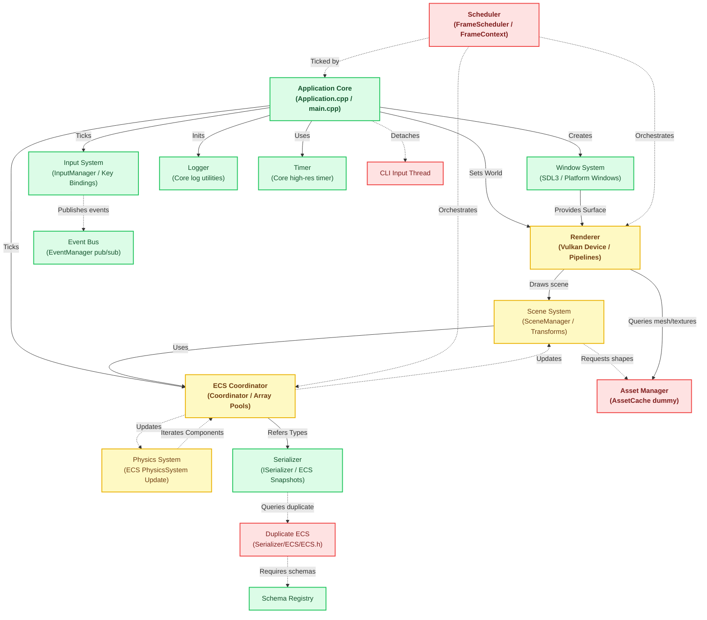

# Subsystem Relationship Graph

This document provides a visual mapping of the engine architecture, detailing subsystem boundaries, dependencies, communication methods, and system health status.

---

## 📊 Subsystem Relationship Diagram

The diagram below shows how control and data flow through the engine. 

* **Solid Arrows ($\rightarrow$)** denote compile-time `#include` dependencies.
* **Dashed Arrows ($-\rightarrow$)** denote runtime pointers, references, or message-passing.
* Nodes are color-coded by their stability and maturity status:
  * **Green (Stable)**: Mature implementations, clean APIs, no known structural issues.
  * **Yellow (Fragile / Partial)**: Working systems containing architectural debt or mixed boundaries.
  * **Red (Prototype / Critical Risk)**: Temporary mock implementations, skeletal headers, or severe structural mismatches.

---

## 📈 Status Summary

* **Logger, Timer, Event Bus, Window System, Input System** are healthy and ready for v0.2 platform bindings.
* **Renderer & Scene Systems** work but suffer from cross-boundary leakages (e.g. Renderer directly polling transforms while Scene node hierarchies duplicate Transform states).
* **Asset Manager & Scheduler** are critical blockers. The Asset Manager has no database backend (acts as a stub), and the Scheduler has zero scheduling implementation, resulting in hardcoded sequential game loop execution.
* **Serializer** works correctly in isolation but is completely decoupled from the active gameplay ECS, depending instead on duplicate class declarations.
