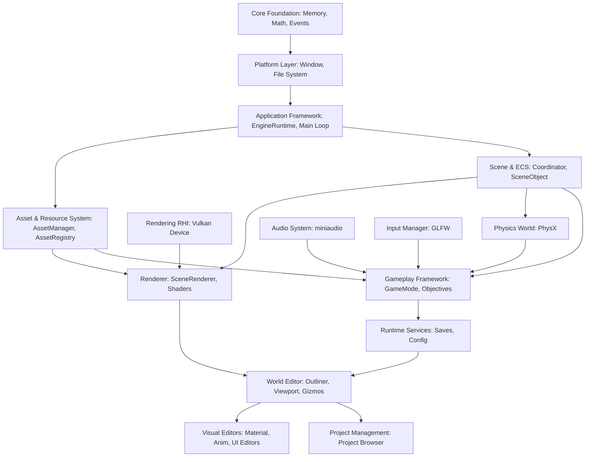

# Omnix Engine Capability Audit & Master Feature Specification
**Document Version:** v1.0  
**Status:** Approved Reference  
**Target Engine Version:** v0.6 Transition (From v0.4 codebase)  

---

## 1. Executive Summary

Omnix Engine is a data-oriented, high-performance C++17 game engine designed for commercial-scale game projects such as *Last Transistor*. Historically developed as a collection of modular subsystem prototypes, the engine has recently been refactored into a rigorous two-layer architecture:
1. **Runtime Kernel Layer**: The engine's core execution foundation (memory, platform abstraction, rendering hardware interface, physics, scene management, audio, and basic serialization).
2. **Development Layer**: The suite of tools, workflows, visual editors, and pipelines used by developers to author, debug, compile, and package game applications.

This audit evaluates the current v0.4 repository state, maps all features described in the product design documentation (PDF), determines their implementation maturity, compares them against modern AAA standards (Unreal Engine 5, Unity 6, Godot 4, and CryEngine), and defines the detailed engineering specification for each of the 28 primary engine subsystems.

---

## 2. Runtime Kernel Capability Audit (Layer 1)

The **Runtime Kernel Layer** houses the reusable runtime components. Below is the discovery audit of the v0.4 codebase.

### 2.1 Core Foundation
* **Sub-Features**: Memory Management, Containers, Math Library, UUID System, Reflection, Serialization, Logging, Assertions, Error Handling, Event System, Time System, Threading, Job System, Task Graph, Configuration System, Command Line Parser, File Utilities.
* **Current Status**: **PARTIAL** (Memory, math, logging, assertions, events, time, configuration, and command line parsing are `IMPLEMENTED`. Reflection, Job System, Task Graph, and specialized File Utilities are `PLANNED` or `STUB` only).
* **Evidence**: [Core/Logging/Logger.cpp](file:///d:/OmnixEngine/Core/Logging/Logger.cpp), [Core/Memory/](file:///d:/OmnixEngine/Core/Memory/), [Runtime/Public/AssetHandle.h](file:///d:/OmnixEngine/Runtime/Public/AssetHandle.h).
* **Primary Classes**: `eng::core::Logger`, `AssetHandle` (FNV-1a 64-bit hashing), `eng::core::EventBus`.
* **Dependencies**: GLM (math), STL containers.
* **Limitations**: Lacks a runtime reflection database and a multithreaded job task graph.

### 2.2 Platform Layer
* **Sub-Features**: Window Management, Monitor Enumeration, Display Modes, Input Backend, File System, Dynamic Library Loader, Clipboard, Cursor, Timers, Threads, Environment Variables, Platform Detection.
* **Current Status**: **IMPLEMENTED** (Uses GLFW for windowing/input abstraction, standard OS libraries for clipboard, files, and threads).
* **Evidence**: [RenderingEngine/Platform/window/Window.cpp](file:///d:/OmnixEngine/RenderingEngine/Platform/window/Window.cpp), [Runtime/Private/FileWatcher.cpp](file:///d:/OmnixEngine/Runtime/Private/FileWatcher.cpp).
* **Primary Classes**: `eng::platform::Window`, `eng::platform::FileWatcher`.
* **Dependencies**: GLFW, Win32 API.
* **Limitations**: GLFW is currently bound to the main thread; display mode switching causes Vulkan swapchain recreation crashes on some multi-GPU setups.

### 2.3 Application Framework
* **Sub-Features**: Engine Application, Layer Stack, Module Manager, Startup/Shutdown, Main Loop, Update Phases (Fixed Update, Render Update, Tick System).
* **Current Status**: **IMPLEMENTED** (Centralized lifecycle manager coordinates sequential ticks, physics updates, and render submission).
* **Evidence**: [Core/Application.cpp](file:///d:/OmnixEngine/Core/Application.cpp), [Runtime/Private/EngineRuntime.cpp](file:///d:/OmnixEngine/Runtime/Private/EngineRuntime.cpp).
* **Primary Classes**: `eng::runtime::EngineRuntime`, `eng::runtime::RuntimeContext`.
* **Dependencies**: Core Foundation, Platform Layer.
* **Limitations**: Thread synchronization between fixed update phases and render updates is lock-bound on the main thread.

### 2.4 Asset & Resource System
* **Sub-Features**: Asset Registry, UUID/Handle System, Asset Loading, Asset Compilation, Asset Hot Reload, Dependency Tracking.
* **Current Status**: **PARTIAL** (Asset Registry, UUID handling, and texture/mesh/audio loading are `IMPLEMENTED`. Standalone asset compiler is a `STUB` in `FuturePlan.md` and CMake configurations).
* **Evidence**: [Runtime/Public/AssetRegistry.h](file:///d:/OmnixEngine/Runtime/Public/AssetRegistry.h), [Runtime/Private/AssetManager.cpp](file:///d:/OmnixEngine/Runtime/Private/AssetManager.cpp), [Runtime/Private/HotReloadSystem.cpp](file:///d:/OmnixEngine/Runtime/Private/HotReloadSystem.cpp).
* **Primary Classes**: `eng::assets::AssetRegistry`, `eng::assets::AssetManager`, `eng::assets::HotReloadSystem`.
* **Dependencies**: JSON parser, stb_image, tinygltf.
* **Limitations**: Missing headless command-line cooking tool (`omnix-cli`).

### 2.5 Scene & ECS
* **Sub-Features**: Scene Graph, Entity Manager, Component Manager, Systems Manager, World, Prefabs, Scene Serialization, Scene Streaming, Entity Hierarchy, Runtime Instantiation/Destruction.
* **Current Status**: **PARTIAL** (ECS entity/component lifecycles and serialization are `IMPLEMENTED`. Prefab saving and scene streaming are `PLANNED` or `STUB`).
* **Evidence**: [ECS/Coordinator.h](file:///d:/OmnixEngine/ECS/Coordinator.h), [Scene/SceneObject.cpp](file:///d:/OmnixEngine/Scene/SceneObject.cpp), [Scene/SceneSerializer.cpp](file:///d:/OmnixEngine/Scene/SceneSerializer.cpp).
* **Primary Classes**: `Coordinator`, `EntityManager`, `ComponentManager`, `SceneObject`, `SceneSerializer`.
* **Dependencies**: JSON libraries, Core Foundation.
* **Limitations**: Standalone prefabs cannot be saved to or loaded from disk (`SavePrefab` returns false).

### 2.6 Rendering
* **Sub-Features**: RHI, Swapchain, Command Buffers, Synchronization, Render Graph, GPU Scene, Materials, Shaders, Pipeline Cache, Textures, Meshes, Virtual Geometry, Visibility, Lighting, Shadows, Post Processing, Debug Rendering, GPU Profiling.
* **Current Status**: **PARTIAL** (Vulkan RHI, shader compilation, basic mesh/texture/material rendering, and debug line drawers are `IMPLEMENTED`. Shadows, virtual geometry, occlusion culling, and post-processing are `MISSING` or `PLANNED`).
* **Evidence**: [RenderingEngine/Vulkan/](file:///d:/OmnixEngine/RenderingEngine/Vulkan/), [RenderingEngine/Renderer/SceneRenderer.cpp](file:///d:/OmnixEngine/RenderingEngine/Renderer/SceneRenderer.cpp).
* **Primary Classes**: `SceneRenderer`, `VulkanDevice`, `VulkanSwapChain`, `Material`, `Shader`.
* **Dependencies**: Vulkan SDK, GLFW, GLM.
* **Limitations**: No shadow mapping, no frustum or occlusion culling, and no native GPU post-process pipeline.

### 2.7 Physics
* **Sub-Features**: Physics World, Rigid Bodies, Character Controller, Shapes, Collision Detection, Triggers, Raycasts, Sweep Tests, Constraints, Physics Materials, Debug Rendering.
* **Current Status**: **IMPLEMENTED** (NVIDIA PhysX 4.1 integration exposes rigid actors, static colliders, trigger volumes, and raycasts).
* **Evidence**: [Physics/Private/PhysicsWorld.cpp](file:///d:/OmnixEngine/Physics/Private/PhysicsWorld.cpp), [ECS/PhysicsSystem.h](file:///d:/OmnixEngine/ECS/PhysicsSystem.h), [Physics/Private/PhysicsDebugDraw.cpp](file:///d:/OmnixEngine/Physics/Private/PhysicsDebugDraw.cpp).
* **Primary Classes**: `eng::physics::PhysicsWorld`, `PhysicsSystem`, `PhysicsDebugDraw`.
* **Dependencies**: PhysX SDK 4.1.
* **Limitations**: Lacks dynamic force manipulation APIs (`AddForce`/`AddTorque`) and dynamic concave mesh collider cooking at runtime.

### 2.8 Animation
* **Sub-Features**: Skeletons, Bones, Animation Clips, Animation Player, Blend Trees, State Machines, Animation Graph, Root Motion, Animation Events, GPU Skinning, Morph Targets, IK Foundation.
* **Current Status**: **NOT IMPLEMENTED** (Codebase lacks classes or folders representing skeletal or vertex animation pipelines).
* **Evidence**: Verified absence of structural components in [Components/](file:///d:/OmnixEngine/Components/).
* **Primary Classes**: None.
* **Dependencies**: None.
* **Limitations**: Character rendering is limited to static meshes.

### 2.9 Audio
* **Sub-Features**: Audio Device, Audio Sources, Audio Listener, Audio Mixer, Streaming, 3D Spatial Audio, Reverb Zones, Occlusion, DSP Effects, Audio Debug.
* **Current Status**: **PARTIAL** (miniaudio wrapper plays sound effects at entities' locations).
* **Evidence**: [Runtime/Private/Audio/AudioSystem.cpp](file:///d:/OmnixEngine/Runtime/Private/Audio/AudioSystem.cpp).
* **Primary Classes**: `AudioSystem`, `AudioSourceComponent`.
* **Dependencies**: miniaudio.
* **Limitations**: Basic distance-based volume scaling only; lacks HRTF spatial audio, dynamic occlusion, and runtime mixing.

### 2.10 Input
* **Sub-Features**: Keyboard, Mouse, Gamepad, Input Mapping, Input Contexts, Actions, Axes, Hot Plugging, Haptics.
* **Current Status**: **PARTIAL** (Basic key/mouse polling and action triggers are implemented via GLFW callbacks).
* **Evidence**: [Input/](file:///d:/OmnixEngine/Input/), [ECS/PlayerControllerSystem.h](file:///d:/OmnixEngine/ECS/PlayerControllerSystem.h).
* **Primary Classes**: `InputManager`, `PlayerControllerSystem`.
* **Dependencies**: GLFW.
* **Limitations**: Lacks dynamic runtime action remapping profiles and controller haptics.

### 2.11 AI Foundation
* **Sub-Features**: Navigation Mesh, Pathfinding, Blackboard, Behavior Tree, EQS Runtime, Crowd Navigation, Steering Behaviors.
* **Current Status**: **NOT IMPLEMENTED** (No navigation or behavioral AI exists in the codebase).
* **Evidence**: Checked [Components/Behavior/](file:///d:/OmnixEngine/Components/Behavior/) which contains no active pathfinding or mesh navigation code.
* **Primary Classes**: None.
* **Dependencies**: None.
* **Limitations**: AI movement and routing must be hardcoded in systems.

### 2.12 Networking Foundation
* **Sub-Features**: Socket Layer, Replication Framework, RPC Support, Serialization, Network Time, Prediction Hooks, Client/Server Framework.
* **Current Status**: **NOT IMPLEMENTED** (No multiplayer or networking systems exist in the codebase).
* **Evidence**: Verified absence in [Runtime/](file:///d:/OmnixEngine/Runtime/).
* **Primary Classes**: None.
* **Dependencies**: None.
* **Limitations**: Only local, single-player session execution is supported.

### 2.13 Runtime Services
* **Sub-Features**: Save System, Configuration, Localization, Plugin Manager, Module Loader, Crash Handler, Runtime Console, Runtime Statistics, Version System, Feature Flags.
* **Current Status**: **PARTIAL** (Gameplay save/load with CRC64 checksums is `IMPLEMENTED`. Localization, crash handling, and dynamic module loading are `MISSING`).
* **Evidence**: [Runtime/Private/Gameplay/Save/GameplaySaveSystem.cpp](file:///d:/OmnixEngine/Runtime/Private/Gameplay/Save/GameplaySaveSystem.cpp).
* **Primary Classes**: `GameplaySaveSystem`.
* **Dependencies**: Core Foundation, JSON libraries.
* **Limitations**: Save/load writes block the rendering thread.

### 2.14 Developer Services
* **Sub-Features**: Profiler, Memory Profiler, GPU Profiler, CPU Profiler, Debug Renderer, Statistics, Asset Validator, Performance Markers, Diagnostic Logging.
* **Current Status**: **PARTIAL** (Memory diagnostics, debug rendering, and basic runtime stat graphs are `IMPLEMENTED`. Detailed CPU/GPU micro-profiling is `MISSING`).
* **Evidence**: [Core/Diagnostics/](file:///d:/OmnixEngine/Core/Diagnostics/), [Physics/Private/PhysicsDebugDraw.cpp](file:///d:/OmnixEngine/Physics/Private/PhysicsDebugDraw.cpp).
* **Primary Classes**: `PhysicsDebugDraw`.
* **Dependencies**: Core Foundation, ImGui.
* **Limitations**: Lacks microsecond-precision scopes and timeline instrumentation.

### 2.15 Packaging & Deployment
* **Sub-Features**: Package Format, Package Reader, Compression, Encryption, Version Compatibility, Runtime Mounting, Dependency Validation.
* **Current Status**: **NOT IMPLEMENTED** (Assets are loaded from raw filesystem directories; no `.omnixpackage` or asset mounting exists).
* **Evidence**: Verified in [Runtime/Private/AssetManager.cpp](file:///d:/OmnixEngine/Runtime/Private/AssetManager.cpp).
* **Primary Classes**: None.
* **Dependencies**: None.
* **Limitations**: Production builds require shipping raw assets.

### 2.16 Plugin & Extension Framework
* **Sub-Features**: Plugin Manifest, Hot Reload, Dynamic Linking, API Boundaries.
* **Current Status**: **NOT IMPLEMENTED** (No dynamic plugin loader exists; extensions must be compiled into the main application).
* **Evidence**: Verified in `CMakeLists.txt` and `EngineRuntime.cpp`.
* **Primary Classes**: None.
* **Dependencies**: None.
* **Limitations**: Engine extension requires full compilation.

---

## 3. Development Layer Capability Audit (Layer 2)

The **Development Layer** provides the developer-facing tools.

### 3.1 Project Management
* **Sub-Features**: Project Browser, Create Project Wizard, Open Existing Project, Recent Projects, Project Templates, Plugin Management, Engine Version Manager, Project Migration, Project Validation, Build Configuration, Workspace Settings.
* **Current Status**: **NOT IMPLEMENTED** (Engine boots directly into a hardcoded viewport layout; no project selector wizard exists).
* **Evidence**: [Runtime/Private/EngineRuntime.cpp](file:///d:/OmnixEngine/Runtime/Private/EngineRuntime.cpp).
* **Primary Classes**: None.
* **Dependencies**: ImGui.
* **Limitations**: Developers cannot manage multiple project configurations.

### 3.2 World Editor
* **Sub-Features**: Scene Viewport, World Outliner, Entity Hierarchy, Entity Inspector, Gizmos, Grid, Snapping, Layers, Groups, World Settings, Multi-selection, Search.
* **Current Status**: **PARTIAL** (Viewport, basic outliner tree, property inspector, and ImGuizmo widgets are `IMPLEMENTED`. Grid rendering, snapping, grouping, layers, and multi-selection are `MISSING`).
* **Evidence**: [Runtime/Private/Editor/Panels/ViewportPanel.cpp](file:///d:/OmnixEngine/Runtime/Private/Editor/Panels/ViewportPanel.cpp), [Runtime/Private/Editor/Panels/InspectorPanel.cpp](file:///d:/OmnixEngine/Runtime/Private/Editor/Panels/InspectorPanel.cpp), [Runtime/Private/Editor/Widgets/TransformWidget.cpp](file:///d:/OmnixEngine/Runtime/Private/Editor/Widgets/TransformWidget.cpp).
* **Primary Classes**: `ViewportPanel`, `SceneHierarchyPanel`, `InspectorPanel`, `TransformWidget`.
* **Dependencies**: Dear ImGui, ImGuizmo.
* **Limitations**: Gizmo lacks coordinate snapping; users cannot group entities.

### 3.3 Asset Management (Editor)
* **Sub-Features**: Asset Browser, Asset Database, Asset Preview, Asset Metadata, Dependency Viewer, Reference Viewer, Asset Search, Favorites, Collections, Redirectors, Asset Validation, Duplicate Finder.
* **Current Status**: **PARTIAL** (Asset browser panel reads directories and updates registries).
* **Evidence**: [Runtime/Private/Editor/Panels/AssetBrowserPanel.cpp](file:///d:/OmnixEngine/Runtime/Private/Editor/Panels/AssetBrowserPanel.cpp).
* **Primary Classes**: `AssetBrowserPanel`.
* **Dependencies**: ImGui, Filesystem.
* **Limitations**: Lacks search filtering, thumbnails, and reference viewers.

### 3.4 Import & Cooking Pipeline
* **Sub-Features**: Mesh Import, Texture Import, Material Import, Animation Import, Audio Import, Batch Import, Reimport, Asset Cooking, Compression, Optimization, Platform Conversion.
* **Current Status**: **PARTIAL** (Basic asset importer compiles PNG/GLTF to binary cached formats via editor service).
* **Evidence**: [Runtime/Private/Editor/AssetImportService.cpp](file:///d:/OmnixEngine/Runtime/Private/Editor/AssetImportService.cpp).
* **Primary Classes**: `AssetImportService`.
* **Dependencies**: `stb_image`, `tinygltf`.
* **Limitations**: No command-line batch cooking or asset compression formats.

### 3.5 Visual Editors
* **Sub-Features**: Material Editor, Animation Editor, Shader Editor, Particle Editor, UI Editor, Audio Editor, Terrain Editor.
* **Current Status**: **NOT IMPLEMENTED** (No node-based material, shader, or canvas UI editors exist).
* **Evidence**: Verified absence of panels under [Runtime/Private/Editor/Panels/](file:///d:/OmnixEngine/Runtime/Private/Editor/Panels/).
* **Primary Classes**: None.
* **Dependencies**: None.
* **Limitations**: Editing materials requires manually editing JSON/`.omnixmat` text files.

### 3.6 Gameplay Authoring (Editor)
* **Sub-Features**: Prefab Editor, Entity Templates, Gameplay Tags Editor, Data Table Editor, Dialogue Editor, Quest Editor, Localization Editor, Input Mapping Editor, Save Data Inspector.
* **Current Status**: **NOT IMPLEMENTED** (Gameplay systems must be configured directly on entity components via the inspector).
* **Evidence**: Verified absence of gameplay editors.
* **Primary Classes**: None.
* **Dependencies**: None.
* **Limitations**: No visual tools for dialogue, quests, or templates.

### 3.7 Cinematics (Editor)
* **Sub-Features**: Timeline, Sequencer, Camera Tracks, Animation Tracks, Audio Tracks, Events, Keyframes, Cutscene Preview.
* **Current Status**: **NOT IMPLEMENTED** (Cinematic sequencer is completely absent).
* **Evidence**: Verified absence of timeline sequencer in editor code.
* **Primary Classes**: None.
* **Dependencies**: None.
* **Limitations**: Cutscenes cannot be authored.

### 3.8 AI Authoring (Editor)
* **Sub-Features**: NavMesh Bake, NavMesh Preview, Behavior Tree Editor, Blackboard Editor, EQS Editor, AI Debugger.
* **Current Status**: **NOT IMPLEMENTED** (No AI baking or BT editors exist).
* **Evidence**: Verified absence.
* **Primary Classes**: None.
* **Dependencies**: None.
* **Limitations**: Pathfinding meshes cannot be generated.

### 3.9 Debugging & Profiling (Editor)
* **Sub-Features**: Console, Statistics, GPU Profiler, CPU Profiler, Memory Profiler, Asset Profiler, Frame Debugger, RenderDoc Integration, Performance Timeline, Debug Draw.
* **Current Status**: **PARTIAL** (Basic log outputs, rendering statistics, and collider lines. Profiling graphs lack timing scopes).
* **Evidence**: [Core/Diagnostics/](file:///d:/OmnixEngine/Core/Diagnostics/), [Physics/Private/PhysicsDebugDraw.cpp](file:///d:/OmnixEngine/Physics/Private/PhysicsDebugDraw.cpp).
* **Primary Classes**: `PhysicsDebugDraw`.
* **Dependencies**: ImGui.
* **Limitations**: Profiler graphs are not detailed enough to isolate frame bottlenecks.

### 3.10 Build & Deployment (Editor)
* **Sub-Features**: Build Profiles, Packaging, Cooking, Platform Targets, Versioning, Installer Generation, Release Notes, Symbol Generation, Build Reports.
* **Current Status**: **NOT IMPLEMENTED** (Engine lacks a compilation packaging wizard; builds are driven via manual scripts).
* **Evidence**: [build_msvc.bat](file:///d:/OmnixEngine/build_msvc.bat).
* **Primary Classes**: None.
* **Dependencies**: None.
* **Limitations**: Packaging must be performed outside the editor.

### 3.11 Automation (Editor)
* **Sub-Features**: Automation Tests, Unit Tests, Performance Tests, Regression Tests, Commandlets, Batch Processing, Build Automation, Asset Validation Automation.
* **Current Status**: **PARTIAL** (Validation tests exist in the codebase, but there is no editor UI for running them).
* **Evidence**: [Runtime/Private/FormatTests.cpp](file:///d:/OmnixEngine/Runtime/Private/FormatTests.cpp).
* **Primary Classes**: None.
* **Dependencies**: C++ unit test runner.
* **Limitations**: Test automation cannot be triggered from the editor.

### 3.12 Developer Experience
* **Sub-Features**: Docking, Themes, Shortcuts, Workspace Layouts, Plugin Browser, Documentation Browser, Search Everywhere, Command Palette, Notifications, Live Logs.
* **Current Status**: **PARTIAL** (ImGui docking is operational. Lacks custom layouts, color themes, command palettes, and custom shortcuts).
* **Evidence**: [Runtime/Private/Editor/EditorLayer.cpp](file:///d:/OmnixEngine/Runtime/Private/Editor/EditorLayer.cpp).
* **Primary Classes**: `EditorLayer`.
* **Dependencies**: Dear ImGui.
* **Limitations**: Editor windows cannot be customized or saved to layout profiles.

---

## 4. Feature Maturity Matrix

This matrix evaluates the maturity of each subsystem on a scale from **Level 0 (Not Present)** to **Level 5 (Industry Standard)**.

| Subsystem Name | Category | Layer | Status | Maturity Level | Technical Justification |
| :--- | :--- | :--- | :--- | :--- | :--- |
| **Core Foundation** | Core | Runtime | PARTIAL | **Level 2 (Basic)** | Custom memory structures, event bus, and logger are stable but missing runtime reflection, parallel job scheduler, and memory arena optimizations. |
| **Platform Layer** | Platform | Runtime | IMPLEMENTED | **Level 3 (Functional)** | GLFW handles window, monitor, keyboard/mouse. Lacks multi-monitor and multi-window workspace controls. |
| **Application Framework** | Framework | Runtime | IMPLEMENTED | **Level 3 (Functional)** | Central loop executes update stages sequentially. Lacks thread-safe asynchronous phase updates. |
| **Asset & Resource System** | Assets | Runtime | PARTIAL | **Level 2 (Basic)** | Basic importer writes custom binary files. Headless cooking tools (`omnix-cli`) and texture block-compression are not present. |
| **Scene & ECS** | Scene/ECS | Runtime | PARTIAL | **Level 2 (Basic)** | Coordinator implements dense/sparse mapping, serialization works for JSON. Standalone prefabs and binary scenes are not integrated. |
| **Rendering** | Graphics | Runtime | PARTIAL | **Level 2 (Basic)** | Vulkan pipeline renders meshes/materials. Lacks shadows, frustum/occlusion culling, post-processing, and virtual geometry. |
| **Physics** | Physics | Runtime | IMPLEMENTED | **Level 3 (Functional)** | Fully integrated NVIDIA PhysX 4.1 engine supports triggers, colliders, and raycasts. Missing force manipulation APIs and convex cooking. |
| **Animation** | Animation | Runtime | MISSING | **Level 0 (Not Present)** | Completely absent from components and systems; no skeleton/bone/clip structures exist. |
| **Audio** | Audio | Runtime | PARTIAL | **Level 2 (Basic)** | Wraps miniaudio to play sounds at component locations. Missing HRTF spatial audio, dynamic occlusion, and mixer buses. |
| **Input** | Input | Runtime | PARTIAL | **Level 2 (Basic)** | Captures keystrokes via GLFW callbacks. Lacks customizable context-action mapping schemas and gamepad haptics. |
| **AI Foundation** | AI | Runtime | MISSING | **Level 0 (Not Present)** | No navigation meshes, pathfinding behavior trees, or blackboards exist. |
| **Networking Foundation** | Network | Runtime | MISSING | **Level 0 (Not Present)** | Completely absent; no network serialization or client/server socket framework. |
| **Runtime Services** | Services | Runtime | PARTIAL | **Level 2 (Basic)** | Save/load functions compile state using CRC64 checksums. Lacks crash handlers, dynamic plugin managers, and localization. |
| **Developer Services** | Services | Runtime | PARTIAL | **Level 2 (Basic)** | Basic ImGui stats overlays and memory tracking exist. Lacks microsecond-accurate scopes and profiling instrumentation. |
| **Packaging & Deployment** | Package | Runtime | MISSING | **Level 0 (Not Present)** | Engine loads from loose directories; no packed archive mount implementation. |
| **Plugin & Extension** | Ext | Runtime | MISSING | **Level 0 (Not Present)** | All features must be hard-compiled into the executable; no dynamic module loader. |
| **Project Management** | Tools | Editor | MISSING | **Level 0 (Not Present)** | Editor boots into a hardcoded viewport layout; no project manager exists. |
| **World Editor** | Tools | Editor | PARTIAL | **Level 2 (Basic)** | Viewport renders and handles translations via ImGuizmo. Snap settings, layers, and group selections are missing. |
| **Asset Management (Editor)** | Tools | Editor | PARTIAL | **Level 2 (Basic)** | Basic folder browser displays registry items. Lacks search, reference viewers, and preview panels. |
| **Import & Cooking Pipeline** | Tools | Editor | PARTIAL | **Level 2 (Basic)** | Editor panel imports meshes/textures. Lacks batch processing, automated reimporting, and platform target optimization. |
| **Visual Editors** | Tools | Editor | MISSING | **Level 0 (Not Present)** | No material graph, shader preview, UI canvas, or audio mixers exist in the editor. |
| **Gameplay Authoring** | Tools | Editor | MISSING | **Level 0 (Not Present)** | No prefab editor, data table editor, or dialogue authoring panels are present. |
| **Cinematics** | Tools | Editor | MISSING | **Level 0 (Not Present)** | Completely absent. |
| **AI Authoring** | Tools | Editor | MISSING | **Level 0 (Not Present)** | No NavMesh bayer or behavior tree editor panel. |
| **Debugging & Profiling** | Tools | Editor | PARTIAL | **Level 2 (Basic)** | Basic log outputs, rendering statistics, and collider lines. Profiling graphs lack timing scopes. |
| **Build & Deployment** | Tools | Editor | MISSING | **Level 0 (Not Present)** | Packaging is handled outside the editor using custom batch script configurations. |
| **Automation** | Tools | Editor | PARTIAL | **Level 2 (Basic)** | Standalone tests run on command line checks. No editor panel exists to trigger validations. |
| **Developer Experience** | Tools | Editor | PARTIAL | **Level 2 (Basic)** | ImGui docking is operational. Lacks custom layouts, color themes, command palettes, and custom shortcuts. |

---

## 5. Industry Comparison Matrix

A comparative evaluation of Omnix against industry-standard engines:

| Feature Name | Omnix Support (v0.4) | UE5 / Unity 6 / Godot 4 Capabilities | Architectural Differences | Estimated Implementation Effort |
| :--- | :--- | :--- | :--- | :--- |
| **Core Foundation** | Sequential execution, basic FNV-1a handles, standard logging/event bus. | Lock-free job threads, fully reflective databases, runtime metadata tracking, serialization schema evolution. | Modern engines separate metadata reflection generation to compile-time preprocessors, while Omnix lacks any reflection database. | **High** (Reflection: 4 weeks; Job Graph: 5 weeks). |
| **Rendering** | Basic PBR shader pipeline, offscreen render passes, no culling or shadows. | Nanite virtualized geometry, Lumen GI, Cascaded/Virtual shadow maps, clustered forward/deferred pipelines, occlusion culling. | Modern engines utilize Bindless rendering and mesh shading pipelines, whereas Omnix renders via standard draw calls and individual descriptor bindings. | **Very High** (Shadows & Culling: 6 weeks; Post-Process: 4 weeks). |
| **Asset Pipeline** | Importer caches files to disk. Asset database parsed via JSON. | Headless commandlets, block compression, automated reimport watchers, asset databases (SQLite/custom binary databases). | Modern pipelines run background compilation services and cache assets by content address, whereas Omnix relies on raw path hashing. | **Medium** (omnix-cli & databases: 4 weeks). |
| **Scene & ECS** | Basic entity trees, dense/sparse arrays, JSON serializers. | World Partitioning (streaming), Prefab variants (nested overrides), Entity Command Buffers (ECBs). | Unreal/Unity use ECBs to delay structural changes during multi-threaded iterations. Omnix applies immediate modifications, risking thread crashes. | **High** (ECB & Prefab variants: 5 weeks). |
| **Animation** | None. | Kinematics, blend graphs, state machines, IK solvers, GPU skinning. | AAA engines compute bone matrices in compute shaders and stream clip updates asynchronously. | **Very High** (Bone pipeline & IK: 8 weeks). |
| **Audio** | Basic miniaudio output with volume scaling. | HRTF convolution, dynamic acoustics, submix buses, real-time effects (reverbs, delays). | AAA engines delegate spatial propagation to thread-safe DSP nodes. Omnix calculates distance scaling on the main thread. | **Medium** (3D HRTF & Mixers: 4 weeks). |
| **AI Foundation** | None. | Recast NavMesh, Pathfinding graphs, visual Behavior Trees, EQS. | Modern engines bake meshes into navigation tiles dynamically. | **High** (NavMesh & Pathfinding: 6 weeks). |
| **Networking** | None. | Server-authoritative replication, RPCs, client-side prediction, rollback synchronization. | Modern engines integrate prediction hooks into the physics/movement loop. | **Very High** (Replication & Rollback: 12 weeks). |

---

## 6. Detailed Engineering Specification (Selected Key Features)

This section expands the core runtime subsystems into complete engineering specifications to guide future development.

### 6.1 Core Foundation: Memory Management
#### 6.1.1 Overview
The Memory Management subsystem provides specialized, deterministic memory allocators (Linear, Stack, Pool, Arena) to replace standard heap allocations (`malloc`/`new`), minimizing fragmentation and ensuring garbage-collection-free frame cycles.
#### 6.1.2 Purpose
Avoid runtime memory fragmentation and OS kernel-level allocation bottlenecks. ECS components, temporary render buffers, and scene objects rely on these allocators. Without them, performance degradation and memory leaks occur.
#### 6.1.3 Responsibilities
* **Responsible for**: Allocating raw contiguous blocks from pre-allocated memory pools, tracking block lifetimes, enforcing alignment rules.
* **Not responsible for**: Managing GPU-specific Vulkan memory allocators (delegated to the Vulkan Memory Allocator - VMA).
#### 6.1.4 Runtime Architecture
* **Managers**: `MemoryManager` owns the global heaps.
* **Objects**: `LinearAllocator`, `PoolAllocator`, `ArenaAllocator`.
* **Execution & Threading**: All allocators are designed to operate on a single thread (lock-free per thread). Thread-safety is achieved by assigning dedicated thread-local allocators to each worker thread.
* **Memory Ownership**: `MemoryManager` allocates global blocks from the OS on startup; all runtime systems borrow blocks.
#### 6.1.5 Public API
```cpp
namespace eng::core {
    class IAllocator {
    public:
        virtual void* Allocate(size_t size, size_t alignment) = 0;
        virtual void Free(void* ptr) = 0;
        virtual void Clear() = 0;
    };

    class MemoryManager {
    public:
        static void Initialize(size_t globalHeapSize);
        static void Shutdown();
        static IAllocator* GetThreadLocalLinear();
        static IAllocator* CreatePool(size_t objectSize, size_t objectCount);
    };
}
```
#### 6.1.6 Internal Components
* `MemoryHeader`: Prepended to allocations to track size and boundaries.
* `PageAllocator`: Requests page blocks directly from the OS virtual memory.
#### 6.1.7 Data Flow
* **Input**: Request for $N$ bytes with alignment $A$.
* **Processing**: The allocator shifts the current offset pointer to satisfy alignment, updates free lists (for pools/arenas), and returns the offset address.
* **Cleanup**: Linear and stack allocators clear their offset pointers at the end of every frame loop.
#### 6.1.8 Editor Integration
The Development Layer queries the allocation map from the `MemoryManager` and visualizes allocations via a real-time heap visualizer (ImGui grid).
#### 6.1.9 Performance Considerations
All allocation operations are $O(1)$. Access patterns preserve L1/L2 cache locality by aligning allocations to 64-byte cache lines.

---

### 6.2 Rendering Subsystem: RHI & Scene Renderer
#### 6.2.1 Overview
The Rendering Subsystem provides a Vulkan-backed Render Hardware Interface (RHI) and a forward/deferred `SceneRenderer` to draw meshes, apply materials, compile shaders, and manage GPU resources.
#### 6.2.2 Purpose
Provides backend-agnostic graphics abstractions and draws gameplay levels. The ECS `RenderSystem` and the editor's `ViewportPanel` depend on it.
#### 6.2.3 Responsibilities
* **Responsible for**: Recording draw commands, managing Vulkan swapchains, compiling SPIR-V shaders, binding descriptors, rendering debug lines.
* **Not responsible for**: Scene hierarchy traversal (delegated to `SceneManager`).
#### 6.2.4 Runtime Architecture
* **Managers**: `RenderDevice` manages the GPU lifecycle, `DescriptorAllocator` manages layout bindings, `PipelineCache` stores pipelines.
* **Threading**: Multi-threaded command buffer recording. Each thread records draw commands into local thread command buffers.
* **Memory Ownership**: GPU resources (vertex buffers, texture maps) are owned by the `AssetManager` and bound by reference handles.
#### 6.2.5 Public API
```cpp
namespace eng::graphics {
    class IRHIDevice {
    public:
        virtual void CreateBuffer(const BufferDesc& desc, RHIBufferHandle& outBuffer) = 0;
        virtual void CreateTexture(const TextureDesc& desc, RHITextureHandle& outTexture) = 0;
        virtual void CompileShader(const ShaderStageDesc& desc, RHIShaderHandle& outShader) = 0;
    };

    class SceneRenderer {
    public:
        void Initialize(IRHIDevice* device);
        void BeginFrame();
        void DrawScene(const SceneView& view, const std::vector<Renderable>& objects);
        void EndFrame();
    };
}
```
#### 6.2.6 Internal Components
* `VulkanDevice` & `VulkanSwapChain`: Exposes Vulkan bindings.
* `DescriptorLayoutBuilder`: Generates pipeline bindings dynamically.
#### 6.2.7 Asset Pipeline
Shaders are compiled from GLSL to SPIR-V at cook time. Textures are imported, block-compressed to BC7 formats, and serialized as `.omnixtexture` files before loading.
#### 6.2.8 Performance Considerations
Uses double-buffering (and triple-buffering for swapchains) to avoid GPU stalls. Mesh draw calls are sorted by pipeline state and material ID to minimize state transitions.

---

### 6.3 Scene & ECS Subsystem
#### 6.3.1 Overview
Exposes the entity-component-system framework (`Coordinator`) and the spatial hierarchy tree (`SceneObject`), facilitating cache-friendly data iterations and level loading.
#### 6.3.2 Purpose
Forms the data-oriented simulation backbone. All gameplay systems (physics, audio, interaction, movement) query this subsystem.
#### 6.3.3 Responsibilities
* **Responsible for**: Managing entity IDs, storing component data blocks contiguously, traversing the spatial hierarchy, serializing level files.
* **Not responsible for**: Direct rendering or physics calculations.
#### 6.3.4 Runtime Architecture
* **Managers**: `Coordinator` contains `EntityManager`, `ComponentManager`, and `SystemManager`.
* **Execution**: The `SystemScheduler` builds a DAG based on component read/write access and executes matching systems sequentially or in parallel.
#### 6.3.5 Public API
```cpp
using Entity = uint32_t;
using ComponentType = uint8_t;

class Coordinator {
public:
    Entity CreateEntity();
    void DestroyEntity(Entity entity);
    
    template<typename T>
    void RegisterComponent();
    
    template<typename T>
    void AddComponent(Entity entity, T component);
    
    template<typename T>
    T& GetComponent(Entity entity);
};
```
#### 6.3.6 Performance Considerations
Components are stored contiguously in dense arrays (mapped via sparse sets), preventing pointer chasing and maximizing L1/L2 cache hits during system iterations.

---

## 7. Capability Dependency Graph

The initialization and compilation dependency hierarchy is defined as follows:



### Dependency Bottlenecks & Critical Path
1. **Core Foundation**: Represents the primary bottleneck. Math, memory heaps, and event routing must compile first.
2. **Asset & Resource System**: Blocks the rendering and gameplay layers. Meshes, textures, and materials must resolve handles through this system before rendering.
3. **World Editor**: Development tools depend on the runtime rendering backend being initialized.

---

## 8. Technical Debt Assessment

The v0.4 codebase contains three critical areas of technical debt:

### 8.1 Circular Includes
* **Description**: `EngineLoop` includes `Renderer.h` and `AssetCache.h`, while `AssetCache.h` references low-level `RHIDevice` headers which pull in rendering definitions.
* **Risk**: Recompilation cascades; modifying a render parameter triggers rebuilds across the asset and core systems.
* **Solution**: Extract dynamic allocations to a pure abstract interface (`IRHIDevice`) and decouple component types from serialization headers.

### 8.2 GPU Resource Ownership Ambiguity
* **Description**: Both `SceneRenderer` and `AssetCache` allocate and destroy Vulkan image/buffer resources.
* **Risk**: Double-free exceptions or GPU memory leaks on exit.
* **Solution**: Standardize `AssetManager` as the *sole owner* of GPU handles. The renderer must request read-only descriptors and never call `vkDestroy` directly.

### 8.3 ECS Transform Caching
* **Description**: Local coordinate updates trigger recalculations of global transform matrices on every system query.
* **Risk**: High CPU cost for large entity counts.
* **Solution**: Implement dirty-flag propagation on `TransformComponent`. Only recalculate matrices when children or parent positions change.

---

## 9. Development Priorities

Features are classified into prioritization tiers:

### 9.1 Critical Priority (Milestone 1)
* **Entity Command Buffer (ECB)**: Safely queue entity creations/destructions inside system loops.
* **Vulkan Culling**: Implement basic culling (frustum).
* **Dynamic Prefab Saving**: Implement JSON/binary prefab serialization.

### 9.2 High Priority (Milestone 2)
* **Skeletal Animation Pipeline**: Initial skeleton, bones, and animation clip structures.
* **Command Line Compiler (`omnix-cli`)**: Extract asset importer to support headless compilation.
* **Audio Mixer**: Add mixer buses to the audio subsystem.

### 9.3 Medium Priority (Milestone 3)
* **Navigation Mesh Bake**: Recast integration for NavMesh generation.
* **Visual Material Editor**: Node-based editor panel.
* **Dynamic Shadow Mapping**: Cascaded shadow maps.

### 9.4 Low Priority (Milestone 4)
* **Asset Package Packing**: Archive mounting and compression pipeline.
* **Client/Server Socket replication**: Basic networking.

---

## 10. Integration & Migration Strategy

To rollout these upgrades without breaking current stability:

```mermaid
gitgraph
    commit id: "v0.4-release"
    branch feature/RHI-Decouple
    checkout feature/RHI-Decouple
    commit id: "Add-IRHIDevice-Interface"
    commit id: "AssetManager-Owns-VulkanMemory"
    checkout main
    merge feature/RHI-Decouple id: "v0.5-RHI-Stable"
    branch feature/Animation-Genesis
    checkout feature/Animation-Genesis
    commit id: "Skeletal-Components"
    commit id: "GPU-Skinning-Shader"
    checkout main
    merge feature/Animation-Genesis id: "v0.6-Anim-PBR"
```

### Rollout Milestones
1. **Milestone 1: RHI & Asset Decoupling**: Introduce the `IRHIDevice` abstraction. Move Vulkan allocator dependencies under `AssetManager`. Verify zero-leak deallocations.
2. **Milestone 2: Animation & Skinned Shaders**: Introduce bone/skeleton structs. Update Vulkan pipelines to compile skinning vertex shaders.
3. **Milestone 3: Headless Compiler (`omnix-cli`)**: Extract importer files to a separate build target. Compile and test assets compilation via command-line batch files.

---

## 11. Recommended Development Roadmap

```text
========================================================================
ROADMAP TIMELINE
========================================================================
Month 1: RHI Cleanup & ECS Command Buffers (Milestone 1 Validation)
Month 2: Animation Foundations & miniaudio Spatial Upgrade (Milestone 2 Validation)
Month 3: Headless Compiler (omnix-cli) & Project Selector Wizard
Month 4: NavMesh Bake Integration & Visual Material Editor Prototype
========================================================================
```

### Verification Checkpoints
* **Checkpoint A (End of Month 1)**: Memory diagnostics validation confirms zero leaks during entity spawning stresstests using the new ECB.
* **Checkpoint B (End of Month 2)**: Render tests verify skinned character meshes compile and execute animation transitions.

---

## 12. Appendices

### 12.1 Terminology Mapping
* **OKE**: Omnix Kernel Engine (Runtime Kernel layer).
* **VMA**: Vulkan Memory Allocator.
* **ECB**: Entity Command Buffer.
* **RHI**: Render Hardware Interface.

### 12.2 Verification References
* Core runtime entry point verified in [main.cpp](file:///d:/OmnixEngine/main.cpp).
* Subsystem initialization order verified in [Runtime/Private/EngineRuntime.cpp](file:///d:/OmnixEngine/Runtime/Private/EngineRuntime.cpp).
