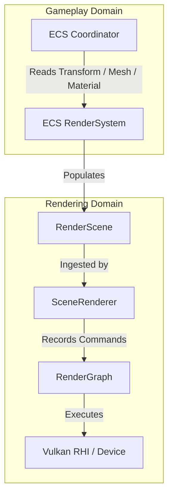
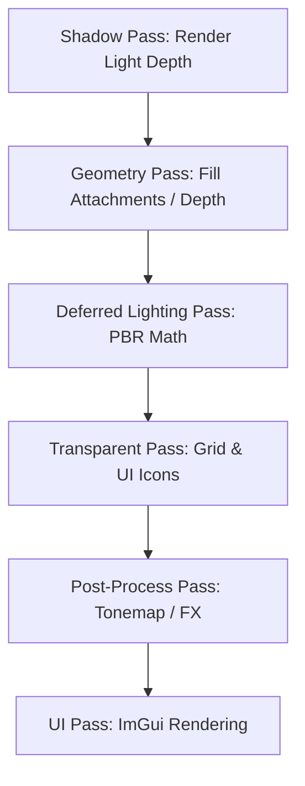
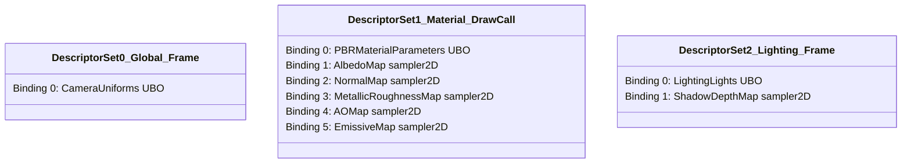
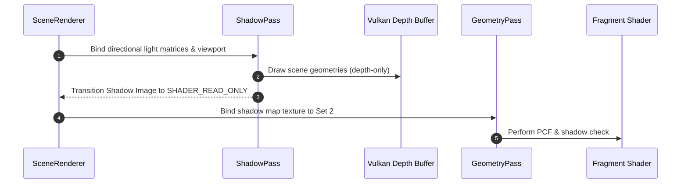

# 🌌 Radiance Rendering System v0.2 Technical Manual

Welcome to the unified technical manual for the **Radiance Rendering System (v0.2)** in the **Omnix Studio Engine**. This document consolidates all rendering design, render graphs, PBR material structures, lighting equations, viewport drawing systems, debug tools, and asset import rules into a single maintainable reference for future development.

---

## Table of Contents
1. [Architecture & Lifecycle](#1-architecture--lifecycle)
2. [Render Graph Pipeline](#2-render-graph-pipeline)
3. [PBR Material & Binding System](#3-pbr-material--binding-system)
4. [Lighting & Shadow Mapping](#4-lighting--shadow-mapping)
5. [Editor Viewport Rendering](#5-editor-viewport-rendering)
6. [Render Debug Views & Diagnostics](#6-render-debug-views--diagnostics)
7. [Asset Import Rendering Requirements](#7-asset-import-rendering-requirements)
8. [Troubleshooting & Debugging Guide](#8-troubleshooting--debugging-guide)

---

## 1. Architecture & Lifecycle

The **Radiance Renderer (v0.2)** is a hybrid forward/deferred rendering engine built on Vulkan. It is designed to run asynchronously, independent of the Entity Component System (ECS) simulation tick.



### 1.1 Decoupling from ECS
In v0.1, the renderer directly queried the ECS coordinator to find active entities, leading to dependency loops. In v0.2:
* **The separation is absolute**: The rendering module does not import `Coordinator.h` or know what an "Entity" is.
* **Ingestion Layer (`RenderScene`)**: An ECS-side `RenderSystem` (in the gameplay codebase) queries `TransformComponent`, `RenderableMeshComponent`, and `MaterialComponent` every frame. It packages these into a lightweight, ECS-agnostic `RenderScene` containing:
  ```cpp
  struct RenderItem {
      Mesh* mesh;
      Material* material;
      glm::mat4 transform;
      uint32_t entityID;
  };
  std::vector<RenderItem> items;
  ```
* **Decoupled API**: `SceneRenderer::drawFrame()` accepts a read-only reference to this `RenderScene`, keeping the GPU pipeline isolated from game state.

### 1.2 Engine Lifecycle Integration
The renderer lifecycle is driven sequentially by the main engine loop:
1. **RHI Initialization**: Configured in `EngineLoop::InitRenderer()`, which sets up `WindowWin32`, initializes the Vulkan instance, debug layers, physical/logical devices, swapchain, command pools, global descriptor sets, and pipeline layouts.
2. **Shader Initialization**: Shaders are loaded from compiled SPIR-V files inside `/shaders` and graphics pipelines are created.
3. **Asset Registration**: Mesh and texture assets are registered and cached on the GPU.
4. **Frame Ingestion & Render Loop**: Run every frame via `SceneRenderer::drawFrame()`.
5. **Teardown**: Executed in reverse order of creation. All pipelines, descriptor pools, command pools, offscreen images, depth attachments, buffer allocations, and frame synchronization objects are cleanly deleted before destroying the logical device and Vulkan instance.

### 1.3 Frame Lifecycle & Buffering
To maximize GPU utilization, the engine runs with **Double Buffering** (or Triple Buffering depending on swapchain configuration), supporting two frames in flight.

* **Fences & Semaphores**:
  * `inFlightFences[frameIndex]`: CPU-GPU sync. The CPU waits for the GPU to finish executing command buffers for this frame index before reusing resources (descriptor updates, command resets).
  * `imageAvailableSemaphores[frameIndex]`: GPU-GPU sync. Signals when the swapchain image has been acquired and is ready for color writing.
  * `renderFinishedSemaphores[frameIndex]`: GPU-GPU sync. Signals when rendering is complete and the swapchain image is ready for presentation.

* **Lifecycle Sequence**:
  ```cpp
  // 1. Wait for GPU to finish compiling previous execution of this frame index
  vkWaitForFences(device, 1, &inFlightFences[frameIndex], VK_TRUE, UINT64_MAX);
  vkResetFences(device, 1, &inFlightFences[frameIndex]);

  // 2. Acquire the next swapchain image
  uint32_t imageIndex;
  vkAcquireNextImageKHR(device, swapChain, UINT64_MAX, imageAvailableSemaphores[frameIndex], VK_NULL_HANDLE, &imageIndex);

  // 3. Reset the command pool for this frame (simultaneously resets all per-pass buffers)
  vkResetCommandPool(device, commandPools[frameIndex], 0);

  // 4. Update UBO data (camera matrix, lighting lists) for this frame
  UpdateUniformBuffers(frameIndex);

  // 5. Record passes via the Render Graph
  renderGraph.execute();

  // 6. Submit command buffers
  VkSubmitInfo submitInfo{};
  submitInfo.waitSemaphoreCount = 1;
  submitInfo.pWaitSemaphores = &imageAvailableSemaphores[frameIndex];
  submitInfo.signalSemaphoreCount = 1;
  submitInfo.pSignalSemaphores = &renderFinishedSemaphores[frameIndex];
  vkQueueSubmit(graphicsQueue, 1, &submitInfo, inFlightFences[frameIndex]);

  // 7. Present the swapchain image
  VkPresentInfoKHR presentInfo{};
  presentInfo.waitSemaphoreCount = 1;
  presentInfo.pWaitSemaphores = &renderFinishedSemaphores[frameIndex];
  presentInfo.pSwapChains = &swapChain;
  presentInfo.pImageIndices = &imageIndex;
  vkQueuePresentKHR(presentQueue, &presentInfo);
  ```

### 1.4 RHI Resource Management
* **Memory Allocations**: Handled via Vulkan Memory Allocator (VMA). All static geometry buffers (vertices and indices) and images (textures, shadow maps, offscreen targets) utilize VMA memory pools for optimal memory alignment and paging.
* **CPU-GPU Staging**: Modifying static data (e.g. uploading meshes or textures) uses temporary staging buffers allocated with `VMA_ALLOCATION_CREATE_HOST_ACCESS_SEQUENTIAL_WRITE_BIT`. Memory is mapped, data is written, and a transfer command is recorded to copy the data into high-performance device-local memory (`VK_MEMORY_PROPERTY_DEVICE_LOCAL_BIT`).

---

## 2. Render Graph Pipeline

The Radiance Render Graph abstracts the frame structure into modular, sequential passes. It provides clean synchronization and layout transitions between stages.



### 2.1 Render Pass Stages
1. **Shadow Pass (`PassID::Shadow` / Index 0)**:
   * Renders the scene from the directional light's perspective.
   * Outputs to a depth texture attachment (`m_ShadowDepthImage`).
   * Color attachments are disabled; only depth test and depth write are active.
2. **Geometry Pass (`PassID::Geometry` / Index 1)**:
   * Renders PBR geometries to fill color, normal, roughness-metallic, and entity ID targets.
   * If editor offscreen rendering is enabled, outputs are written to the offscreen multi-target framebuffers (`m_OffscreenFramebuffers`). Otherwise, outputs write directly to the swapchain framebuffer.
   * **Mandatory Depth Buffer**: Proper depth testing (`VkPipelineDepthStencilStateCreateInfo` with `depthTestEnable = VK_TRUE`) runs against `m_DepthImage` to handle 3D sorting correctly.
3. **Lighting Pass (`PassID::Lighting` / Index 2)**:
   * Computes PBR lighting equations per pixel. Samples G-buffer color, normals, roughness-metallic, and depth targets, applying directional, point, spot, and sky light calculations.
4. **Transparent Pass (`PassID::Transparent` / Index 3)**:
   * Renders transparent/translucent elements (e.g. spatial grids, editor 2D billboard icons, debug wireframes) over the solid geometries.
   * Depth writing is disabled (`depthWriteEnable = VK_FALSE`), but depth testing is kept active.
5. **Post-Process Pass (`PassID::PostProcess` / Index 4)**:
   * Performs HDR exposure adjustment, Reinhard tone-mapping, color correction, and anti-aliasing.
6. **UI Pass (`PassID::UI` / Index 5)**:
   * Transitions the swapchain image format to `VK_IMAGE_LAYOUT_PRESENT_SRC_KHR`.
   * Begins the UI render pass (`m_UIRenderPass`) with `loadOp = LOAD` and runs ImGui command drawers to composite the editor panels (scene tree, console, viewport window) over the final display.

### 2.2 Pass Synchronization & Layout Transitions
Synchronization between passes is handled via pipeline barriers (`vkCmdPipelineBarrier`) to avoid write-after-read hazards.

* **Example: Transitioning Offscreen Output for ImGui Sampling**:
  After writing the 3D scene offscreen, the offscreen image must be transitioned to a layout suitable for texture sampling inside ImGui:
  ```cpp
  VkImageMemoryBarrier barrier{};
  barrier.sType = VK_STRUCTURE_TYPE_IMAGE_MEMORY_BARRIER;
  barrier.oldLayout = VK_IMAGE_LAYOUT_COLOR_ATTACHMENT_OPTIMAL;
  barrier.newLayout = VK_IMAGE_LAYOUT_SHADER_READ_ONLY_OPTIMAL;
  barrier.srcAccessMask = VK_ACCESS_COLOR_ATTACHMENT_WRITE_BIT;
  barrier.dstAccessMask = VK_ACCESS_SHADER_READ_BIT;
  barrier.image = m_OffscreenImages[frameIndex];
  barrier.subresourceRange.aspectMask = VK_IMAGE_ASPECT_COLOR_BIT;
  barrier.subresourceRange.levelCount = 1;
  barrier.subresourceRange.layerCount = 1;

  vkCmdPipelineBarrier(cmd,
      VK_PIPELINE_STAGE_COLOR_ATTACHMENT_OUTPUT_BIT,
      VK_PIPELINE_STAGE_FRAGMENT_SHADER_BIT,
      0,
      0, nullptr,
      0, nullptr,
      1, &barrier
  );
  ```

---

## 3. PBR Material & Binding System

Radiance utilizes a Physically Based Rendering (PBR) metallic-roughness workflow matching the standard glTF model specification.

### 3.1 Material Pipeline & `.omnixmat` Format
Material definitions are stored on disk in JSON format as `.omnixmat` files:
```json
{
  "name": "MetalTexture",
  "blendMode": 0,
  "cullMode": 0,
  "depthTest": 1,
  "albedoTexturePath": "Assets/Textures/metal_albedo.png",
  "normalTexturePath": "Assets/Textures/metal_normal.png",
  "metallicRoughnessTexturePath": "Assets/Textures/metal_roughness.png",
  "aoTexturePath": "Assets/Textures/metal_ao.png",
  "emissiveTexturePath": "Assets/Textures/metal_emissive.png",
  "albedoColor": [1.0, 1.0, 1.0, 1.0],
  "metallicFactor": 1.0,
  "roughnessFactor": 0.8
}
```

* **Texture Fallback**: If a texture slot (like normal or AO) is empty in `.omnixmat`, the asset pipeline binds fallback 1x1 textures (e.g. flat purple `(0.5, 0.5, 1.0)` for normal maps, white `(1.0, 1.0, 1.0)` for albedo/AO) to maintain descriptor layout consistency.

### 3.2 Descriptor Sets Layout & Bindings
The shader pipeline layout uses three distinct descriptor sets bound at different frequencies to optimize performance.



#### Descriptor Set 0: Global Frame Data (Bound once per frame)
* **Binding 0**: `GlobalUBO` (Uniform Buffer)
  ```cpp
  struct GlobalUBO {
      glm::mat4 view;
      glm::mat4 proj;
      glm::vec4 cameraPos;
  };
  ```

#### Descriptor Set 1: Material Properties (Bound per draw call)
* **Binding 0**: `MaterialUBO` (Uniform Buffer)
  ```cpp
  struct MaterialUBO {
      glm::vec4 albedoTint;
      float metallicFactor;
      float roughnessFactor;
      uint32_t hasAlbedoTex;
      uint32_t hasNormalTex;
      uint32_t hasMetallicRoughnessTex;
      uint32_t hasAOTex;
      uint32_t hasEmissiveTex;
  };
  ```
* **Binding 1**: `sampler2D albedoTex`
* **Binding 2**: `sampler2D normalTex`
* **Binding 3**: `sampler2D metallicRoughnessTex`
* **Binding 4**: `sampler2D aoTex`
* **Binding 5**: `sampler2D emissiveTex`

#### Descriptor Set 2: Lighting & Shadows (Bound once per frame)
* **Binding 0**: `LightingUBO` (Uniform Buffer)
  ```cpp
  struct PointLightData {
      glm::vec4 positionRange; // PosXYZ, RadiusW
      glm::vec4 colorIntensity; // ColorRGB, IntensityW
  };
  struct SpotLightData {
      glm::vec4 positionRange; // PosXYZ, RangeW
      glm::vec4 directionAngle; // DirXYZ, InnerAngleW
      glm::vec4 colorOuterAngle; // ColorRGB, OuterAngleW
  };
  struct LightingUBO {
      glm::vec4 ambientColorIntensity;
      glm::vec4 directionalLightDir;
      glm::vec4 directionalLightColorIntensity;
      glm::mat4 directionalLightProjView; // For Shadow Mapping
      uint32_t activePointLightCount;
      uint32_t activeSpotLightCount;
      uint32_t pad0;
      uint32_t pad1;
      PointLightData pointLights[64];
      SpotLightData spotLights[64];
  };
  ```
* **Binding 1**: `sampler2D shadowMap`

---

## 4. Lighting & Shadow Mapping

Lighting computations are processed inside `pbr_frag.glsl` utilizing physical light units.

### 4.1 Light Sources
1. **Directional Light**:
   * Modeled as infinitely far away with parallel rays (e.g. sun).
   * Generates orthographic shadow map projections.
2. **Point Light**:
   * Radiates energy spherically. Light intensity falls off using the inverse-square law:
     $$\text{Attenuation} = \text{max}\left(0, 1 - \left(\frac{d}{r}\right)^2\right)^2$$
     where $d$ is the distance to the light source and $r$ is the light range (radius).
3. **Spot Light**:
   * Casts a conical light shape. Attenuation fades between the inner cone angle ($\theta$) and the outer cone angle ($\phi$):
     $$\text{AngleAttenuation} = \text{clamp}\left(\frac{\cos(\alpha) - \cos(\phi)}{\cos(\theta) - \cos(\phi)}, 0.0, 1.0\right)^2$$
4. **Sky Light**:
   * Provides uniform ambient lighting and environmental reflection coordinates.

### 4.2 Shadow Mapping Pipeline
The shadow mapping pipeline extracts depth information from the main directional light to compute real-time shadows.



1. **Light Proj-View Matrix**: The light is treated as an orthographic camera centered around the player or viewport:
   $$\mathbf{V}_{\text{light}} = \text{LookAt}(\mathbf{p}_{\text{light\_pos}}, \mathbf{p}_{\text{center}}, \mathbf{v}_{\text{up}})$$
   $$\mathbf{P}_{\text{light}} = \text{Ortho}(x_{\text{min}}, x_{\text{max}}, y_{\text{min}}, y_{\text{max}}, z_{\text{near}}, z_{\text{far}})$$
   $$\mathbf{M}_{\text{light}} = \mathbf{P}_{\text{light}} \times \mathbf{V}_{\text{light}}$$
2. **Depth Drawing**: Geometry is rendered using a simple vertex shader mapping positions via push-constant matrices:
   $$\mathbf{v}_{\text{clip}} = \mathbf{M}_{\text{light}} \times \mathbf{M}_{\text{model}} \times \mathbf{v}_{\text{pos}}$$
3. **Shadow Check (PCF & Bias)**:
   In `pbr_frag.glsl`, the fragment world position is projected to shadow map texture coordinate space:
   ```glsl
   vec4 shadowCoord = uboLighting.directionalLightProjView * vec4(vWorldPos, 1.0);
   shadowCoord = shadowCoord / shadowCoord.w;
   // Convert NDC [-1, 1] to UV [0, 1]
   shadowCoord.xy = shadowCoord.xy * 0.5 + 0.5;
   ```
   * **Shadow Bias**: To prevent shadow acne, a dynamic bias is applied based on the surface slope relative to the light:
     ```glsl
     float bias = max(0.05 * (1.0 - dot(N, L)), 0.005);
     ```
   * **Percentage-Closer Filtering (PCF)**: Renders soft shadow edges by sampling a 3x3 pixel grid around the coordinates:
     ```glsl
     float shadow = 0.0;
     vec2 texelSize = 1.0 / textureSize(shadowMapSampler, 0);
     for(int x = -1; x <= 1; ++x) {
         for(int y = -1; y <= 1; ++y) {
             float pcfDepth = texture(shadowMapSampler, shadowCoord.xy + vec2(x, y) * texelSize).r;
             shadow += (shadowCoord.z - bias) > pcfDepth ? 1.0 : 0.0;
         }
     }
     shadow /= 9.0;
     ```

---

## 5. Editor Viewport Rendering

The editor integrates Vulkan rendering buffers into ImGui viewport layouts, providing selection indicators and camera controls.

### 5.1 Viewport Rendering Path
* **Offscreen Framebuffer**: Scene geometry is rendered to an offscreen target size matching the current ImGui viewport window size.
* **Layout Transition**: The offscreen color image is transitioned to `VK_IMAGE_LAYOUT_SHADER_READ_ONLY_OPTIMAL`.
* **ImGui Texture Registration**: The image view is registered via:
  ```cpp
  VkDescriptorSet viewportTexSet = ImGui_ImplVulkan_AddTexture(sampler, imageView, VK_IMAGE_LAYOUT_SHADER_READ_ONLY_OPTIMAL);
  ```
* **Composition**: Inside `ViewportPanel::Render()`, this descriptor set is drawn as an image:
  ```cpp
  ImGui::Image((ImTextureID)viewportTexSet, ImVec2(width, height));
  ```

### 5.2 Object Outlines & Border Detection
To highlight the selected object in the editor viewport:
1. During the **Geometry Pass**, the active entity ID of each object is written to the G-Buffer target (GBufferC).
2. During the **Deferred/Transparent Pass**, a border edge shader checks the current pixel's entity ID against its 4 neighbors:
   ```glsl
   float edge = 0.0;
   float centerID = texture(gBufferEntityID, uv).r;
   float selectedID = pushConstants.selectedEntityID;

   if (centerID == selectedID) {
       float n = texture(gBufferEntityID, uv + vec2(0, 1) * pixelSize).r;
       float s = texture(gBufferEntityID, uv - vec2(0, 1) * pixelSize).r;
       float e = texture(gBufferEntityID, uv + vec2(1, 0) * pixelSize).r;
       float w = texture(gBufferEntityID, uv - vec2(1, 0) * pixelSize).r;

       if (n != selectedID || s != selectedID || e != selectedID || w != selectedID) {
           edge = 1.0; // Mark as border
       }
   }
   ```
3. If `edge == 1.0`, the pixel is colored with an orange outline (`vec4(1.0, 0.5, 0.0, 1.0)`).

### 5.3 Cameras: Edit Mode vs. Play Mode
* **Edit Mode**: The viewport utilizes a free-fly `EditorCamera`. Camera input (holding right click to fly with WASD, using alt + left drag to orbit) computes camera view matrices.
* **Play Mode**: When simulation starts, the camera matrix source switches to the gameplay camera component (`CameraComponent`) attached to the player entity.

---

## 6. Render Debug Views & Diagnostics

Radiance provides debug utilities to inspect individual render targets and debug physics wireframes.

### 6.1 Visual Debug Modes
Developers can toggle rendering debug outputs directly in the viewport panel, replacing final color composition with individual channels:
* **Albedo**: Displays raw texture base color without lighting.
* **Normals**: Visualizes normal maps in world space (`vec3(N * 0.5 + 0.5)`).
* **Depth**: Renders visual representation of the depth buffer.
* **Roughness / Metallic**: Visualizes surface roughness (green channel) and metallic (blue channel) factors.
* **Ambient Occlusion (AO)**: Renders computed shadows from surrounding ambient light.

### 6.2 Debug Wireframes & Guides
The editor overlays debug geometry during the transparent pass:
* **Colliders**: Displays green lines outlining shapes for `BoxColliderComponent` (box outline), `SphereColliderComponent` (wireframe sphere), and `CapsuleColliderComponent` (wireframe capsule) to verify collision volumes match mesh sizes.
* **Light Guides**:
  * Selected Point Light: Draws a wireframe sphere showing the light's attenuation radius.
  * Selected Spot Light: Draws double wireframe cones visualizing the inner and outer cone illumination angles.

### 6.3 Entity Picking Buffer
Clicking in the viewport reads back the entity ID directly from the GPU:
1. Retrieves the mouse coordinates relative to the viewport window.
2. Runs a single-pixel buffer copy command:
   ```cpp
   VkBufferImageCopy region{};
   region.imageSubresource.aspectMask = VK_IMAGE_ASPECT_COLOR_BIT;
   region.imageExtent = {1, 1, 1};
   region.imageOffset = { mouseX, mouseY, 0 };

   vkCmdCopyImageToBuffer(cmd, gBufferEntityIDImage, VK_IMAGE_LAYOUT_TRANSFER_SRC_OPTIMAL, stagingBuffer, 1, &region);
   ```
3. Maps the staging buffer on the CPU to retrieve the `uint32_t` entity ID, selecting the entity in the editor inspector hierarchy.

---

## 7. Asset Import Rendering Requirements

To ensure materials and geometries render correctly in the Vulkan PBR pipeline, assets must be processed and registered using the following structure.

### 7.1 Mesh Processing & Normal/Tangent Generation
The mesh importer (`MeshImporter`) compiles OBJ/glTF files into proprietary `.omnixmesh` binaries:
* **Normals**: If vertex normals are missing, they are generated using face direction accumulation:
  $$\mathbf{N}_v = \text{Normalize}\left(\sum_{f \in \text{Faces}(v)} \mathbf{N}_f\right)$$
* **Tangents**: For normal mapping, vertex tangents must be present. If missing, they are generated using the **MikkTSpace** algorithm to prevent seam mapping issues:
  * Generates tangent vectors ($\mathbf{T}$) and bitangents ($\mathbf{B}$) from mesh UV coordinates and vertex normals, saving the tangent as a `vec4` (where the `w` component stores the handiness sign).

### 7.2 UV Validation
The importer validates texture coordinates during compile time:
* Checks for degenerate triangles where the UV area is zero.
* Rejects or warns on vertex coordinate sets where coordinates exceed standard texture mapping boundaries, preventing wrapping overflows.

### 7.3 Texture Compilation
Textures are processed by `TextureImporter` into `.omnixtex` files:
* Decodes source images (PNG, JPG, BMP) using `stb_image`.
* Generates full **Mipmap** chains:
  * Downscales the image progressively, creating half-sized versions (e.g. $1024 \to 512 \to 256$) to prevent texture aliasing at far distances.
* Registers the textures in `AssetRegistry` with deterministic handles.

---

## 8. Troubleshooting & Debugging Guide

### 8.1 Broken Depth testing (Meshes overlapping incorrectly)
* **Symptom**: Objects in the distance render on top of closer objects.
* **Checks**:
  1. Confirm the render pass (swapchain or offscreen) allocates and registers a depth attachment view (`VK_FORMAT_D32_SFLOAT`).
  2. Verify the framebuffer creation includes the depth attachment view as attachment index 1.
  3. Ensure the active pipeline specifies depth testing and writing:
     ```cpp
     VkPipelineDepthStencilStateCreateInfo depthStencil{};
     depthStencil.depthTestEnable = VK_TRUE;
     depthStencil.depthWriteEnable = VK_TRUE;
     depthStencil.depthCompareOp = VK_COMPARE_OP_LESS;
     ```
  4. Ensure your clear values array contains depth clear parameters:
     ```cpp
     clearValues[1].depthStencil = {1.0f, 0};
     ```

### 8.2 Black Materials or Textures
* **Symptom**: Meshes render as pure black silhouettes.
* **Checks**:
  1. Check descriptor set layout bindings. If a shader expects a texture (e.g. `sampler2D albedoTex` at binding 1) but the application updates descriptor sets with `VK_NULL_HANDLE` for the image view, rendering fails.
  2. Verify that `hasAlbedoTex`, `hasNormalTex`, etc. are correctly set to `1` or `0` in `MaterialUBO`. If set to `1` but the sampler is empty, it causes visual errors.
  3. Ensure the texture has been transitioned to `VK_IMAGE_LAYOUT_SHADER_READ_ONLY_OPTIMAL` before draw submission.

### 8.3 Shadow Acne & Peter Panning
* **Symptom**: Dark stripes across shadows (acne), or shadows detaching from objects (peter panning).
* **Checks**:
  1. Shadow Acne: Increase depth bias parameters in the rasterizer configuration:
     ```cpp
     vkCmdSetDepthBias(cmd, constantFactor, clampValue, slopeFactor);
     ```
  2. Peter Panning: If shadow bias is too high, the shadow disconnects from the mesh base. Decrease bias values or tighten orthographic light projection boundaries around the scene.

### 8.4 Vulkan Validation Errors
* **Symptom**: Log prints errors regarding layout transitions or sync flags.
* **Checks**:
  1. Run the engine with validation layers enabled (`VK_LAYER_KHRONOS_validation`).
  2. If layout errors appear, check your render pass load/store operations. If a pass has `loadOp = LOAD`, the resource must begin in the correct layout (e.g. `VK_IMAGE_LAYOUT_COLOR_ATTACHMENT_OPTIMAL`).
  3. Ensure all image barriers transition resources to the correct layout before binding descriptors.
