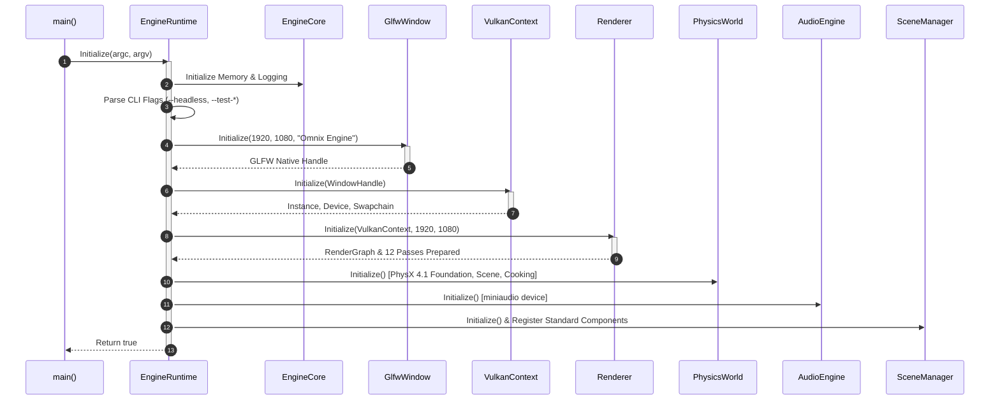
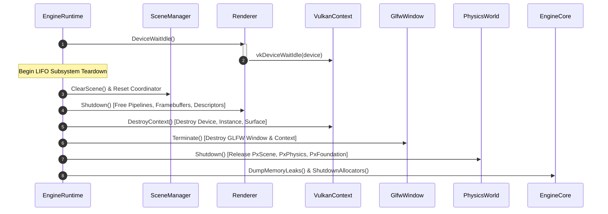

# Omnix Engine Execution Model

This document outlines the concrete runtime execution lifecycle of Omnix Engine v0.4: from binary entrypoint and subsystem bootstrap, through the 15-stage single-threaded frame loop, to orderly LIFO teardown.

---

## 1. System Bootstrap Sequence

Engine initialization is deterministically driven by [`main.cpp`](file:///d:/OmnixEngine/main.cpp) handing execution to [`Omnix::EngineRuntime::Initialize()`](file:///d:/OmnixEngine/Runtime/Private/EngineRuntime.cpp#L123-L287). The boot phase executes sequentially on the primary thread (Thread 0) with zero speculative concurrent initialization.



### 1.1 Command-Line Bootstrap Flags
Before graphics or hardware initialization, CLI arguments are intercepted:
* `--headless`: Skips window creation, swapchain setup, and rendering pipeline instantiation. Used for headless server simulation, verification, and automated test runners.
* `--test-stress`: Invokes `StressTest::Run()` directly post-bootstrap, executing 100k entity instantiation and memory tests before exiting.
* `--test-memory`: Invokes memory allocator validation suite across `LinearAllocator`, `PoolAllocator`, and `StackAllocator`.
* `--test-scene`: Runs deep transform hierarchy traversal and TRS propagation validation tests.

---

## 2. The 15-Stage Frame Loop

The engine main loop is located in [`EngineRuntime::Run()`](file:///d:/OmnixEngine/Runtime/Private/EngineRuntime.cpp#L293-L373). Execution is strictly synchronous, executing 15 discrete phases sequentially per frame.

```mermaid
flowchart TD
    subgraph Frame Loop: EngineRuntime::Run()
        S1[1. FrameBegin<br/><i>Time tracking & delta time clamp</i>] --> S2[2. Input System<br/><i>Poll GLFW events & update key maps</i>]
        S2 --> S3[3. Events<br/><i>Process engine event queue</i>]
        S3 --> S4[4. PreUpdate<br/><i>Pre-simulation subsystem hooks</i>]
        S4 --> S5[5. Update<br/><i>Core gameplay logic & ECS system ticks</i>]
        S5 --> S6[6. PostUpdate<br/><i>Post-simulation corrections</i>]
        S6 --> S7[7. Physics Update<br/><i>PhysX 4.1 Fixed Timestep & Sync</i>]
        S7 --> S8[8. Interaction<br/><i>Raycasts & cursor interaction</i>]
        S8 --> S9[9. GameplayEvents<br/><i>Dispatch collision & trigger events</i>]
        S9 --> S10[10. BoundsUpdate<br/><i>AABB & frustum culling updates</i>]
        S10 --> S11[11. GameMode<br/><i>Rule evaluation & state machine ticks</i>]
        S11 --> S12[12. Animation<br/><i>Evaluate skeletal & procedural anim</i>]
        S12 --> S13[13. RenderPreparation<br/><i>Extract transform matrices & lighting</i>]
        S13 --> S14[14. Render<br/><i>Vulkan 12-Pass Deferred RenderGraph</i>]
        S14 --> S15[15. FrameEnd<br/><i>Pacing sleep & stats collection</i>]
        S15 -->|Loop while !glfwWindowShouldClose| S1
    end
```

### Stage Breakdown & Responsibilities

| Stage | Method Call | Primary Responsibilities | Thread |
|:---|:---|:---|:---|
| **1. FrameBegin** | `BeginFrame()` | Calculates frame delta time `dt`, clamps maximum frame time to 100ms (preventing spiral-of-death), and increments frame counter. | Thread 0 |
| **2. Input** | `PollInput()` | Calls `glfwPollEvents()`. Synchronizes mouse cursor delta, scroll offsets, keyboard bitmasks, and controller state. | Thread 0 |
| **3. Events** | `DispatchEvents()` | Drains event buffers for window resize, focus changes, input mappings, and asset hot-reloads. | Thread 0 |
| **4. PreUpdate** | `PreUpdate(dt)` | Executes early lifecycle systems; camera position updates and controller orientation preparation. | Thread 0 |
| **5. Update** | `Update(dt)` | Primary tick. Iterates ECS systems (`Coordinator::UpdateSystems(dt)`), script components, and scene entities. | Thread 0 |
| **6. PostUpdate** | `PostUpdate(dt)` | Late transforms, camera following calculations, and procedural constraint resolution. | Thread 0 |
| **7. Physics** | `PhysicsWorld::Step(dt)` | Accumulates delta time for fixed-step physics (`dt_fixed = 1/60s`). Calls `PxScene::simulate()` and `PxScene::fetchResults()`. Copies PhysX rigid body transforms back into ECS `TransformComponent`s. | Thread 0 |
| **8. Interaction** | `ProcessInteraction()` | Executes scene picking via viewport raycasting against physics geometry. | Thread 0 |
| **9. GameplayEvents** | `DispatchGameplayEvents()`| Dispatches collision contact callbacks (`OnCollisionEnter`, `OnTriggerStay`, etc.) into registered ECS receivers. | Thread 0 |
| **10. BoundsUpdate** | `UpdateSceneBounds()` | Recomputes world-space bounding spheres and Axis-Aligned Bounding Boxes (AABB) for all active `RenderComponent`s. | Thread 0 |
| **11. GameMode** | `UpdateGameMode(dt)` | Evaluates game-specific rules, win/loss triggers, and high-level match state machines. | Thread 0 |
| **12. Animation** | `UpdateAnimations(dt)` | Evaluates keyframe tracks, skeletal bone hierarchies, and procedural skinning buffers. | Thread 0 |
| **13. RenderPrep** | `PrepareRenderData()` | Performs view frustum culling. Flattens visible entity matrices, material IDs, and dynamic point/spot lights into GPU-ready uniform buffers. | Thread 0 |
| **14. Render** | `Renderer::RenderFrame()` | Records Vulkan command buffers across 12 render passes (Shadow, G-Buffer, Lighting, Post-Processing, ImGui) and submits to graphics queue. Submits swapchain present. | Thread 0 |
| **15. FrameEnd** | `EndFrame()` | Gathers memory and execution telemetry; applies frame pacing sleep (target 60 FPS / ~16.6ms); resets frame temporary linear allocators. | Thread 0 |

---

## 3. Concurrency & Synchronization Model

Omnix Engine v0.4 features a **cooperative, primarily single-threaded** execution architecture.

```
+-----------------------------------------------------------------------------------+
| Thread 0 (Main / Simulation / Render Thread)                                     |
| [Input] -> [ECS Tick] -> [PhysX Step] -> [RenderPrep] -> [Vulkan Recording]       |
+-----------------------------------------------------------------------------------+
                                                                     |
                                                                     | Vulkan Queue Submit
                                                                     v
+-----------------------------------------------------------------------------------+
| GPU Hardware (Hardware Queues)                                                    |
| [Compute / Depth Pass] -> [Deferred Lighting] -> [PostFX] -> [Swapchain Present]  |
+-----------------------------------------------------------------------------------+
```

### 3.1 Concurrency Invariants
1. **Single-Threaded Scene Mutation**: ECS components, `Coordinator`, and `SceneManager` are **not thread-safe**. All entity creation, deletion, component attachments, and queries must execute on Thread 0.
2. **Synchronous Render Recording**: Vulkan command buffer generation in `Renderer.cpp` runs exclusively on Thread 0. There are no secondary command buffer worker threads in v0.4.
3. **GPU-CPU Synchronization**: Synchronization between the CPU host and Vulkan device uses double-buffering with per-frame `VkFence` objects and `VkSemaphore` chains (ImageAvailable $\rightarrow$ RenderFinished $\rightarrow$ Present). CPU waits on `vkWaitForFences` during `FrameBegin` if the previous frame in flight has not finished execution.
4. **PhysX Simulation Concurrency**: While PhysX 4.1 internally supports a multi-threaded CPU task dispatcher, Omnix Engine v0.4 initializes it with single-threaded execution (`PxDefaultCpuDispatcherCreate(0)` or default single-thread fallback) to maintain absolute determinism during simulation ticks.

---

## 4. Subsystem Shutdown & Teardown Protocol

Subsystem teardown in [`EngineRuntime::Shutdown()`](file:///d:/OmnixEngine/Runtime/Private/EngineRuntime.cpp#L375-L420) is strictly **Last-In, First-Out (LIFO)**. This prevents dangling Vulkan device handles, GPU-memory page faults, and double-free exceptions.



### Teardown Order Verification Table

| Destruction Order | Target Subsystem | Resources Freed | Failure Consequence if Out of Order |
|:---|:---|:---|:---|
| **1** | `Renderer` | Framebuffers, RenderPasses, PipelineLayouts, Pipelines, DescriptorPools | `VK_ERROR_DEVICE_LOST` if VulkanContext destroyed first |
| **2** | `VulkanContext` | `VkDevice`, `VkSurfaceKHR`, `VkDebugUtilsMessengerEXT`, `VkInstance` | Operating system driver crash or GPU hang |
| **3** | `GlfwWindow` | `GLFWwindow*`, platform window handle, GLFW library context | Window handle invalidation while Vulkan surface attempts release |
| **4** | `SceneManager` | GameObjects, ECS entity tables, component pools | Attempting to release physics actor handles after PhysX teardown |
| **5** | `PhysicsWorld` | `PxScene`, `PxPhysics`, `PxCooking`, `PxFoundation` | Access violation accessing PhysX allocator callbacks |
| **6** | `AudioEngine` | `ma_engine`, miniaudio device audio stream | Audio stream thread calling unmapped memory buffers |
| **7** | `EngineCore` | Root memory pools, linear arena allocators, log flush | Silent memory leaks, unclosed file descriptors |
