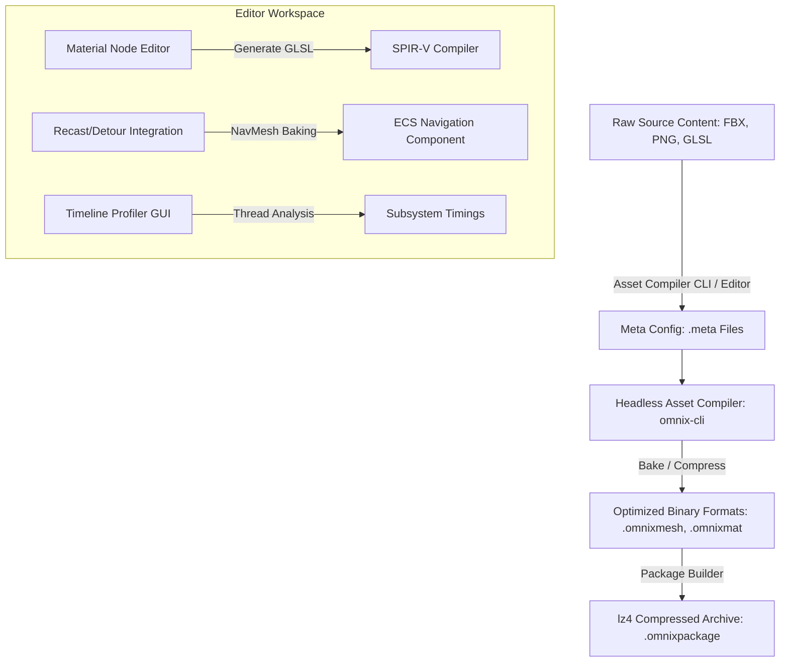

# 🌌 Omnix Studio Engine: v0.2 Review & v0.3 "Toolchain Expansion" Report

This report evaluates the current codebase of the **Omnix Studio Engine** (v0.2 *Runtime Genesis*) and lays out a detailed architectural plan for v0.3 *Toolchain Expansion*. 

Based on static analysis of the source code, build scripts, and dependencies in `d:\OmnixEngine`, we can conclude that the v0.2 runtime successfully integrates the core subsystems (ECS, Vulkan RHI, PhysX, Asset Management, delta serialization, and ImGui/ImGuizmo Editor) into a unified, deterministic runtime lifecycle.

---

## 🏛️ Part 1: Analysis of the Current Codebase (v0.2 "Runtime Genesis")

The codebase has transitioned from isolated experimental modules in v0.1 to a cohesive runtime application driven by a centralized manager class. Below is the technical breakdown of the engine's current state:

### 1. Central Runtime Lifecycle (`EngineRuntime`)
* **Centralization**: The entry point in [main.cpp](file:///d:/OmnixEngine/main.cpp) instantiates `eng::runtime::EngineRuntime`, which owns and manages all subsystems via `std::unique_ptr`.
* **Deterministic Sequencing**: [EngineRuntime.cpp](file:///d:/OmnixEngine/Runtime/Private/EngineRuntime.cpp) dictates a strict startup hierarchy:
  1. Core Utilities (static Logging & Timer bootstrap)
  2. Platform Input & Event Bus (`InputManager`, `EventManager`)
  3. ECS World (`World`, `Coordinator`)
  4. Scheduler (`SystemScheduler`)
  5. Renderer (`EngineLoop`, Vulkan context, RHI swapchain)
  6. Physics World (`PhysicsWorld`, PhysX SDK initialization)
  7. Resource Management (`AssetCache`, `AssetRegistry`)
  8. Scene graph (`SceneManager`)
  9. Editor Layer (`EditorLayer`, initialized conditionally with `--editor`)
* **Dependency Injection**: Subsystem coupling is managed via `RuntimeContext`, which passes raw, non-owning pointers of dependencies to subsystems during their initialization. Singletons have been removed, enforcing clear ownership boundaries.
* **Teardown Order**: Deallocation occurs in the exact reverse order of initialization, preventing Vulkan device-lost assertions or PhysX memory-access violations.

### 2. Data-Oriented Entity Component System (ECS)
* **Archetype & Pool Pools**: Components are allocated contiguously in dense pools via `ComponentManager` to maximize cache efficiency.
* **State Updates**: The gameplay loop updates systems sequentially using `SystemScheduler`.
* **Components Library**: Exposes components like `TransformComponent`, `CameraComponent`, `NameComponent`, `PointLightComponent`, `RigidbodyComponent`, `RenderableMeshComponent`, `MaterialComponent`, `TriggerComponent`, and `CharacterControllerComponent`.
* **Systems**: Orchestrated by `World`, containing systems such as `PhysicsSystem`, `TriggerSystem`, `CameraSystem`, `LightCollectionSystem`, `PlayerSystem`, `PlayerControllerSystem`, and `RenderSystem`.

### 3. RHI & Vulkan Renderer (`EngineLoop` & `SceneRenderer`)
* **Render Loop**: Driven by `EngineLoop`, handling swapchain recreation, Vulkan fences, frame timing, and synchronization.
* **Offscreen Pass**: The scene is rendered to offscreen render targets (color and depth `VkImage` buffers) controlled by `SceneRenderer`, enabling separate viewport panels.
* **UI Render Pass**: Features a dedicated `UIRenderPass` callback that hooks into ImGui Vulkan backend. Viewport rendering dynamically recreates framebuffer structures when the editor viewport panel is resized.
* **Shader Toolchain**: Shaders are compiled via Vulkan SDK's `glslc` into SPIR-V (`vert.spv`, `frag.spv`, and PBR shaders).

### 4. Physics & Simulation (`PhysicsWorld`)
* **PhysX Integration**: Uses NVIDIA PhysX SDK. Coordinates character controllers and static/dynamic rigid bodies.
* **Trigger Overlaps**: Implemented overlap detection via `TriggerSystem`, exposing custom event calls (e.g., `"ConsoleTrigger"`).
* **Screenspace Debug Drawer**: Physics colliders (boxes, spheres) are drawn via `PhysicsDebugDraw` which translates raw PhysX shapes into lines and renders them over the editor viewport.

### 5. Asset Management & Custom Formats
* **UUID References**: Assets are referenced via `AssetHandle` (a `uint64_t` wrapper). The handle is generated deterministically by hashing canonical lowercased paths using the FNV-1a algorithm (`GenerateAssetUUID`).
* **Registry Database**: `AssetRegistry` maintains a persistent record of all assets (`AssetRegistry.json`), capturing dependencies, dirty states, and source paths.
* **Custom Binary Formats**: Implements high-performance binary formats designed to skip disk-parsing overhead during runtime:
  - **`.omnixmesh`**: Stores raw vertex layouts (`OmnixVertex`, `OmnixSkinnedVertex`), index buffers, submesh indices, bounds, and material slots.
  - **`.omnixmat`**: Textures and parameters (albedo, roughness, metallic, normal scaling).
  - **`.omnixscene`**: XML/JSON representation of the entity tree, components, and prefab slots.
  - **`.omnixpackage`**: Custom binary archive of packed assets, including dependency tables.
* **Reference-Counted Cache**: `AssetCache` handles lifecycle counts for GPU resources, preventing double-free errors.

### 6. File Watching & Hot Reloading (`HotReloadSystem`)
* **Asynchronous Monitoring**: `FileWatcher` leverages OS-specific file notifications on registered asset directories.
* **Topological Dependency Resolution**: If a texture or shader changes, the reload queue resolves dependent assets in topological order (e.g., updating texture -> updating material -> updating mesh binding) before reloading them, avoiding runtime invalid state.

### 7. Editor GUI Layer (`EditorLayer`)
* **Dockable Workspace**: Employs Dear ImGui Dockspace. Implements a premium, custom dark theme (`EditorTheme`).
* **Modular Panels**:
  - **Scene Hierarchy Panel**: View and restructure parent-child entity trees.
  - **Inspector Panel**: Detailed field reflection to edit transforms, physics mass, lights, and material variables.
  - **Viewport Panel**: Embeds the offscreen Vulkan texture, features play/stop toolbar widgets, and handles camera focusing ('F' key framing).
  - **Console Panel**: Streams stdout/stderr from `Logger`.
  - **Asset Browser Panel**: Displays registered assets in a grid/table, supports drag-and-drop asset assignment, and provides asset importing options.

---

## 🏁 Part 2: Deliverables Checklist & Codebase Status

Here is the verification checklist of v0.3 target components in the current codebase, specifying implementation details, code files, and outstanding elements:

- [x] **`EditorLayer`**
  * *Implementation Details*: Implemented as a runtime system in [EditorLayer.cpp](file:///d:/OmnixEngine/Runtime/Private/Editor/EditorLayer.cpp). It initializes the ImGui Vulkan backend, creates descriptor pools, and binds the `UIRenderPass` callback to the main `EngineLoop`.
- [x] **`SceneHierarchyPanel`**
  * *Implementation Details*: Located in [SceneHierarchyPanel.cpp](file:///d:/OmnixEngine/Runtime/Private/Editor/Panels/SceneHierarchyPanel.cpp). Renders the tree node structures of the scene graph, supporting parent-child node traversal and node selections.
- [x] **`InspectorPanel`**
  * *Implementation Details*: Located in [InspectorPanel.cpp](file:///d:/OmnixEngine/Runtime/Private/Editor/Panels/InspectorPanel.cpp). Contains the visual component editing fields for active components (transforms, meshes, materials, light intensities, colliders, character speeds, etc.).
- [x] **`AssetBrowserPanel`**
  * *Implementation Details*: Located in [AssetBrowserPanel.cpp](file:///d:/OmnixEngine/Runtime/Private/Editor/Panels/AssetBrowserPanel.cpp). Supports asset type filtering (meshes, materials, textures), project rescanning, asset-to-entity double-click assignments, and mock entity creations.
- [x] **`DiagnosticsPanel`**
  * *Implementation Details*: Handled within [EditorLayer.cpp](file:///d:/OmnixEngine/Runtime/Private/Editor/EditorLayer.cpp#L1099) via toggled ImGui windows: `"Play Mode Diagnostics"` (monitoring PhysX Raycast hits, Character Controller velocity vector coordinates, and overlap counts) and `"Renderer Light Diagnostics"`.
- [ ] **`.omnixprefab` format**
  * *Implementation Details*: **Missing**. Currently only outlined as a placeholder entry in `FuturePlan.md` (Line 758). Prefab templates are loaded/saved using standard JSON structure. The `SavePrefab` implementation in [SceneSerializer.cpp](file:///d:/OmnixEngine/Scene/SceneSerializer.cpp#L310) is currently stubbed out to return `false`.
- [/] **Prefab instancing**
  * *Implementation Details*: **Partially Implemented**. [Prefab::Instantiate](file:///d:/OmnixEngine/Scene/Prefab.h#L61) in `Prefab.cpp` performs deep-copying of the SceneObject hierarchy, copies component data, and re-allocates Entity IDs from the ID pool. However, loading prefabs from disk in [PrefabRegistry::LoadPrefabFromFile](file:///d:/OmnixEngine/Scene/PrefabRegistry.cpp#L145) remains stubbed out with a warning that the loader is not fully integrated.
- [x] **Edit Mode / Play Mode system**
  * *Implementation Details*: Fully implemented. Driven by state gating inside [EngineRuntime.cpp](file:///d:/OmnixEngine/Runtime/Private/EngineRuntime.cpp#L410) and managed visually via the Play/Stop toolbar buttons in [EditorLayer.cpp](file:///d:/OmnixEngine/Runtime/Private/Editor/EditorLayer.cpp#L789).
- [x] **Runtime scene cloning**
  * *Implementation Details*: Fully implemented in [Scene.cpp](file:///d:/OmnixEngine/Scene/Scene.cpp#L397) (`Scene::Clone` and `Scene::CompareScene`). Before entering Play Mode, the active scene and its associated ECS Coordinator are deep-cloned to allow the engine to restore the pre-play state deterministically upon stopping.
- [x] **PhysicsWorld foundation**
  * *Implementation Details*: Fully implemented in [PhysicsWorld.cpp](file:///d:/OmnixEngine/Physics/Private/PhysicsWorld.cpp). It handles the PhysX SDK context creation, simulation stepping (fixed updates), dynamic actor attachments, and scene configurations.
- [x] **Static colliders**
  * *Implementation Details*: Fully implemented. Static bodies are registered into the PhysX scene during startup or scene transitions via `PhysicsWorld::RegisterStaticColliders`.
- [x] **Player controller prototype**
  * *Implementation Details*: Fully implemented. Managed via [PlayerControllerSystem.h](file:///d:/OmnixEngine/ECS/PlayerControllerSystem.h), capturing mouse/WASD inputs, moving the character controller, and adjusting the camera offset dynamically.
- [x] **Trigger volumes**
  * *Implementation Details*: Fully implemented via [TriggerSystem.h](file:///d:/OmnixEngine/ECS/TriggerSystem.h) and `TriggerComponent`. Supports shape definitions (boxes, spheres, capsules), custom callback event hooks (e.g., `ConsoleTrigger`), and logs overlaps.
- [x] **Light components**
  * *Implementation Details*: Fully implemented. Supports serialization and Inspector editing for `DirectionalLightComponent`, `PointLightComponent`, `AmbientLightComponent`, and `SpotLightComponent`.
- [x] **Renderer light integration**
  * *Implementation Details*: Fully implemented. The Vulkan pipeline updates the global lighting buffer data (`uboData`) inside [SceneRenderer.cpp](file:///d:/OmnixEngine/RenderingEngine/Renderer/SceneRenderer.cpp#L736) by copying color, intensity, and attenuation properties from active light components.
- [x] **Scene validator**
  * *Implementation Details*: Fully implemented in [SceneValidator.cpp](file:///d:/OmnixEngine/Scene/SceneValidator.cpp). Provides a static validation suite checking for duplicate entity names, invalid transform limits, missing/incorrect asset handles, and cycles in the parent-child hierarchy.
- [x] **`test_room.omnixscene`**
  * *Implementation Details*: Located at [test_room.omnixscene](file:///d:/OmnixEngine/Assets/Scenes/test_room.omnixscene). It is a configured testing room scene containing light fixtures, character controller starts, trigger areas, and physical colliders.
- [ ] **`v0.3_VALIDATION_RESULTS.md`**
  * *Implementation Details*: **Missing**. There is currently no validation results markdown file present in the codebase.

---

## 🚀 Part 3: Proposed Plan for v0.3 "Toolchain Expansion"

While v0.2 delivers a running runtime, it lacks the developer tools, automation, and asset pipeline scale needed for production. The objective of **v0.3: Toolchain Expansion** is to build a robust pipeline that converts the engine from a game sandbox into an integrated content creation and compilation environment.

The following architectural additions are proposed for v0.3:



---

### 1. Headless CLI Tooling (`omnix-cli`)
To enable automated builds, packaging, and CI/CD validation, we must extract compiler operations from the graphical editor into a standalone command-line application.

* **Command Specification**:
  - `omnix-cli import --src <path> --meta <path>`: Imports a raw asset using custom parameters.
  - `omnix-cli compile --project <path> --platform <win/linux/mobile>`: Headless execution of asset baking and shader translation.
  - `omnix-cli pack --in <dir> --out <package_path> --compress <lz4/zlib>`: Creates asset packages.
  - `omnix-cli validate --scene <path>`: Performs static scene structure checks (dangling entity references, broken asset handles, missing colliders) and exits with error codes.
* **Implementation Strategy**: Build a separate executable target in `CMakeLists.txt` that links to `EngineCore`, `Serialization`, and a headless variant of `EngineRuntime` (disabling Vulkan surface creation and GLFW dependencies).

---

### 2. Advanced Asset Compiler & Metadata Pipeline
Currently, importing is a direct copy. A professional asset pipeline requires a compilation step that processes raw assets (FBX, PNG, GLSL) into optimized runtime formats based on metadata configurations.

* **Meta Files (`.meta`)**:
  Every source asset gets an associated `<filename>.<extension>.meta` JSON file.
  ```json
  {
    "guid": 8734958374982374,
    "importer_settings": {
      "texture": {
        "format": "BC7",
        "generate_mipmaps": true,
        "filter_mode": "Anisotropic",
        "max_size": 2048
      },
      "mesh": {
        "generate_lods": true,
        "lod_count": 3,
        "compress_vertices": true,
        "bake_collisions": true
      }
    }
  }
  ```
* **Compilation Pipeline**:
  - **Texture Compression**: Implement ISPC Texture Compressor or similar library to encode textures directly into block-compressed formats (BC7 for desktops, ASTC for mobile) during import rather than loading raw PNGs.
  - **Mesh Optimization**: Integrate `meshoptimizer` to reorder vertices/indices for cache optimization, generate LODs, and simplify geometry.
  - **Automatic Meta Regeneration**: The editor or CLI checks for raw files lacking `.meta` records, auto-generating UUIDs and saving default settings.

---

### 3. Editor Multi-Viewport & Docking Stabilization
In v0.2, multi-viewports were disabled to prevent Vulkan swapchain errors when dragging panels outside the main window.
* **Objective**: Fully enable `ImGuiConfigFlags_ViewportsEnable` to allow floating panels (e.g., moving the Inspector to a second monitor).
* **Vulkan RHI Refactoring**:
  - Modify `VulkanSwapChain` and `EngineLoop` to support multiple swapchains (one per secondary OS window spawned by ImGui).
  - Implement dynamic frame creation logic that binds ImGui viewport handles to custom surface contexts.
  - Gracefully handle secondary window destruction without destroying the master Vulkan device context.

---

### 4. Material Node Graph Editor & Compiler
v0.2 uses static `.omnixmat` files pointing to fixed PBR shaders. Developers need the ability to author custom shaders visually.

* **Material Node Graph UI**:
  - Create a custom ImGui canvas panel utilizing `ImNodes` or `imgui-node-editor` integrations.
  - Expose mathematical nodes (add, multiply, dot product), texture sample nodes, and input constants.
* **Code Generation Backend**:
  - The node graph generates standard GLSL code dynamically.
  - Integrate `shaderc` or execute a background `glslc` compile pass to assemble the generated GLSL code into a transient Vulkan SPIR-V file.
  - Automatically map descriptor sets based on the bindings defined in the graph.

---

### 5. Package Pipeline Compression & Streaming
Expand the packaging toolchain to support modern deployment constraints.

* **Archive Compression**: Integrate LZ4 or Zstandard algorithms into `PackageBuilder` to compress block payloads.
* **Chunked Streaming**:
  - Divide `.omnixpackage` files into logical chunks (e.g., boot chunk, level 1 chunk, level 2 chunk).
  - Implement asynchronous IO queues in `PackageManager` using thread pools, allowing assets to load from packages in the background without causing frame rate stutters.
* **Visual Package Explorer**: Add a panel in the editor to inspect package contents, showing compression ratios and asset sizes.

---

### 6. Timeline Profiler Panel
Build a graphical diagnostic analyzer directly within the editor to identify CPU/GPU bottlenecks.

* **Timeline Interface**:
  - Implement a CPU frame lane visualizer showing task durations across thread lanes.
  - Track ECS system iteration times (e.g., timing of `PhysicsSystem` vs `RenderSystem`).
  - Graph active memory allocation sizes, highlighting pools, arenas, and potential fragmentation.
* **GPU Timestamps**:
  - Integrate Vulkan query pools (`VkQueryPool`) to measure GPU execution times for specific render passes (e.g., Shadow pass, G-Buffer pass, UI pass).

---

### 7. NavMesh & AI Navigation Baking
Expand the scene system to include navigation grids for AI behavior.

* **Recast/Detour Integration**:
  - Integrate the Recast Navigation library into the editor toolchain.
  - Bake a navigation mesh (`.omnixnav`) by scanning the bounding boxes of entities with `ColliderComponent` in the active scene.
* **Editor Visualizer**: Render the baked NavMesh in the viewport as a translucent green overlay.
* **ECS Pathfinding System**: Add a `NavMeshAgentComponent` to ECS that query paths asynchronously.

---

## 🔬 Part 4: Verification & Validation Plan for v0.3

To ensure these additions do not destabilize the existing architecture, the following automated validation targets will be established:

### 1. Automated Unit Tests
* **CLI Tests**:
  - Execute headless compilation pipelines via test scripts, comparing resulting `.omnixmesh` hashes with a golden database.
  - Verify that `omnix-cli` returns appropriate exit codes (0 for success, non-zero for failure) under invalid command flags.
* **Package Compression Tests**:
  - Verify LZ4 decompression returns byte-perfect replicas of the original uncompressed source buffers.
  - Verify chunk streaming queries load and unload safely on background threads under high concurrency.
* **Node Compiler Tests**:
  - Synthesize mock node graph files, compile them to GLSL, and verify the shader compiles successfully via the offline shader compiler.

### 2. Manual Verification
* **Multi-Viewport Stress Tests**: Drag multiple panels (Console, Inspector, Viewport) outside the main window bounds, resize them rapidly, and verify zero Vulkan validation layer crashes or device lost errors.
* **NavMesh Re-baking**: Modify scene geometry in the editor (add static colliders), trigger a re-bake, and confirm the visual navigation path adapts in real-time.

---

## 📅 Summary of Proposed Version Milestones

| Version | Milestone | Key Features |
| :--- | :--- | :--- |
| **v0.1** | Foundation | Core ECS, Vulkan RHI, Deterministic scheduler, Serialization bridge |
| **v0.2** | Integration | EngineRuntime lifecycle, PhysX integration, ImGui Editor Layer, Asset Registry, Hot Reloading |
| **v0.3** *(Proposed)* | Toolchain Expansion | `omnix-cli`, `.meta` asset compiler, Multi-viewports, Material Shader Graph, LZ4 Package streaming, Timeline Profiler, NavMesh baking |
| **v0.4** | Content Pipeline | Skeletal animation, Audio system, Scene streaming, Particle editor |
