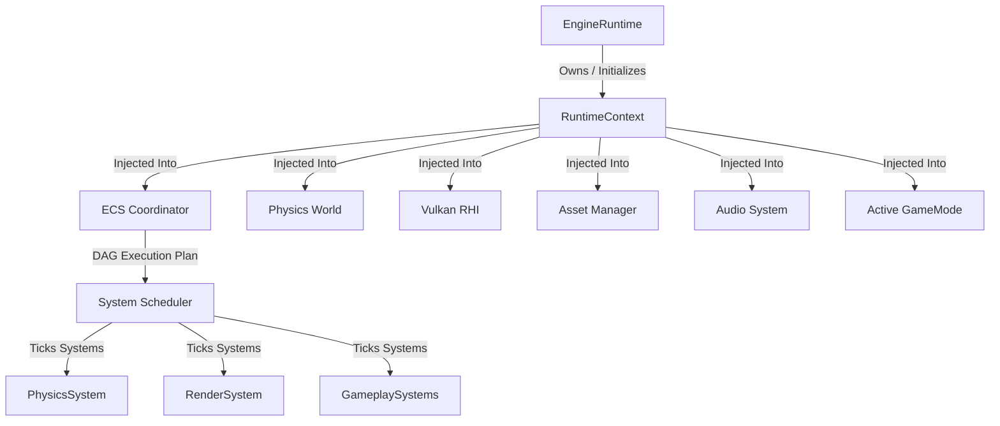

# 🌌 Omnix Engine v0.4 Technical Consultant Report

This document provides a detailed technical overview of the **Omnix Studio Engine v0.4**, outlining its design, subsystem architectures, gameplay systems, custom binary formats, and levels pipeline. It is structured to allow an external technical consultant to understand how the engine functions and how it can be utilized to author and package game levels without requiring direct access to the full source tree.

---

## 1. Project Overview

### 1.1 Engine Specifications
* **Engine Version**: `v0.4` (Content Pipeline & Gameplay Framework Update)
* **Core Goal**: A high-performance, data-oriented C++17 game engine featuring a deterministic Entity Component System (ECS), a robust Render Hardware Interface (RHI) with a Vulkan backend, PhysX physics simulation, custom binary asset compilation, and a fully featured dockable Editor Layer.
* **Current State**: Transitioned from a modular prototype (v0.1/v0.2) to an integrated editor and runtime execution environment (v0.3/v0.4). Features full Edit/Play mode state machines, gameplay systems (objectives, checkpoints, save systems), audio playback, hot-reloading, and asset compilation/packaging.
* **Main Executable Entry Point**: `Application` (defined in [main.cpp](file:///d:/OmnixEngine/main.cpp) and `Core/Application.cpp`). The entry point bootstraps static loggers/timers, instantiates the central `eng::runtime::EngineRuntime`, and runs the central loop:
  ```cpp
  int main(int argc, char* argv[]) {
      Logger::Init("Omnix.log", LogLevel::Trace);
      {
          eng::runtime::EngineRuntime runtime;
          if (runtime.Initialize(argc, argv)) {
              runtime.Run();
              runtime.Shutdown();
          }
      }
      Logger::Shutdown();
      return 0;
  }
  ```
* **Build System**: CMake 3.10+
* **Compiler/Toolchain**: Microsoft Visual C++ (MSVC 2019/2022/2026, targeting C++17 standard) on Windows; GCC/Clang on Unix-like environments.
* **Platform Target**: Windows x64 (primary target utilizing Vulkan and GLFW/Win32 API callbacks).
* **Major Dependencies**:
  * **Vulkan SDK**: Modern low-level rendering API.
  * **GLFW / SDL3**: Context creation, window management, and low-level input loop.
  * **unofficial-omniverse-physx-sdk**: NVIDIA PhysX SDK 4.1+ for high-fidelity rigid body and character controller simulation.
  * **Dear ImGui & ImGuizmo**: Immediate-mode editor GUI interface and viewport translation widgets.
  * **miniaudio**: Single-file audio playback engine backend.
  * **nlohmann_json & RapidJSON**: Metadata database storage, serialization bridges, and `.omnixscene` structure definitions.
  * **GLM (OpenGL Mathematics)**: SIMD-ready mathematical structures.
  * **stb_image & tinygltf**: Importing raw images and GLTF model files.

### 1.2 Folder Structure Map
Below is the directory map of the engine workspace:

```txt
OmnixEngine/
  ├── Assets/                    # Raw and compiled assets (meshes, textures, scenes, audio)
  │    ├── Scenes/               # Level layouts (.omnixscene, .json formats)
  │    ├── Meshes/               # 3D meshes (raw .fbx/.gltf and compiled .omnixmesh)
  │    ├── Materials/            # Material configuration files (.omnixmat)
  │    ├── Textures/             # Textures (.png, .jpg and compiled .omnixtexture)
  │    ├── Audio/                # Sound files (.wav, .ogg formats)
  │    ├── Prefabs/              # Reusable entity templates (.json / .omnixprefab)
  │    └── Shaders/              # Glsl shader source files
  ├── Components/                # Complete catalog of ECS components
  │    ├── Spatial/              # Transforms, parent-child links, bounding boxes
  │    ├── Physical/             # Rigidbody, colliders, velocity, mass parameters
  │    ├── Perpectual/           # RenderMesh, Camera, Light, Material, AudioSource
  │    ├── Logical/              # Health, Mana, Score, StatusEffects, Objectives
  │    ├── Existential/          # Identity, Enable state, Lifetime, PrefabInstance
  │    ├── Relational/           # Inventory, Child/Parent nodes, Owner/Faction
  │    └── Behavior/             # AIController, movement capabilities, navigation agents
  ├── Core/                      # Fundamental engines utility classes
  │    ├── Logging/              # Logging infrastructure (Logger.cpp/.h)
  │    ├── Memory/               # Customized pool, stack, and linear allocators
  │    ├── Diagnostics/          # Allocation validation and profiling stress-tests
  │    └── Application.cpp       # Glue code for initialization and frame execution
  ├── ECS/                       # Entity Component System Coordinator code
  │    ├── Coordinator.cpp       # Manages entities, components, systems sync
  │    ├── EntityManager.cpp     # Entity lifetimes, allocations, signatures
  │    ├── ComponentManager.cpp  # Sparse-set-based contiguous memory pools
  │    └── SystemManager.cpp     # Systems registry and dependencies
  ├── Physics/                   # PhysX integration wrappers
  │    ├── Private/              # PhysicsWorld.cpp, debug drawers, and validations
  │    └── Public/               # Wrappers for controllers and collider interfaces
  ├── RenderingEngine/           # Graphics subsystem
  │    ├── Vulkan/               # Devices, swapchains, buffers, memory allocations
  │    └── Renderer/             # Scene render passes, mesh renderers, GLTF loaders
  ├── Serializer/                # World state serialization framework
  │    ├── Serialization/        # Binary/JSON serializers, delta snapshot structures
  │    └── ECS/                  # ECS snapshots, schema registries, delta trackers
  ├── Runtime/                   # Central runtime layer & gameplay state systems
  │    ├── Public/               # Interfaces for audio, asset loaders, GameModes
  │    └── Private/              # Implementations for gameplay and editor panels
  ├── ThirdParty/                # Bundled libraries (glm, imgui, ImGuizmo, nlohmann)
  ├── CMakeLists.txt             # Primary CMake project configuration script
  ├── main.cpp                   # Engine application entry point
  └── AssetRegistry.json         # Master database of asset UUIDs and metadata
```

---

## 2. Core Subsystem Architecture

The Omnix Engine architecture enforces a strict decoupling of simulation (ECS), rendering (Vulkan RHI), physics (PhysX), and lifecycle management. Subsystems do not use singleton patterns; instead, they are instantiated by the central `EngineRuntime` and access each other via a injected `RuntimeContext` containing raw pointers.



### 2.1 Central Lifecycle (`EngineRuntime`)
Centralized lifecycle management handles the exact ordering of initialization and teardown:
1. **Startup Sequence**:
   * Core Logging & High-Precision Timers.
   * `InputManager` and `GameplayEventBus` creation.
   * ECS `World` and `Coordinator` instantiation.
   * `SystemScheduler` system dependencies DAG generation.
   * RHI `EngineLoop` and Vulkan context/swapchain creation.
   * `PhysicsWorld` (NVIDIA PhysX SDK contexts, allocator, and CPU dispatcher).
   * `AssetRegistry` configuration database loading.
   * `SceneManager` registration.
   * `AudioSystem` (ma_engine initialization).
   * Active `GameMode` registration.
   * `EditorLayer` initialization (if `--editor` command-line argument is passed).
2. **Teardown Sequence**: Occurs in the precise reverse order of initialization, guaranteeing that Vulkan buffers/images and PhysX actors are freed before their respective device/SDK contexts are destroyed, eliminating memory violations on shutdown.

### 2.2 Entity Component System (ECS)
Omnix ECS is designed around the Data-Oriented Design (DOD) pattern:
* **Entities**: Representation as 32-bit unique IDs accompanied by a generation counter (to prevent ABA lookup bugs during reuse).
* **Component Pools**: Stored contiguously in dense array structures mapped via sparse-sets. This ensures that iterating through systems guarantees CPU cache-friendly contiguous reads.
* **System Scheduler**: Builds a Directed Acyclic Graph (DAG) of registered systems. Subsystems (like Physics, Rendering, or Custom Player logic) define their read/write component dependencies, and the scheduler executes them in a guaranteed, deterministic order.

### 2.3 Vulkan Rendering Engine & RHI
A backend-agnostic Render Hardware Interface (RHI) handles resources:
* **Offscreen Render Pass**: The main game viewport is drawn to an offscreen render target (`VkImage`). This decoupled framebuffer is bound to an ImGui window context, allowing the editor interface to scale the viewport size dynamically.
* **UI Render Pass**: Features a separate overlay pipeline using Vulkan Descriptor pools to render Editor widgets and in-game HUDs.
* **Shaders**: Loaded via SPIR-V binary formats. The shader stage builds draw command lists which are synchronized on the GPU using Vulkan Semaphores and Fences.

### 2.4 Physics & Collision (`PhysicsWorld`)
NVIDIA PhysX SDK handles dynamic physics calculations:
* **Actor Creation**: Rigid bodies (`RigidbodyComponent`) are mapped to dynamic PhysX actors, updating the `TransformComponent` after every fixed timestep step.
* **Static Colliders**: Loaded from scene geometry configurations and registered as static PhysX actors.
* **Trigger Overlaps**: Overlap volumes monitor bounds crossings, raising events like `TriggerEnter` and `TriggerExit` to notify gameplay systems.
* **Debug Line Drawer**: A dedicated `PhysicsDebugDraw` renderer queries active PhysX colliders and renders wireframe outlines over the viewport.

### 2.5 Audio Subsystem (`AudioSystem`)
The audio layer wraps the `miniaudio` library to handle background music and sound effects:
* **Audio Clips**: Tracked as unique resource references, loading sound file streams into memory.
* **One-Shots & Entities**: Support for localized entity sounds (linked to `AudioSource` component positions) or UI-driven master one-shot sound calls.
* **Events Hooks**: Subscribes directly to the `GameplayEventBus` to auto-trigger playback (e.g., player death sound, checkpoint chime, door opening).

---

## 3. GameMode & Gameplay Framework

The **Gameplay Framework** introduced in `v0.4` turns the engine from a graphical simulation sandbox into a cohesive gameplay runtime. It is driven by the active `GameMode` and interacts with the ECS via events and components.

### 3.1 Gameplay Lifecycle & GameMode
The `GameMode` base class coordinates level flow, rules, and game state. Custom game modes, such as `VerticalSliceGameMode`, override virtual methods to drive playtest-specific logic:

```cpp
namespace eng::runtime {
    class GameMode {
    public:
        virtual void OnLevelStart(RuntimeContext* context);
        virtual void OnLevelEnd();
        virtual void Tick(float dt);
        virtual void CompleteLevel();
        virtual void FailLevel();
        virtual void RestartLevel();
        virtual void PauseLevel();
        virtual void ResumeLevel();
        virtual bool RestoreFromSnapshot(const GameplaySaveSnapshot& snapshot);

        ObjectiveSystem* GetObjectiveSystem() const;
        CheckpointSystem* GetCheckpointSystem() const;
        GameplayHUD* GetGameplayHUD() const;
        ObjectActivationSystem* GetObjectActivationSystem() const;
    };
}
```

State changes update the centralized `GameState` struct:
```cpp
struct GameState {
    std::string ActiveSceneName;
    GameSessionState SessionState; // None, PreGame, Active, Paused, Completed, Failed
    std::string ActiveObjectiveID;
    std::vector<std::string> CompletedObjectives;
    float ElapsedGameplayTime = 0.0f;
    std::string CurrentCheckpointID;
    std::unordered_map<std::string, bool> GameplayFlags;
};
```

### 3.2 Objectives System (`ObjectiveSystem`)
The objectives system tracks game progress and triggers objectives:
* **Definition**: An `Objective` is represented by an ID, Title, Description, and State (`Inactive`, `Active`, `Completed`, `Failed`).
* **Component Mapping**: Entities in the level can carry an `ObjectiveComponent`:
  ```cpp
  struct ObjectiveComponent {
      std::string ObjectiveID;
      std::string Title;
      std::string Description;
      ObjectiveCompletionMode CompletionMode; // None, Interaction, TriggerEnter
      bool StartsActive = true;
      bool Repeatable = false;
      bool Completed = false;
  };
  ```
* **Completion Rules**:
  * `TriggerEnter`: Completes when an entity (like the player) overlaps with the collision volume.
  * `Interaction`: Completes when the player moves into range and presses the interaction key (`E`).

### 3.3 Checkpoint System (`CheckpointSystem`)
Checkpoints store a snapshot of the game session. When the player triggers a checkpoint volume, the `CheckpointSystem` captures a `CheckpointSnapshot` in-memory:

```cpp
struct CheckpointSnapshot {
    std::string CheckpointID;
    std::string CheckpointName;
    TransformComponent PlayerTransform; // Re-spawning location
    std::string ActiveObjectiveID;
    std::vector<std::string> CompletedObjectives;
    std::unordered_map<std::string, SimpleObjectState> SimpleObjectStates; // Environment states
    float ElapsedGameplayTime = 0.0f;
    bool Valid = false;
};
```
If the player dies, the `CheckpointSystem` restores the snapshot state instantly.

### 3.4 Object Activation System & Simple States
The engine provides components to handle interactive level objects:
* **`SimpleStateComponent`**: Represents the current state (`Inactive`, `Active`, `Completed`, `Locked`, `Unlocked`) of doors, panels, buttons, etc.
* **`ActivatableComponent`**: Controls event linkages:
  ```cpp
  struct ActivatableComponent {
      std::string ActivationID;       // Target ID to trigger
      std::string TargetActivationID; // Associated trigger volume ID
      bool RequiresUnlocked = false;
      bool OneShot = true;
      bool HasActivated = false;
  };
  ```
* **`DoorComponent`**: Governs spatial movement:
  ```cpp
  struct DoorComponent {
      Vector3 ClosedPosition;
      Vector3 OpenOffset = Vector3(0.0f, 3.0f, 0.0f);
      float OpenSpeed = 2.0f;
      DoorOpenMode OpenMode = DoorOpenMode::Instant; // Instant or Smooth
      bool IsOpen = false;
  };
  ```
  When the player completes a trigger, the `ObjectActivationSystem` matches the activation IDs and animates the corresponding door.

### 3.5 Gameplay Save & Load (`GameplaySaveSystem`)
To persist states across engine sessions, the `GameplaySaveSystem` writes the complete level snapshot to disk:
1. **Header Metadata**: Saves version number, file signature (`MAGIC_SAVE`), timestamp, and a calculated CRC64 checksum.
2. **Payload Snapshot**: Writes player coordinates, health status, active objectives list, reached checkpoints, and interactive state maps to a binary file.
3. **Checksum Validation**: During loading, the engine recalculates the checksum. If it does not match the header checksum (meaning the save file was tampered with or corrupted), the load routine fails gracefully and alerts the console.

---

## 4. Level Design Workflow & Custom Formats

### 4.1 Custom Binary Formats
Omnix Engine v0.4 compiles all asset types into optimized binary formats to avoid text-parsing bottlenecks during level loading.

#### 4.1.1 Mesh Format (`.omnixmesh`)
Pre-compiled 3D geometry structure supporting optional skeletal nodes:
```cpp
struct OmnixMeshHeader {
    FileHeader file;              // Magic bytes: 'OMXMESH\0'
    uint32_t vertexCount;
    uint32_t indexCount;
    uint32_t vertexStride;
    uint32_t submeshCount;
    uint32_t hasSkeleton;
    uint32_t materialSlotCount;
    BoundingBox bounds;
    BoundingSphere sphere;
};
```

#### 4.1.2 Scene Format (`.omnixscene`)
Serialized level hierarchy storing complete ECS components and structures:
```cpp
struct OmnixSceneHeader {
    FileHeader file;              // Magic bytes: 'OMXSCENE'
    uint32_t entityCount;
    uint32_t componentTypeCount;
    uint32_t assetReferenceCount;
    uint32_t hierarchyNodeCount;
    uint32_t componentBlockCount;
};
```

### 4.2 Scene Structure & Validator
Entities inside the scene form a tree structure utilizing the relational components `Parent` and `Children`. 

To prevent errors like circular parenting or duplicate entity names (which can break script lookups), the editor runs a **`SceneValidator`** pass before a scene is exported. The validator checks for:
* Parent-child dependency cycles (e.g., Entity A parented to B, B parented to A).
* Invalid transform values (NaN coordinates or zero scales).
* Missing asset references (UUID references pointing to assets missing from the registry).

### 4.3 Scene Construction Example (`.omnixscene` JSON equivalent)
Below is an example of how a game level layout is represented, outlining lighting nodes, character starts, trigger volumes, and interactive doors:

```json
{
  "SceneName": "Sector_04_ResearchLab",
  "AssetReferences": [
    { "UUID": 4910482058301859, "Type": "Mesh", "Path": "Assets/Meshes/lab_door.omnixmesh" },
    { "UUID": 8394018592018592, "Type": "Material", "Path": "Assets/Materials/door_metal.omnixmat" }
  ],
  "Entities": [
    {
      "EntityID": 1,
      "Name": "SpawnPoint_Player",
      "Components": {
        "TransformComponent": {
          "Position": [0.0, 1.0, 0.0],
          "Rotation": [0.0, 0.0, 0.0, 1.0],
          "Scale": [1.0, 1.0, 1.0]
        },
        "CharacterControllerComponent": {
          "Speed": 5.0,
          "Gravity": -9.81
        }
      }
    },
    {
      "EntityID": 2,
      "Name": "Terminal_Keycard",
      "Components": {
        "TransformComponent": {
          "Position": [4.5, 1.0, 10.0],
          "Rotation": [0.0, 90.0, 0.0, 1.0]
        },
        "TriggerComponent": {
          "Shape": "Box",
          "HalfExtents": [1.0, 1.0, 1.0]
        },
        "ObjectiveComponent": {
          "ObjectiveID": "OBJ_UnlockLab",
          "Title": "Recover keycard",
          "Description": "Interact with the terminal to unlock the main doors.",
          "CompletionMode": "Interaction",
          "StartsActive": true
        },
        "ActivatableComponent": {
          "ActivationID": "ACT_DoorOpenTrigger",
          "TargetActivationID": ""
        }
      }
    },
    {
      "EntityID": 3,
      "Name": "Security_Door",
      "Components": {
        "TransformComponent": {
          "Position": [0.0, 0.0, 15.0]
        },
        "RenderMeshComponent": {
          "MeshUUID": 4910482058301859,
          "MaterialUUID": 8394018592018592
        },
        "ColliderComponent": {
          "Shape": "Box",
          "HalfExtents": [2.0, 3.0, 0.5],
          "IsStatic": true
        },
        "SimpleStateComponent": {
          "InitialState": "Locked",
          "CurrentState": "Locked",
          "ResetOnPlay": true
        },
        "ActivatableComponent": {
          "ActivationID": "",
          "TargetActivationID": "ACT_DoorOpenTrigger",
          "RequiresUnlocked": true
        },
        "DoorComponent": {
          "ClosedPosition": [0.0, 0.0, 15.0],
          "OpenOffset": [0.0, 4.0, 0.0],
          "OpenSpeed": 1.5,
          "OpenMode": "Smooth"
        }
      }
    }
  ]
}
```

### 4.4 Step-by-Step Level Design Pipeline
For a technical consultant looking to construct game levels inside Omnix Engine:

1. **Asset Import Phase**:
   * Compile raw asset resources (e.g., importing `.fbx` geometry and `.png` textures) via the editor import panel or the offline command tool.
   * This step automatically creates `.meta` files, assigns UUIDs, and writes optimized `.omnixmesh` and `.omnixtexture` binary files to the cache directory.
2. **Visual Layout Assembly**:
   * Launch the editor using the `--editor` command-line argument.
   * Create entity nodes and add a `RenderMeshComponent` to map geometry to the scene.
   * Use the **ImGuizmo** translation handles in the Viewport panel to place meshes and construct the level geometry (floors, walls, props).
3. **Gameplay Setup**:
   * Place a spawn point entity and assign it a `CharacterControllerComponent`.
   * Create trigger collision volumes at interactive objects (terminals, doors, elevators).
   * Add an `ObjectiveComponent` to key quest objectives, setting the desired completion mode (e.g., `Interaction` or `TriggerEnter`).
   * Add a `CheckpointComponent` to level milestones to serve as re-spawn locations.
4. **Interaction Routing**:
   * Link trigger nodes to environment objects. For instance, set the `TargetActivationID` of a door's `ActivatableComponent` to match the `ActivationID` of a terminal's trigger volume.
5. **Validation & Packaging**:
   * Execute the `SceneValidator` from the editor's file menu to check for parent-child cycles, dangling references, or unnamed entities.
   * Save the level scene file (e.g., `Level1.omnixscene`).
   * Build the project using the package builder tool to pack the scene and its dependencies into a compressed `.omnixpackage` archive for distribution.

---

## 5. Verification & Stability Suite

To ensure level stability and performance benchmarks, the engine provides diagnostic modes:
* **Memory Stresstest (`--test-memory`)**: Validates the custom stack, pool, and linear allocators under high frequency allocations, checking that memory is fully freed on shutdown.
* **Diagnostics Panel**: Renders real-time graphs showing frame time, update time, draw call counts, physics raycast rates, and memory allocation maps.
* **Vulkan Validation Layers**: Enabled by default in debug configurations to verify swapchain synchronization and catch API violations.
