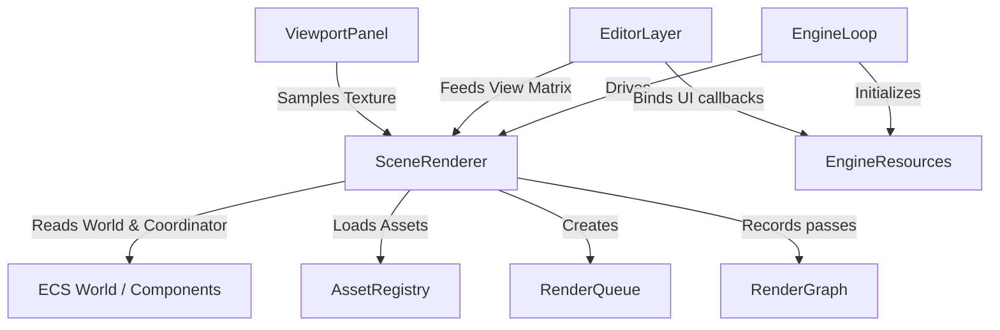
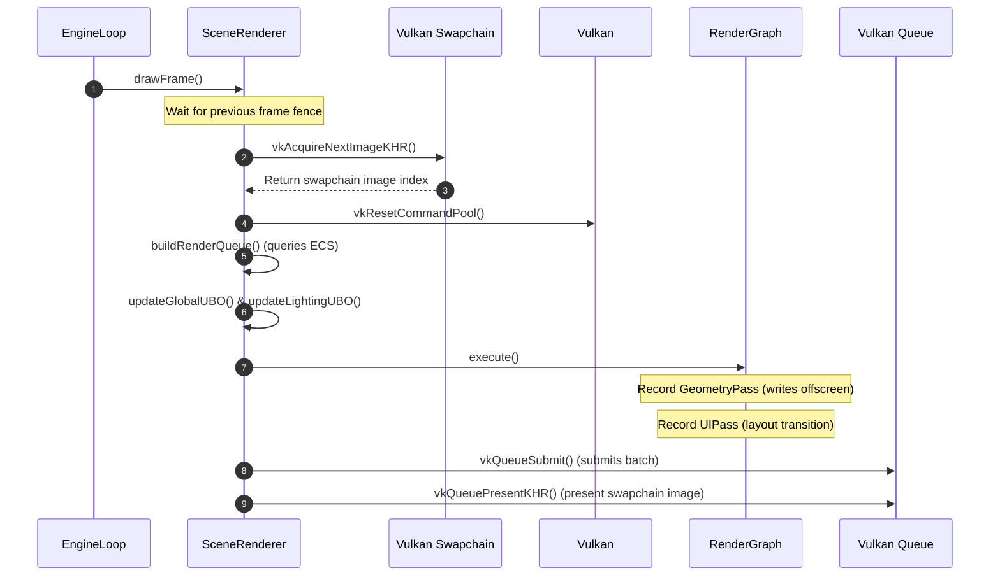

# 🌌 Radiance Renderer (v0.1) Architecture Audit & Migration Plan

This document provides a comprehensive technical audit of the **Radiance Renderer (v0.1)** currently implemented in the **Omnix Studio Engine**. It analyzes the entry points, resource management lifecycles, ECS coupling, viewport rendering, and underlying Vulkan limitations, presenting a structured migration plan to transition the rendering architecture to a modular, correct, and robust **v0.2** state.

---

## 1. Executive Summary

The v0.1 renderer is structured as a **Forward Renderer** built around a single dynamic geometry pass. It handles both static 3D models (OBJ/glTF) and dynamic ECS entities, but delegates a large part of its setup to a legacy prototype ([PyramidRenderer.cpp](file:///d:/OmnixEngine/RenderingEngine/Renderer/PyramidRenderer.cpp)). 

While the renderer succeeded in establishing basic rendering, the current design features significant technical debt:
1. **Critical Visual Defects**: There is no depth attachment created or bound during swapchain or offscreen render passes, rendering proper depth testing impossible and resulting in broken 3D overlaps in the viewport.
2. **Tight ECS Coupling**: The renderer directly queries the ECS World Coordinator to discover entities, fetch components, and load assets on-the-fly, breaking core separation of concerns.
3. **Inefficient Asset Pipeline**: glTF texture loading performs a slow disk round-trip (decoding images, writing to temporary PNGs on disk, and decoding them again).
4. **Scattered Vulkan State**: Multiple hardcoded pipeline states are scattered across files with differing properties (e.g., mismatching culling orientations).

---

## 2. Detailed Technical Audit

### 2.1 Entry Point & Lifecycle Coordination
* **Main Entry Point**: Per-frame rendering is driven by [SceneRenderer::drawFrame()](file:///d:/OmnixEngine/RenderingEngine/Renderer/SceneRenderer.cpp#L383).
* **Execution Path**:
  1. The frame ticks inside [EngineLoop.cpp](file:///d:/OmnixEngine/RenderingEngine/Runtime/engine/EngineLoop.cpp#L94).
  2. If `USE_SCENE_RENDERER` is enabled, `EngineLoop::BuildAndExecuteGraph()` (line 532) directly delegates frame execution by calling `m_SceneRenderer->drawFrame()`.
  3. `SceneRenderer` acquires the swapchain image, resets its command pools, updates global/lighting uniform buffers, executes the render graph passes, and presents the image.

### 2.2 Swapchain Image Acquisition
* **Acquisition Call**: The swapchain image index is obtained using `vkAcquireNextImageKHR`.
* **Locations**:
  * Active: [SceneRenderer.cpp:L393](file:///d:/OmnixEngine/RenderingEngine/Renderer/SceneRenderer.cpp#L393) inside `SceneRenderer::drawFrame()`. It signals a semaphore `imageAvailableSemaphores` for the current frame.
  * Fallback: [EngineLoop.cpp:L553](file:///d:/OmnixEngine/RenderingEngine/Runtime/engine/EngineLoop.cpp#L553) inside `EngineLoop::BuildAndExecuteGraph()` when `USE_SCENE_RENDERER` is false.

### 2.3 Command Buffer Lifecycle
* **Creation**: Command pools and buffers are allocated during renderer initialization:
  * One command pool per in-flight frame is created in `EngineLoop::InitRenderer()` (line 379) and wrapped in [EngineResources.h](file:///d:/OmnixEngine/RenderingEngine/Core/Engine/EngineResources.h#L55).
  * Command buffers are allocated in `EngineResources::createCommandBuffers()`, creating `PASS_COUNT` buffers per frame (one for each render pass in `PassID`).
* **Resetting**: In `SceneRenderer::drawFrame()` (line 416), the entire command pool for the current frame is reset:
  ```cpp
  vkResetCommandPool(resources.device, resources.commandPools.at(frameIndex), VK_COMMAND_POOL_RESET_RELEASE_RESOURCES_BIT);
  ```
  This is highly efficient as it frees all per-pass command buffers simultaneously.
* **Recording**: Done via the Render Graph execution ([SceneRenderer.cpp:L428](file:///d:/OmnixEngine/RenderingEngine/Renderer/SceneRenderer.cpp#L428)). The graph iterates over passes and invokes their registered lambdas, which call standard commands like `vkBeginCommandBuffer`, `vkCmdBeginRenderPass`, and `vkEndCommandBuffer`.
* **Submission**: Command buffers for all passes are gathered and submitted in a single batch via `vkQueueSubmit` in [SceneRenderer.cpp:L456](file:///d:/OmnixEngine/RenderingEngine/Renderer/SceneRenderer.cpp#L456):
  ```cpp
  VK_CHECK(vkQueueSubmit(resources.graphicsQueue, 1, &submitInfo, resources.inFlightFences.at(frameIndex)));
  ```
  Synchronization is handled via `imageAvailableSemaphores` (wait), `renderFinishedSemaphores` (signal), and `inFlightFences`.

### 2.4 Render Passes & Framebuffer Attachments
The engine utilizes three distinct Vulkan Render Pass configurations:
1. **Swapchain Render Pass (`m_RenderPass`)**: Created in `EngineLoop::InitRenderer()` (line 317).
2. **Offscreen Render Pass (`m_OffscreenRenderPass`)**: Created in `SceneRenderer::CreateOffscreenResources()` (line 826) to render the 3D scene to an offscreen buffer for the editor viewport.
3. **UI Render Pass (`m_UIRenderPass`)**: Created in `EditorLayer::Initialize()` (line 152) with a `loadOp` of `VK_ATTACHMENT_LOAD_OP_LOAD` to draw ImGui elements over the swapchain image.

> [!WARNING]
> **Depth Buffer Omission**: The swapchain render pass and offscreen render pass are created with **only one color attachment**. Neither pass allocates, references, or binds a depth/stencil attachment. As a result, depth testing (`vkCmdSetDepthTestEnable`) is completely ineffective during 3D scene rendering, causing severe visual artifacts (geometries overlap incorrectly based on draw order).

### 2.5 Mesh Submission & Drawing
* Meshes are drawn inside the `GeometryPass` lambda registered in the render graph ([SceneRenderer.cpp:L235-303](file:///d:/OmnixEngine/RenderingEngine/Renderer/SceneRenderer.cpp#L235)):
  ```cpp
  for (const RenderItem& item : renderQueue.getItems())
  {
      if (resources.pipelineLayout != VK_NULL_HANDLE) {
          vkCmdPushConstants(cmd, resources.pipelineLayout, VK_SHADER_STAGE_VERTEX_BIT, 0, sizeof(glm::mat4), glm::value_ptr(item.transform));
      }
      item.material->bind(cmd, resources.pipelineLayout);
      item.mesh->bind(cmd);
      vkCmdDrawIndexed(cmd, item.mesh->getIndexCount(), 1, 0, 0, 0);
  }
  ```
* Mesh binding (vertex buffer and index buffer) is performed in [Mesh.cpp:L124](file:///d:/OmnixEngine/RenderingEngine/Renderer/scene/Mesh.cpp#L124).

### 2.6 Mesh Asset Formats
The v0.1 renderer supports two formats:
1. **OBJ (Wavefront)**: Parsed in [ModelLoader.cpp:L22](file:///d:/OmnixEngine/RenderingEngine/Renderer/scene/ModelLoader.cpp#L22).
   * *Limitation*: The parser only reads `v` (positions) and `f` (faces). It **ignores texture coordinates (`vt`) and normals (`vn`)**, replacing them with dummy values (white vertex color, `{0.0f, 0.0f}` UV, and `{0.0f, 0.0f, 1.0f}` normal). This breaks texturing and PBR lighting on OBJ models.
2. **glTF/glb (GL Transmission Format)**: Loaded via `tiny_gltf` in [GltfModel.cpp:L196](file:///d:/OmnixEngine/RenderingEngine/Renderer/gltf/GltfModel.cpp#L196).
   * It correctly parses `POSITION`, `NORMAL`, and `TEXCOORD_0` into `PbrVertex` structures.

### 2.7 Material & Texture Binding Flow
Descriptor binding is split into three sets:
* **Set 0 (Global Camera)**: Configured in `SceneRenderer::updateGlobalUBO()`. Contains the `GlobalUBO` struct (view matrix, projection matrix, camera position) bound at binding 0.
* **Set 1 (Material)**: Allocated and updated in [Material.cpp:L210](file:///d:/OmnixEngine/RenderingEngine/Renderer/scene/Material.cpp#L210).
  * Binding 0: `MaterialUBO` (albedo color tint, metallic factor, roughness factor, and texture usage flags).
  * Binding 1: `sampler2D` for the Albedo texture.
  * Binding 2: `sampler2D` for the Normal map.
* **Set 2 (Lighting)**: Updated in `SceneRenderer::updateLightingUBO()`. Contains ambient lights, directional lights, and up to 16 point lights.
* **Binding Mechanism**: Inside `SceneRenderer::setupRenderGraph()`, global descriptors (Sets 0 and 2) are bound once at the pass level, while `item.material->bind(cmd, layout)` binds Set 1 (pipeline and textures) per draw call.

### 2.8 ECS Component Rendering
ECS entities are converted into renderable items dynamically each frame in [SceneRenderer::buildRenderQueue()](file:///d:/OmnixEngine/RenderingEngine/Renderer/SceneRenderer.cpp#L507):
1. It retrieves the ECS coordinator and loops over active entities.
2. It checks for a `TransformComponent` and a `MeshRendererComponent`.
3. If both are present, it performs transform matrix calculations and checks if the entity is visible.
4. If a `RenderableMeshComponent` exists, it resolves the `meshAssetHandle` by querying the `AssetRegistry` metadata and loading the OBJ mesh on-the-fly if it is not cached in `m_EcsMeshCache`.
5. If a `MaterialComponent` exists, it resolves the `materialAssetHandle`, deserializes the `.omnixmat` material definition, and loads the albedo/normal textures.
6. The resulting parameters are pushed into `RenderQueue` as a `RenderItem`.

### 2.9 Editor Viewport Rendering Path
When running the Editor, offscreen rendering is enabled via `SceneRenderer::SetOffscreenRenderingEnabled(true)`:
1. `SceneRenderer` allocates color images (`m_OffscreenImages`) via VMA (`vmaCreateImage`) and creates image views.
2. Framebuffers (`m_OffscreenFramebuffers`) are bound to `m_OffscreenRenderPass`.
3. The geometry pass writes directly to the offscreen images.
4. Each offscreen image view is registered with ImGui as a texture descriptor set (`m_OffscreenImGuiTextures`) via:
   ```cpp
   m_OffscreenImGuiTextures[i] = ImGui_ImplVulkan_AddTexture(m_OffscreenSampler, m_OffscreenImageViews[i], VK_IMAGE_LAYOUT_SHADER_READ_ONLY_OPTIMAL);
   ```
5. In [ViewportPanel.cpp:L174](file:///d:/OmnixEngine/Runtime/Private/Editor/Panels/ViewportPanel.cpp#L174), the offscreen texture is drawn directly inside the ImGui Viewport child window:
   ```cpp
   ImGui::Image((ImTextureID)viewportTexture, size, ImVec2(0.0f, 0.0f), ImVec2(1.0f, 1.0f));
   ```

### 2.10 ImGui/UI Rendering Order
1. **Scene Render**: The 3D scene (static meshes + ECS items) is rendered offscreen in `SceneRenderer::drawFrame()`.
2. **UI Pass (RenderGraph)**: The final pass in the render graph transitions the swapchain image to `PRESENT_SRC_KHR` layout and calls `resources.uiCallback`.
3. **ImGui Render**: The `uiCallback` triggers `EditorLayer::RenderUI(...)`.
4. **UI Render Pass**: Inside `RenderUI`, a separate render pass `m_UIRenderPass` begins on the swapchain framebuffer with `loadOp = LOAD`. It runs `ImGui_ImplVulkan_RenderDrawData` to draw the editor interface (which samples and displays the offscreen scene viewport).
5. Present queue displays the combined editor frame.

### 2.11 Camera Matrix Generation
* **View/Projection Matrices**: Generated in [SceneRenderer::updateGlobalUBO()](file:///d:/OmnixEngine/RenderingEngine/Renderer/SceneRenderer.cpp#L704).
* The projection matrix is generated using `camera.getProjMatrix(aspect)`, and then the Y-coordinate scaling is inverted for Vulkan coordinate alignment:
  ```cpp
  ubo.proj[1][1] *= -1.0f;
  ```
* **Camera Input**:
  * **Edit Mode**: [EditorLayer.cpp:L452-459](file:///d:/OmnixEngine/Runtime/Private/Editor/EditorLayer.cpp#L452) copies the editor camera's view parameters (computed from WASD + mouse drag in `EditorCamera`) to `SceneRenderer::camera`.
  * **Play Mode**: [EditorLayer.cpp:L514-551](file:///d:/OmnixEngine/Runtime/Private/Editor/EditorLayer.cpp#L514) retrieves the camera component of the player entity and maps its position, yaw, pitch, and FOV to `SceneRenderer::camera`.

### 2.12 Shader Folder Structure & Pipelines
* **Legacy Shaders**: Sources in `RenderingEngine/Shaders/shader.vert|frag` compiled to `vert.spv` and `frag.spv` in the root workspace. Used by the legacy `PyramidRenderer`.
* **PBR Shaders**: Sources in `shaders/pbr_vert|frag.glsl` compiled to `shaders/pbr_vert|frag.spv`. Loaded dynamically by materials.
* **Stub Shaders**: The renderer pipeline initialization requests `shadow_vert.spv`, `lighting_frag.spv`, and `postprocess_frag.spv`.
  * *Limitation*: These shader source files do not exist. In `SceneRenderer::initPipelines()`, their omission triggers a fallback to the `PyramidRenderer` baseline graphics pipeline.

---

## 3. Current Limitations & Visual Weaknesses

> [!CAUTION]
> The following architectural and implementation issues in v0.1 directly degrade visual quality, cause performance overhead, or block features:

1. **No Depth Buffering**: The lack of a depth attachment in the offscreen framebuffer breaks Z-sorting. Meshes are drawn purely in the order they are submitted in `buildRenderQueue`. Solid objects drawn later will overlap objects in front of them.
2. **Broken OBJ Normal/UV Maps**: Since `ModelLoader::LoadOBJ` discards normal/texture coordinate data, OBJ files cannot support normal mapping or proper texturing.
3. **Slow glTF Texture Loading**: In `GltfModel::loadTexture`, texture pixel data is written to a temporary file on the user's hard drive and then loaded back:
   ```cpp
   std::string tmpPath = "tmp_gltf_img_" + std::to_string(imageIndex) + ".png";
   stbi_write_png(tmpPath.c_str(), ...);
   tex->loadFromFile(tmpPath, ...);
   ```
   This disk round-trip is extremely slow and generates unnecessary disk I/O.
4. **Incorrect View Vector in Fragment Shader**: In `pbr_frag.glsl`, the specular highlights previously calculated the view vector as `normalize(-vWorldPos)` (assuming the camera was at `[0,0,0]`). This has been patched to `normalize(vCameraPos - vWorldPos)` but exposes fragile state synchronization.
5. **No Shadowing or Post-Processing**: The shadow, lighting, and post-process passes are stubbed out. No shadow maps are generated, and no tone-mapping is executed on the 3D scene (outside of a simple Reinhard tone-map hardcoded at the end of the PBR fragment shader).

---

## 4. Subsystem Dependency & Flow Diagrams

### 4.1 Module Dependencies
The diagram below shows how the renderer depends directly on the ECS World and components, creating an architectural loop.



### 4.2 Frame Execution Flow
This diagram details the sequence of Vulkan operations executed per-frame.



---

## 5. Refactoring Matrix

### 5.1 Files That Must Be Refactored
To prepare the engine for v0.2, the following files require architectural changes:

| File | Action | Rationale |
|------|--------|-----------|
| [SceneRenderer.h](file:///d:/OmnixEngine/RenderingEngine/Renderer/SceneRenderer.h) | Modify | Remove direct ECS caching and `World` dependencies. Define a clean, ECS-agnostic rendering API. |
| [SceneRenderer.cpp](file:///d:/OmnixEngine/RenderingEngine/Renderer/SceneRenderer.cpp) | Modify | Re-architect `buildRenderQueue` to ingest a clean array of render packets instead of querying the ECS coordinator. Add depth buffer attachment to the offscreen framebuffer. |
| [EngineLoop.cpp](file:///d:/OmnixEngine/RenderingEngine/Runtime/engine/EngineLoop.cpp) | Modify | Add a depth buffer attachment to the swapchain render pass. Align initialization sequence to guarantee RHI and Assets are active before SceneRenderer. |
| [ModelLoader.cpp](file:///d:/OmnixEngine/RenderingEngine/Renderer/scene/ModelLoader.cpp) | Modify | Extend the OBJ parser to read `vt` (UV) and `vn` (Normal) elements, filling `Vertex` data properly. |
| [GltfModel.cpp](file:///d:/OmnixEngine/RenderingEngine/Renderer/gltf/GltfModel.cpp) | Modify | Refactor `loadTexture` to stream glTF pixel data directly to Vulkan staging buffers, removing the temporary PNG disk write. |
| [pbr_frag.glsl](file:///d:/OmnixEngine/shaders/pbr_frag.glsl) | Modify | Clean up lighting equations. Prepare interfaces for shadow-map sampler bindings. |

### 5.2 Files That Should Not Be Touched
These files are stable, decoupled, or unrelated to the renderer, and should be preserved to avoid scope creep:

| File / Directory | Rationale |
|------------------|-----------|
| `ECS/` (EntityManager, ComponentManager, Coordinator) | The core ECS container is completely stable and handles entity management correctly. Modifying it is unnecessary. |
| `Serializer/` (Delta/Normal Serializers, Snapshots) | The serialization system runs deterministically and does not interact with GPU/Vulkan lifecycles. |
| `Physics/` (PhysicsWorld, PhysicsValidation) | PhysX simulations run independently of rendering, communicating only via component updates. |
| [InputManager.cpp](file:///d:/OmnixEngine/Input/InputManager.cpp) | Handles windowing input events and has zero dependencies on Vulkan or scene renderers. |
| `ThirdParty/` (ImGui, ImGuizmo, tinyglf) | External dependencies must remain clean and unmodified to ensure compile stability. |

---

## 6. Migration Plan: v0.1 to v0.2

To transition the renderer to v0.2, we propose a 4-phase migration plan focused on decoupling, lifecycle correctness, and rendering corrections.

### Phase 1: Decoupling the Renderer from ECS
* **Goal**: Establish a clear boundary. The renderer should not know what an "ECS Entity" or "Coordinator" is.
* **Steps**:
  1. Define a clean `RenderScene` class containing list arrays of renderable meshes, materials, and transform matrices.
  2. Implement an ECS-side `RenderSystem` (part of the runtime, not the rendering engine). This system queries `TransformComponent` and `MeshRendererComponent` and populates the `RenderScene`.
  3. Change `SceneRenderer::drawFrame()` to accept a `RenderScene` pointer, completely removing `m_World` references from the renderer header.

### Phase 2: RHI Hardening & Resource Lifecycle
* **Goal**: Solve the split ownership of GPU assets.
* **Steps**:
  1. Transfer all image/buffer allocations (including textures and static mesh buffers) to `AssetCache` or `AssetManager`.
  2. The renderer only receives read-only Vulkan handles (`VkBuffer`, `VkImageView`, `VkSampler`) and does not manage their deletion.
  3. Clean up the legacylike dependencies between `SceneRenderer` and `PyramidRenderer`. `SceneRenderer` should configure its own graphics pipeline layout instead of sharing the legacy pointer in `m_SharedResources`.

### Phase 3: Visual & Vulkan Pipeline Fixes
* **Goal**: Fix the depth buffer and asset loading issues.
* **Steps**:
  1. Allocate a depth image (`VkImage`) and depth view (`VkImageView`) alongside swapchain views.
  2. Modify the swapchain and offscreen Render Pass creation structures to include a depth attachment:
     * Color attachment: Index 0
     * Depth attachment: Index 1 (`VK_FORMAT_D32_SFLOAT` or similar)
  3. Bind the depth attachment to framebuffers and configure `VkPipelineDepthStencilStateCreateInfo` with `depthTestEnable = VK_TRUE`.
  4. Fix culling orientation: unify all pipeline rasterization states to `VK_FRONT_FACE_COUNTER_CLOCKWISE`.
  5. Rewrite `ModelLoader::LoadOBJ` to extract normals and textures.
  6. Rewrite `GltfModel::loadTexture` to upload raw buffer pixels directly using VMA staging buffers, bypassing `stbi_write_png`.

### Phase 4: Modernizing the Render Graph & Shader Pipeline
* **Goal**: Replace stubs with functional passes.
* **Steps**:
  1. Introduce a shadow pass shader and generate a depth map for the directional light. Bind it to Set 2 (Lighting) for shadow sampling.
  2. Add real post-processing (e.g. HDR exposure, bloom) inside the post-process pass using screen-space shaders.
  3. Clean up the shader directories, keeping all shaders (both source and SPV) under a unified `/shaders` directory.
