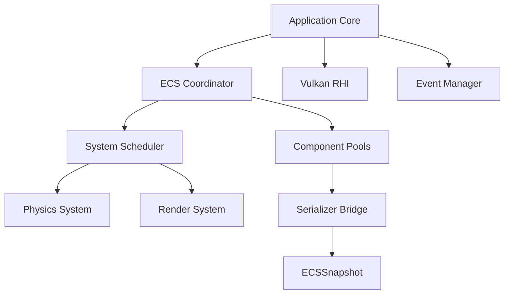

# 🌌 Omnix Studio Engine v0.1

[](https://en.cppreference.com/w/cpp/17)
[]()
[]()
[]()

**Omnix Studio Engine** is a high-performance, data-oriented game engine written in modern C++17. Built around a robust **Entity Component System (ECS)** and a modular **Render Hardware Interface (RHI)**, Omnix is designed for scalability, determinism, and maximum hardware utilization.

---

## 📖 Project Overview

**Omnix Studio Engine** is a high‑performance, data‑oriented game engine written in modern C++17. It targets Windows, Linux and macOS, using Vulkan for rendering and an Entity‑Component‑System for simulation. The engine emphasizes deterministic execution, strict modularity and extensibility.

---

## 🗂️ Core Application (Application.cpp)

`Application.cpp` implements the entry point for the engine (`EngineMain`). It sets up logging, spawns the input thread, creates the global `World` instance, and runs the state‑machine that drives the boot, menu and gameplay phases. It also initialises the Vulkan `EngineLoop`, registers a render callback and forwards per‑frame input and update calls to the appropriate ECS systems (physics, render, player). This file is the glue that connects the low‑level core utilities (`Core/*`) with the high‑level subsystems (ECS, RenderingEngine, Input, EventManagement).


The engine is built on four core pillars:
1.  **Data-Oriented Design (DOD):** Maximizing CPU cache efficiency by storing component data in contiguous dense arrays.
2.  **Strict Modularity:** Every major subsystem (Rendering, Physics, Serialization) is isolated behind clean interfaces.
3.  **Determinism:** Guarantees identical execution across runs through sorted entity/component iteration and fixed-timestep updates.
4.  **Extensibility:** A generic system scheduler and registration mechanism allow for easy integration of new features.

### High-Level Module Map


---

## 🔧 Core Modules Deep-Dive

### 1. Entity Component System (ECS)
Located in `/ECS`, this is the heartbeat of Omnix.
*   **Entity Management:** Uses 32-bit unique IDs with a generation counter to prevent ABA problems during ID reuse.
*   **Component Pools:** Components are stored in `ComponentPool<T>`, which uses a sparse-set-like structure to maintain dense data arrays for rapid iteration.
*   **Coordinator:** Acts as the central hub, managing the lifecycle of entities and synchronizing component additions/removals.
*   **System Scheduler:** Found in `/Systems/Scheduler`, it builds a **Directed Acyclic Graph (DAG)** of system dependencies, allowing for optimal execution order and potential parallelization.

### 2. Rendering Engine & Vulkan RHI
Located in `/RenderingEngine`, Omnix features a modern graphics stack.
*   **RHI Abstraction:** A backend-agnostic interface (`/rhi`) that defines Buffers, Textures, Pipelines, and Command Lists.
*   **Vulkan Backend:** A fully-featured Vulkan implementation (`/Vulkan`) handling:
    *   Descriptor set management and dynamic updates.
    *   Swapchain synchronization and framebuffering.
    *   Memory allocation via specialized Vulkan memory allocators.
*   **Frame Graph:** A high-level rendering architecture that manages resource dependencies between passes, automatically handling synchronization barriers and layout transitions.

### 3. Advanced Serialization
Located in `/Serializer`, this module handles persistence and networking state.
*   **Binary & Text Support:** Highly optimized binary format for production and human-readable text/JSON for debugging.
*   **Snapshot System:** The `ECSSnapshot` captures the entire world state into a versioned, checksum-validated buffer.
*   **Deterministic Pipeline:** Every field is serialized in a strictly defined order (Entity ID -> Component Type -> Field ID) to ensure bit-perfect output.
*   **Delta Compression:** Support for serializing only changed fields between snapshots, drastically reducing network bandwidth and save file size.

### 4. Scene & Prefab System
Located in `/Scene`, managing the spatial hierarchy.
*   **Scene Objects:** A hierarchical organization of entities, allowing for complex parent-child transform propagation.
*   **Prefab Registry:** Templates for entities that can be instantiated with overridden properties, supporting nested prefabs.
*   **Camera System:** Support for multiple perspective and orthographic viewports with frustum culling integration.

### 5. Event & Input Management
Located in `/EventManagement` and `/Input`.
*   **Pub/Sub Event Bus:** A decoupled communication layer allowing systems to broadcast events (e.g., `OnEntityCollision`, `OnInputKey`) without direct dependencies.
*   **Unified Input:** Abstracted input handling for Keyboard, Mouse, and Gamepad, supporting action-based remapping.

---

## 🚀 Technical Highlights

| Feature | Implementation | Benefit |
| :--- | :--- | :--- |
| **Memory** | Custom Pool Allocators | Zero fragmentation, high cache hit rate |
| **Physics** | Integration with PhysX & Custom SPH | High-fidelity rigid body and fluid simulation |
| **Timing** | High-precision Timer | Nanosecond delta-time accuracy |
| **Systems** | DAG-based Scheduling | Deterministic execution, easy dependency management |
| **Math** | Optimized `Matrix4x4` & `Quaternion` | Specialized SIMD-ready math primitives |

---

## 🛠️ Building & Running

### Prerequisites
*   **Compiler:** C++17 compatible (MSVC 2019+, GCC 9+, Clang 10+)
*   **Build System:** CMake 3.15+
*   **Dependencies:** SDL3 (Bundled in `/Dependencies`)

### Quick Start
1.  **Clone the repository:**
    ```bash
    git clone https://github.com/your-repo/OmnixEngine.git
    cd OmnixEngine
    ```
2.  **Generate & Build:**
    ```bash
    mkdir build && cd build
    cmake ..
    cmake --build . --config Release
    ```
3.  **Run the Sampler:**
    ```bash
    ./bin/Release/sampler
    ```

---

### Top‑Level Directories (one‑liner description)

- `Core/` – Fundamental utilities (logger, timer, the `Application.cpp` entry point).
- `ECS/` – Entity‑Component‑System implementation: entity IDs, component pools, coordinator and system scheduler.
- `RenderingEngine/` – Vulkan RHI, frame‑graph and render‑pipeline implementations.
- `Systems/` – System definitions, scheduler DAG and core gameplay systems (physics, render, player, AI, etc.).
- `Serializer/` – World‑state snapshot/serialization framework with binary and JSON support.
- `Scene/` – Hierarchical scene graph, prefab registry and camera handling.
- `EventManagement/` – Thread‑safe publish/subscribe event bus used across subsystems.
- `Input/` – Unified input abstraction for keyboard, mouse and gamepad.
- `Components/` – Library of pre‑defined data components (transform, physics, AI, rendering, etc.).
- `ThirdParty/` – External dependencies (glm, nlohmann‑json, rapidjson, SDL3, etc.).

---


*   `Core/`: Fundamental utilities (Logger, Timer, Application).
*   `ECS/`: Core Entity-Component-System implementation.
*   `RenderingEngine/`: Vulkan RHI and rendering pipelines.
*   `Systems/`: System management, scheduling, and core logic systems.
*   `Serializer/`: Robust world-state serialization framework.
*   `Scene/`: Hierarchy, Transforms, and Prefab management.
*   `EventManagement/`: Thread-safe decoupled event bus.
*   `Input/`: Multi-device input abstraction.
*   `Components/`: Large library of pre-defined data components.
*   `ThirdParty/`: External integrations (glm, nlohmann-json).

---

## 📖 Extended Documentation

For deeper dives into specific modules, consult the following guides:
*   [Engine Overview](file:///e:/Omnix_Studio_v0.1/Engine/ENGINE_COMPLETE_OVERVIEW.md) - Full architectural breakdown.
*   [Project Structure](file:///e:/Omnix_Studio_v0.1/Engine/PROJECT_STRUCTURE_README.md) - File-by-file directory map.
*   [Installation Guide](file:///e:/Omnix_Studio_v0.1/Engine/INSTALLATION_GUIDE.md) - Platform-specific setup.
*   [Serialization Implementation](file:///e:/Omnix_Studio_v0.1/Engine/IMPLEMENTATION_COMPLETE.md) - Details on the save/load system.

---

© 2024 Omnix Studio Team. All rights reserved.
