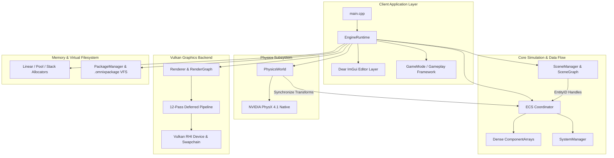

# Omnix Studio Engine v0.4

[](https://en.cppreference.com/w/cpp/17)
[](https://www.vulkan.org/)
[](https://github.com/NVIDIA-Omniverse/PhysX)
[]()
[]()
[](docs/benchmarks.md)

**Omnix Engine** is a modular, high-performance C++17 systems game engine built on a deterministic Entity Component System (ECS), a 12-pass Vulkan deferred rendering pipeline, NVIDIA PhysX 4.1 rigid-body dynamics, custom cache-friendly memory allocators, and an in-memory package virtual file system.

> **Engineering Release Notice**: This repository is prepared as a transparent, inspectable systems release. Architectural claims are backed by audited source code, and performance numbers are backed by reproducible benchmarks executed on local test hardware.

---

## 1. Technical Documentation Set

Complete technical documentation is organized in [`docs/`](docs/):

* **[Architecture Overview](docs/architecture.md)** — Core topology, component-level breakdowns, data/control flow, and subsystem inventory matrix.
* **[Execution Model](docs/execution-model.md)** — Binary bootstrap sequence, 15-stage single-threaded frame loop, concurrency invariants, and LIFO teardown protocol.
* **[Design Decisions (ADRs)](docs/design-decisions.md)** — Architecture Decision Records covering ECS vs. OOP, 12-pass Vulkan RenderGraph, LIFO teardown, asset handles, serialization, and archive mounting.
* **[Empirical Benchmarks](docs/benchmarks.md)** — Hardware testbed, statistical methodology, full results table, and architectural bottleneck analysis.
* **[Reproducibility Guide](docs/reproducibility.md)** — Build prerequisites, CMake/Ninja compilation commands, and verification test execution.
* **[Known Limitations](docs/limitations.md)** — Single-threaded execution, monolithic `Renderer.cpp`, fixed entity capacities, and incomplete modules marked `Planned`.

---

## 2. Headline Empirical Benchmarks

The figures below represent empirical measurements executed via [`benchmarks/bench_main.cpp`](benchmarks/bench_main.cpp) on an **Intel Core i7-6820HQ @ 2.70GHz, 8GB DDR4, Windows 11 Enterprise (MSVC /O2 x64, Ninja 1.13.2)**:

| Engine Subsystem | Workload Description | Batch Count | Median Duration | p95 Latency | Measured Throughput |
|:---|:---|:---:|:---:|:---:|:---:|
| **Memory Allocator** | Linear Arena Allocation (64-byte chunks) | 1,000 | 11.70 $\mu\text{s}$ | 11.80 $\mu\text{s}$ | **85,034,013 allocs/sec** |
| **Memory Allocator** | Stack Allocator LIFO Push/Pop (128-byte) | 500 | 5.70 $\mu\text{s}$ | 20.20 $\mu\text{s}$ | **72,337,962 push-pop/sec** |
| **Memory Allocator** | Pool Allocator Fixed-Size Recycle (32-byte) | 1,000 | 17.90 $\mu\text{s}$ | 37.90 $\mu\text{s}$ | **44,901,441 alloc-ops/sec** |
| **Transform & Math** | Affine Matrix4x4 TRS SIMD Composition | 10,000 | 4,695.60 $\mu\text{s}$ | 5,497.40 $\mu\text{s}$ | **2,117,534 matrices/sec** |
| **Asset Pipeline** | Package Archive Offset & Handle Lookup | 1,000 | 710.90 $\mu\text{s}$ | 1,419.50 $\mu\text{s}$ | **1,249,164 queries/sec** |
| **ECS Subsystem** | Entity Batch Instantiation (50k Entities) | 50,000 | 49,189.80 $\mu\text{s}$ | 52,023.70 $\mu\text{s}$ | **1,016,268 entities/sec** |
| **ECS Subsystem** | System Iteration & Signature Dispatch (10k) | 10,000 | 44,208.60 $\mu\text{s}$ | 56,557.00 $\mu\text{s}$ | **211,709 ent-ticks/sec** |
| **Serialization** | Binary ECS State Serialization (2k Entities) | 2,000 | 16,823.10 $\mu\text{s}$ | 18,751.40 $\mu\text{s}$ | **116,556 entities/sec** |
| **Transform & Math** | Deep Hierarchy Tree Traversal (Depth 100) | 1 | 13.70 $\mu\text{s}$ | 28.50 $\mu\text{s}$ | **65,030 traversals/sec** |
| **ECS Subsystem** | Dynamic Component Attachment (10k Entities) | 10,000 | 152,651.00 $\mu\text{s}$ | 174,683.10 $\mu\text{s}$ | **64,499 entities/sec** |

*Raw CSV telemetry available at [`benchmarks/benchmark_results.csv`](benchmarks/benchmark_results.csv).*

---

## 3. High-Level System Architecture



---

## 4. Quickstart: Building & Running

### 4.1 Prerequisites
* Windows 10/11 x64
* Visual Studio 2022 / 2026 (MSVC x64 C++17)
* CMake 3.25+ & Ninja
* LunarG Vulkan SDK 1.3+
* `vcpkg` packages: `glfw3:x64-windows`, `glm:x64-windows`, `unofficial-omniverse-physx-sdk:x64-windows`

### 4.2 Configure and Compile
```powershell
# In x64 Native Tools Command Prompt
git clone https://github.com/na124441/OmnixEngine.git
cd OmnixEngine

mkdir build_ninja
cd build_ninja

cmake -G "Ninja" -DCMAKE_BUILD_TYPE=Release -DCMAKE_TOOLCHAIN_FILE="$env:VCPKG_ROOT\scripts\buildsystems\vcpkg.cmake" ..
ninja -j 8
```

### 4.3 Running Binaries
```powershell
# Run the interactive Vulkan editor & runtime
.\Application.exe --editor

# Run the empirical benchmark suite
.\omnix_benchmarks.exe

# Run the transform & math unit tests
.\transform_tests.exe

# Run headless memory diagnostic suite
.\Application.exe --test-memory --headless
```

---

## 5. Repository Structure

```txt
OmnixEngine/
├── benchmarks/          Empirical benchmark harness (bench_main.cpp, benchmark_results.csv)
├── docs/                Architectural and benchmark release documentation
│   ├── architecture.md      High-level system topology & subsystem breakdown
│   ├── execution-model.md   15-stage frame loop, bootstrap & LIFO teardown
│   ├── design-decisions.md  Architectural Decision Records (ADRs)
│   ├── benchmarks.md        Empirical performance report & bottleneck analysis
│   ├── limitations.md       Known limitations & architectural debt
│   └── reproducibility.md   Step-by-step build & verification guide
├── Core/                Memory allocators (Linear, Pool, Stack), diagnostics, logging
├── ECS/                 Coordinator, EntityManager, ComponentManager, ComponentArray
├── Physics/             PhysX 4.1 integration, rigid actors, raycasting, debug draw
├── Rendering/           Vulkan 1.3 backend, 12-pass deferred pipeline, RenderGraph
├── Runtime/             EngineRuntime frame loop, EditorLayer, PackageManager, Audio
├── Scene/               SceneManager, SceneObject handles, Transform hierarchy
├── Serializer/          Schema-driven reflectionless binary serialization
├── shaders/             GLSL sources and compiled SPIR-V binaries
└── CMakeLists.txt       Root build configuration
```

---

## 6. License & Acknowledgments

Omnix Engine is released under the [MIT License](LICENSE). Third-party libraries bundled or linked include GLFW, GLM, NVIDIA PhysX 4.1, Dear ImGui, ImGuizmo, and miniaudio.
