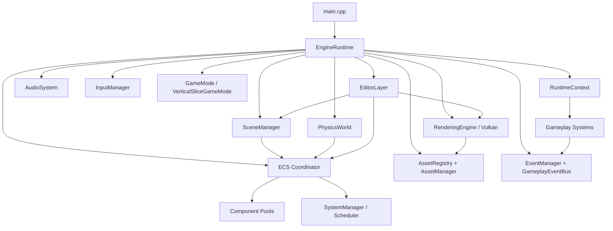

# Omnix Studio Engine v0.4

[](https://en.cppreference.com/w/cpp/17)
[]()
[]()
[]()

Omnix Studio Engine is a modular C++17 game engine built around a deterministic Entity Component System, a Vulkan rendering backend, PhysX simulation, an integrated editor layer, and a runtime gameplay framework. The v0.4 codebase moves the engine from a rendering/ECS prototype into an integrated editor and runtime environment with scene loading, gameplay systems, audio, asset import, hot reload, packaging, and diagnostics.

The primary executable is `Application`, implemented by `main.cpp`, `Core/Application.cpp`, and `Runtime/Private/EngineRuntime.cpp`.

## Current Feature Summary

### Runtime and Lifecycle

- Central `EngineRuntime` owns initialization, frame execution, and shutdown.
- Runtime modes support normal game execution and editor mode through `--editor`.
- Startup and shutdown are deterministic, with teardown performed in reverse order to release GPU, physics, scene, audio, and asset resources safely.
- Frame timing uses high-resolution clocks, delta-time clamping, and fixed timestep physics updates.
- `RuntimeContext` injects subsystem pointers into gameplay, editor, scheduler, scene, audio, and save systems without relying on broad singleton ownership.

### ECS and Simulation

- Entity creation, destruction, component registration, component add/remove, and system signature matching are implemented.
- Component data is organized for data-oriented iteration through manager-owned component pools.
- Gameplay-ready components include transforms, render meshes, materials, rigid bodies, colliders, triggers, character controllers, player starts, objectives, checkpoints, doors, simple state objects, and interactables.
- A scheduler/DAG framework exists, while several gameplay and physics update stages are still explicitly sequenced in `EngineRuntime`.

### Scene and Level Authoring

- `SceneManager`, `SceneLoader`, `SceneSerializer`, `SceneValidator`, `SceneObject`, prefab support, camera support, and hierarchy management are present.
- JSON scene loading and saving are integrated for runtime and editor workflows.
- `.omnixscene` binary format structures and tests exist, but binary scene loading is not yet the default runtime scene path.
- Scene validation checks for hierarchy cycles, invalid transforms, duplicate names, and missing asset references.

### Rendering

- Vulkan is the primary graphics backend.
- Rendering code is split across RHI-style resource interfaces, Vulkan device/swapchain/memory setup, render scene structures, render passes, shader loading, GLTF model loading, and scene rendering.
- Implemented rendering features include mesh rendering, material handling, shader loading from SPIR-V, lighting components, UI/HUD overlays, debug rendering, and editor viewport rendering.
- CMake can compile Vulkan shaders through `glslc` when the Vulkan SDK tool is available.

### Physics and Collision

- PhysX-backed `PhysicsWorld` is integrated with runtime fixed updates.
- Implemented features include dynamic rigid bodies, static colliders, trigger volumes, raycasts, character controller support, collision/trigger events, and debug collider drawing.
- Missing or partial areas include mesh collider support, richer collision filtering, visual interpolation between physics ticks, and advanced character step/slope behavior.

### Gameplay Framework

- `GameMode` and `VerticalSliceGameMode` drive level flow.
- `GameplayEventBus` connects runtime events to objectives, interaction, checkpointing, object activation, HUD, audio, and save systems.
- Implemented gameplay systems include:
  - player spawn and player controller
  - interactable objects
  - objective tracking
  - checkpoints and respawn snapshots
  - activatable doors and simple state objects
  - gameplay HUD prompts and notifications
  - gameplay save/load snapshots with checksum validation
  - audio events through miniaudio

### Editor

- Launch editor mode with `Application.exe --editor`.
- Editor layer uses Dear ImGui and ImGuizmo.
- Implemented panels and tools include viewport, scene hierarchy, inspector, console, asset browser, transform gizmos, component widgets, file dialogs, selection state, dirty-state tracking, scene save/load, and play/edit simulation transitions.
- Play mode clones active scene state so simulation can be stopped and restored to edit state.

### Asset Pipeline and Runtime Formats

- `AssetRegistry.json` tracks asset metadata and UUID-style references.
- Runtime import and loading code includes texture import, OBJ/GLTF mesh import, mesh validation, asset manager, asset cache tests, runtime loaders, file watching, hot reload, package builder, package manager, and package tests.
- Supported or defined engine formats include:
  - `.omnixmesh`
  - `.omnixtexture`
  - `.omnixmat`
  - `.omnixscene`
  - `.omnixworld`
  - `.omnixzone`
  - `.omnixpackage`
  - gameplay save files under `Saves/`

### Diagnostics and Memory

- Core memory utilities include allocation tracking, linear allocators, pool allocators, stack allocators, validation, and fragmentation diagnostics.
- Runtime diagnostics include allocation diagnostics, ownership validation, stress tests, frame/runtime stage tracking, and memory test mode.
- Run memory diagnostics with `Application.exe --test-memory`.

## Architecture Overview



### Subsystem Boundaries

| Subsystem | Main Location | Responsibility |
| :--- | :--- | :--- |
| Core | `Core/` | Logging, timers, diagnostics, memory allocators, application glue. |
| Runtime | `Runtime/` | Engine lifecycle, runtime context, gameplay framework, editor layer, asset pipeline, audio, hot reload, packaging. |
| ECS | `ECS/` | Entity IDs, component registration, component pools, signatures, system registration. |
| Components | `Components/` | Spatial, physical, perceptual, logical, relational, temporal, and behavior component definitions. |
| Scene | `Scene/` | Scene graph, scene loading/saving, prefabs, cameras, validation, hierarchy management. |
| Rendering | `RenderingEngine/` | Vulkan device/swapchain, RHI resources, frame/render graphs, render passes, shaders, meshes, materials, GLTF loading. |
| Physics | `Physics/` | PhysX world, rigid/static actors, raycasts, trigger handling, debug draw, validation. |
| Systems | `Systems/` | Scheduler framework and planned/typed simulation system categories. |
| Serializer | `Serializer/` | Binary/text serialization, ECS snapshots, schema registry, delta snapshots. |
| Input | `Input/` | Keyboard, mouse, gamepad, input bindings, input events. |
| EventManagement | `EventManagement/` | Event queues, event types, decoupled pub/sub messaging. |
| Assets | `Assets/` | Scenes, materials, textures, audio, and sample content. |
| ThirdParty | `ThirdParty/`, `Dependencies/` | ImGui, ImGuizmo, nlohmann_json, RapidJSON, SDL3, miniaudio, and other bundled dependencies. |

### Startup Order

The intended boot sequence is:

1. Logger and core diagnostics.
2. Timers and frame timing.
3. Input manager and event buses.
4. ECS world and coordinator.
5. Scheduler and frame stage tracking.
6. Window, Vulkan RHI, swapchain, renderer, and shader resources.
7. Asset registry and asset/runtime loaders.
8. Scene manager and initial scene.
9. Physics world.
10. Audio system.
11. Game mode and gameplay systems.
12. Editor layer, when launched with `--editor`.

Shutdown runs in reverse order.

## Build and Run

### Prerequisites

- CMake 3.10 or newer.
- C++17 compiler.
- Vulkan SDK.
- GLFW package available to CMake.
- PhysX package via `unofficial-omniverse-physx-sdk` when `OMNIX_WITH_PHYSX=ON`.
- Windows x64 is the primary tested target.

The repository also includes bundled dependencies such as SDL3, Dear ImGui, ImGuizmo, miniaudio, nlohmann_json, RapidJSON, stb_image, and tinygltf.

### Configure and Build

```powershell
cmake -S . -B build_ninja
cmake --build build_ninja --config Release
```

Or use the provided MSVC helper:

```powershell
.\build_msvc.bat
```

### Run

```powershell
.\build_ninja\Application.exe
```

Run editor mode:

```powershell
.\build_ninja\Application.exe --editor
```

Run memory diagnostics:

```powershell
.\build_ninja\Application.exe --test-memory
```

Run the ECS sampler:

```powershell
.\build_ninja\sampler.exe
```

Depending on the generator and configuration, binaries may also appear under `build/bin/Release/`.

## CMake Targets

- `EngineCore`: logging, timers, diagnostics, memory utilities, core behavior support.
- `Serialization`: binary/text serializers, delta serializers, ECS snapshots, schema bridge.
- `ECS`: entity, component, system, and coordinator implementation.
- `Input`: input manager.
- `Scene`: scene graph, scene manager, prefabs, cameras, loader, serializer, validator.
- `Physics`: PhysX-facing physics world, validation, conversion, debug draw.
- `RenderingEngine`: Vulkan runtime, windowing, renderer, scene renderer, model/material/texture/shader loading.
- `EngineRuntime`: gameplay, editor, asset registry, importers, loaders, hot reload, package management, diagnostics, audio.
- `Application`: main engine executable.
- `sampler`: ECS sample executable.
- `imgui`: Dear ImGui static library used by renderer and editor.
- `CompileShaders`: optional shader compilation target when `glslc` is found.

## Known Partial or Planned Areas

- Scheduler DAG exists, but some runtime systems are still hardcoded in sequential frame stages.
- Binary `.omnixscene` format is defined and tested, but JSON remains the integrated scene loading path.
- Additive scene loading and visual loading screens are not fully implemented.
- Prefab disk save/load has partial/stubbed areas.
- Dynamic shadow mapping, skybox rendering, multi-material blending, skeletal animation/skinning, and mesh colliders are still incomplete or planned.
- Editor undo/redo, snapping, asset search/tag filtering, and frame-step debugging are not yet complete.
- Async scene loading and async save/load are not yet integrated.

## Documentation

Useful deeper references:

- `OMNIX_V0_4_ENGINE_REPORT.md`
- `OMNIX_V0_4_VERIFIED_FEATURE_AUDIT.md`
- `EDITOR_MODE_DEEP_AUDIT.md`
- `Docs/Architecture/SUBSYSTEMS.md`
- `Docs/Architecture/STARTUP_ORDER.md`
- `Docs/Architecture/SHUTDOWN_ORDER.md`
- `Docs/Architecture/RELATIONSHIP_GRAPH.md`
- `Docs/Formats/OMNIXWORLD_FORMAT.md`
- `Markdown/INSTALLATION_GUIDE.md`
- `Markdown/PROJECT_STRUCTURE_README.md`
- `Markdown/ENGINE_COMPLETE_OVERVIEW.md`

## Repository Layout

```txt
OmnixEngine/
  Assets/              Runtime scenes, materials, textures, audio, and sample content
  Components/          ECS component catalog
  Config/              Editor/runtime configuration files
  Core/                Logging, timing, diagnostics, allocators, application glue
  Docs/                Architecture and format documentation
  ECS/                 Coordinator, entity manager, component manager, systems
  EventManagement/     Engine and gameplay event definitions and queues
  Input/               Input devices, bindings, and input manager
  Physics/             PhysX integration and physics debug utilities
  RenderingEngine/     Vulkan renderer, RHI resources, render passes, scene renderer
  Runtime/             Engine runtime, editor, gameplay, assets, audio, hot reload
  Scene/               Scene graph, loading, saving, prefabs, validation
  Serializer/          ECS and binary/text serialization
  Systems/             Scheduler and system category definitions
  ThirdParty/          Bundled external libraries
  Time/                Time scale, frame timer, frame budget utilities
  shaders/             PBR shader sources and compiled SPIR-V
```

